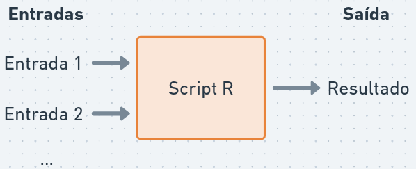
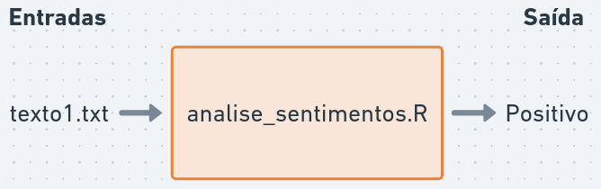
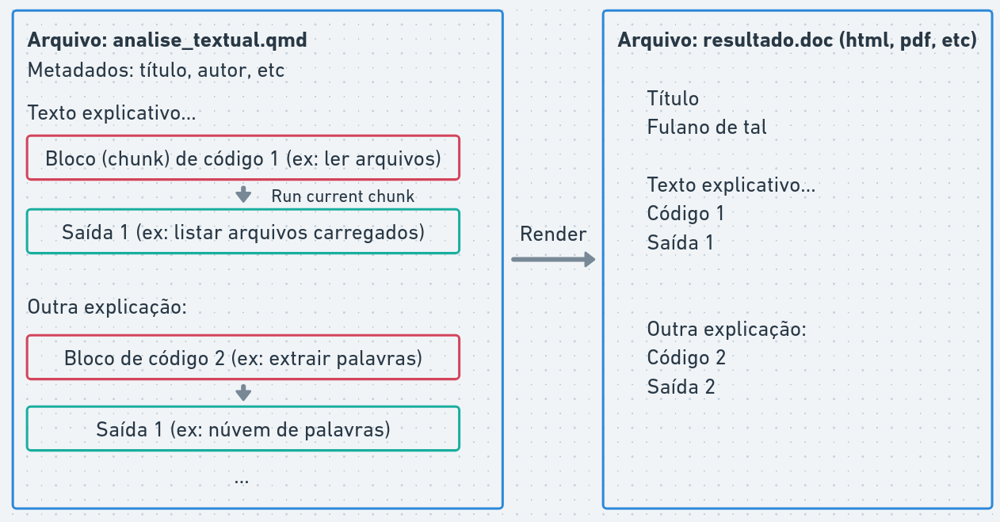
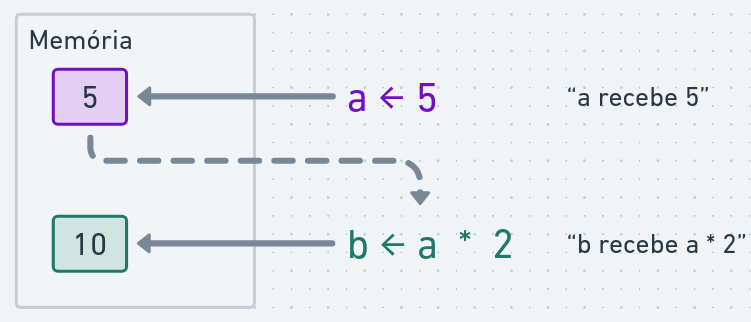
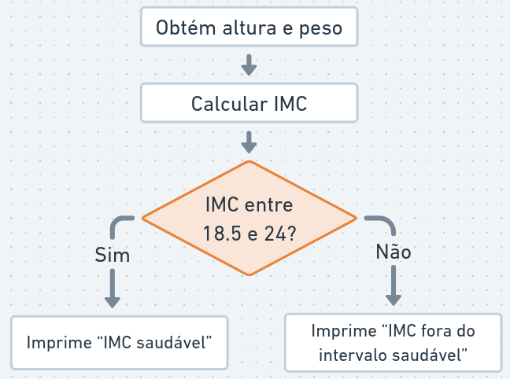
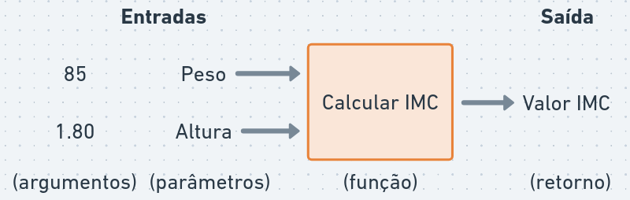
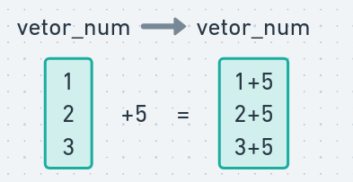
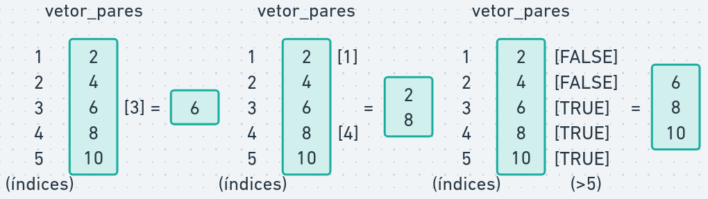

::: callout-note
## Nesta aula

-   Como utilizar a linguagem R

-   Comandos básicos

-   Utilizando bibliotecas

-   Funções para processamento de texto

Link para Google Colab: <https://colab.research.google.com/drive/1LalxshzmyMmTyfuIaFbp7RYcoP5Qnvuo>
:::

-   **R** é uma linguagem de programação e ambiente de software para computação estatística e gráficos

-   Criada por Ross Ihaka e Robert Gentleman em 1993

-   Muito utilizada em ciência de dados, estatística e análise de texto

-   Possui uma grande comunidade de usuários e desenvolvedores, com muitas bibliotecas para análise de textos

## Programando scripts em R:

{fig-align="center" width="60%"}

Script R: sequência de comandos R que podem ser executados para realizar uma tarefa específica (ex: análise de sentimentos)

Em PLN:

{fig-align="center" width="70%"}

`analise_sentimentos.R` é um arquivo contendo instruções para:

-   Ler arquivos de texto
-   Processar textos (tokenização, remoção de stopwords, stemming)
-   Analisar sentimentos (encontrar palavras positivas e negativas)
-   Gerar saída (relatório, gráfico, tabela)

O **interpretador R (Rscript)** é um programa que executa os comandos do script e produz a saída desejada. Por exemplo, pelo terminal de comandos:

`{$ Rscript analise_sentimentos.R texto1.txt} > "Positivo"`

## Ambientes para programar em R

O interpretador R está disponível para download em <https://cran-r.c3sl.ufpr.br/>

```{r}
## (código utilizado apenas para exibir páginas no Google Colab)
if (!requireNamespace("htmltools", quietly = TRUE)) {
  install.packages("htmltools")
}
htmltools::tags$iframe(src = "https://cran-r.c3sl.ufpr.br/", width = "100%", height = "315")
```

-   No Windows, é necessário também instalar o RTools, disponível em <https://cran.r-project.org/bin/windows/Rtools/>, que inclui ferramentas para auxiliar a instalação de pacotes do R.

Podemos escrever comandos R em diversos ambientes:

### Rstudio

-   Ambiente de programação integrado (IDE) instalada localmente (Windows, Mac, Linux).
-   Possui diversas funcionalidades para facilitar a escrita e execução de código R, como editor de scripts, console interativo, visualização de gráficos e gerenciamento de pacotes.

Disponível em: <https://posit.co/downloads/>.

Uma alternativa é o IDE Positron, disponível em: <https://positron.posit.co/download.html>.

### Google Colab

-   Ambiente online para programação em Python, mas também suporta R com algumas configurações adicionais (selecione "R" como linguagem de programação para criar um notebook R).
-   Permite compartilhar notebooks interativos com código R e resultados.

Disponível em: <https://colab.research.google.com/>.

Outra alternativa é a posit.cloud, disponível em: <https://posit.cloud>.

### Console R

-   Interface de linha de comando para executar comandos R diretamente no terminal.
-   Um comando é executado por vez (digite o comando e aperte Enter), e o resultado é exibido imediatamente.
-   É um ambiente menos amigável para desenvolver scripts longos, mas útil para testes rápidos e para o aprendizado da linguagem.

Acessando o console R:

-   No terminal, digite `R` para iniciar o console R e `q()` para sair.
-   No RStudio, o console R está disponível na parte inferior da interface.
-   No Google Colab, clique em "Terminal" e digite "R" para iniciar o console R.

### Scripts R

-   Arquivo de texto com extensão `.R` que contém uma sequência de comandos R.
-   Permite organizar e reutilizar código, facilitando a execução de tarefas complexas.

Como escrever um script R:

-   No RStudio, crie um novo script em: `File > New File > R Script`. Clique em "Source" para executar o script inteiro ou selecione linhas específicas e clique em "Run" para executar apenas essas linhas.

### Notebooks R

-   Notebooks são documentos que combinam texto explicativo, código R e resultados (gráficos, tabelas) em um formato interativo.
-   Permitem criar relatórios dinâmicos e interativos, facilitando a comunicação dos resultados.

Para criar e executar notebooks R, você pode usar o Rstudio ou o Google Colab:

-   No Rstudio, crie um novo notebook: File \> New File \> Quarto Document.
-   No Google Colab, clique em "File" \> "New Notebook" e selecione "R" como linguagem de programação.

{fig-align="center" width="100%"}

Notebooks possuem dois tipos de células:

-   células de texto para escrever explicações e comentários
-   células de código para escrever e executar códigos em R (o botão "play" executa cada célula individualmente).

## Comandos básicos

-   Executar cálculos
-   Operadores relacionais e lógicos
-   Variáveis
-   Listas e vetores
-   Funções
-   Strings (cadeias de caracteres)

### Operadores aritméticos

R pode ser utilizado para cálculos básicos, por exemplo:

```{r}
print(4 + 3)
```

-   `print(*)` é uma função que exibe o resultado de uma expressão na tela.

```{r}
print(5 * 2 + 3)
```

```{r}
print((6 - 1) / 2) 
```

Qualquer código após `#` é considerado um comentário e não é executado:

```{r}
print(8 / 3)     # Isto é um comentário, não será executado
```

### Operadores relacionais e lógicos

Operadores relacionais são utilizados para comparar valores.

Igualdade:

```{r}
print(5 == 5)
```

Diferença:

```{r}
print(1 != 2)
```

Maior que:

```{r}
print(4 > 3)
```

Menor que:

```{r}
print(2 < 5)
```

Maior ou igual a:

```{r}
print(3 >= 3)
```

-   Expressões lógicas: retornam verdadeiro (`TRUE`) ou falso (`FALSE`)

Conjunção "e":

```{r}
print(4 > 3 && 8 > 2)
```

-   `&&` é o operador lógico "e" (conjunção) que retorna `TRUE` se ambas as expressões forem verdadeiras, caso contrário retorna `FALSE`:

-   `TRUE  && TRUE` retorna `TRUE`

-   `TRUE  && FALSE` retorna `FALSE`

-   `FALSE && TRUE` retorna `FALSE`

-   `FALSE && FALSE` retorna `FALSE`

Disjunção "ou":

```{r}
print(4 > 3 || 2 > 8)
```

-   `||` é o operador lógico "ou" (disjunção), que retorna `TRUE` se pelo menos uma das expressões for verdadeira. Caso contrário, retorna `FALSE`.

-   `TRUE  || TRUE` retorna `TRUE`

-   `TRUE  || FALSE` retorna `TRUE`

-   `FALSE || TRUE` retorna `TRUE`

-   `FALSE || FALSE` retorna `FALSE`

Negação "não"

```{r}
print(!(5 > 3))
```

-   `!` é o operador lógico "não" (negação) que inverte o valor lógico de uma expressão. Se a expressão for `TRUE`, retorna `FALSE`, e se for `FALSE`, retorna `TRUE`.

-   `!(TRUE)` retorna `FALSE`

-   `!(FALSE)` retorna `TRUE`

```{r}
print((TRUE && FALSE) || TRUE)
```

### Variáveis

**Variáveis** são utilizadas para guardar valores na memória do computador:

```{r}
a <- 5

print(a)
```

Utilizamos o operador `<-` para atribuir valores a variáveis.

O valor armazenado pode ser utilizado em outras expressões:

```{r}
print(a * 2 + 3)
```

Ou podemos criar novas variáveis a partir de outras:

```{r}
b <- a * 2

print(b)
```

{fig-align="center" width="70%"}

O valor armazenado na variável pode ser alterado:

```{r}
a <- 10

print(a)
```

Variáveis podem armazenar diferentes tipos:

```{r}
p <- 1 == 1
q <- 4 < 3

print(p || q)
```

O nome de uma variável deve começar com uma letra e pode conter letras, números (exceto no começo), underscores (`_`) e pontos:

```{r}
isto_é_uma_variável <- 10
aluno_aprovado_1 <- isto_é_uma_variável == 10

print(isto_é_uma_variável)
print(aluno_aprovado_1)
```

Exemplo de cálculo do índice de massa corporal (IMC):

```{r}
peso <- 70 # peso em kg
altura <- 1.75 # altura em metros

imc <- peso / (altura * altura)

imc_saudavel <- imc >= 18.5 && imc <= 24

print(imc)
print(imc_saudavel)
```

### Condicionais

O comando `if` é utilizado para executar um bloco de código apenas se uma condição for verdadeira:

```{r}
x <- 10

if (x > 5) {
  print("x é maior que 5")
}
```

O comando `else` pode ser utilizado para executar um bloco de código alternativo caso a condição seja falsa:

{fig-align="center" width="70%"}

```{r}
peso <- 70 # peso em kg
altura <- 1.75 # altura em metros

imc <- peso / (altura * altura)

print(imc)

imc_saudavel <- imc >= 18.5 && imc <= 24

if (imc_saudavel) {
  print("IMC saudável")
} else {
  print("IMC fora do intervalo saudável")
}
```

### Funções

Uma **função** é um bloco de código que possui um nome e realiza uma tarefa específica, geralmente para operações comuns que se repetem.

Por exemplo, `print` é a função que usamos para exibir resultados na tela.

R possui várias funções para estatística e análise de dados. Alguns exemplos são:

Valor absoluto:

```{r}
print(abs(-5))
```

Raiz quadrada:

```{r}
raiz <- sqrt(16)

print(raiz)
```

Logaritmo:

```{r}
log(100, base = 10)
```

-   O número 100 é o primeiro argumento da função.

-   O número 10 é o segundo argumento, nomeado como base. Por padrão, a base é o número de Euler (exp(1)), calculando o logaritmo natural.

-   Para obter ajuda sobre uma função, execute `help(log)` ou `?log`.

Também é possível definir nossas próprias funções:

```{r}
calcular_imc <- function(peso, altura) {
  altura_quadrado <- altura * altura
  return(peso / altura_quadrado)
}

imc <- calcular_imc(85, 1.80)
print(imc)
```

{fig-align="center" width="80%"}

Observe a sintaxe para declarar uma função:

```         
nome_da_funcao <- function(argumentos) {
  # corpo da função
}
```

A expressão `return(...)` é utilizada para indicar o valor que a função deve retornar. Se `return()` não for especificado, a função retornará o resultado da última expressão avaliada em seu corpo.

Note que qualquer variável criada dentro de uma função é uma variável **local**, ou seja, ela não pode ser acessada fora do escopo da função:

```{r, error=TRUE}
print(altura_quadrado)
```

Após definir uma função, podemos utilizá-la em qualquer parte do código:

```{r}
teste_imc <- function(peso, altura) {
  imc <- calcular_imc(peso, altura)
  imc_saudavel <- imc >= 18.5 && imc <= 24
  return(imc_saudavel)
}

print(calcular_imc(80, 1.75) < calcular_imc(70, 1.65))
```

Em certos casos, utilizamos o resultado de uma função como argumento de outra função:

```{r}
converter_para_celsius <- function(fahrenheit) {
  celsius <- (fahrenheit - 32) * 5 / 9
  return(celsius)
}

esta_congelando <- function(celsius) {
  congelando <- celsius <= 0
  return(congelando)
}

temperatura_inverno <- 25 # Graus Fahrenheit (aprox. -3.8 °C)

resultado <- esta_congelando(converter_para_celsius(temperatura_inverno))

print(resultado)
```

Em R, podemos utilizar o *operador pipe* (`|>`) para encadear funções de forma mais legível:

```{r}
temperatura_inverno <- 25 # Graus Fahrenheit (aprox. -3.8 °C)

resultado <- temperatura_inverno |>
  converter_para_celsius() |>
  esta_congelando()

print(resultado)
```

-   No exemplo, a expressão `temperatura_inverno` é passada como primeiro argumento para a função `converter_para_celsius()`, e o resultado dessa função é então passado como primeiro argumento para a função `esta_congelando()`.

O operador pipe (`|>`) torna o código mais legível, permitindo que as funções sejam encadeadas de maneira clara e fluida.

### Vetores

Vetores são estruturas que armazenam uma sequência de elementos do mesmo tipo:

```{r}
vetor_num <- c(1, 2, 3, 4, 5, 6, 7)

print(vetor_num)
```

Operações aritméticas podem ser aplicadas a todos os elementos de um vetor simultaneamente:

```{r}
vetor_num <- c(1, 2, 3)
vetor_num <- vetor_num + 5

print(vetor_num)
```

{width="50%"}

É possível criar sequências numéricas de forma simples:

```{r}
vetor_seq <- 1:10

print(vetor_seq)
```

Algumas funções operam sobre vetores:

```{r}
print(sum(1:100))
print(mean(1:100))
print(sd(1:100))
```

Para acessar um elemento específico do vetor, utilizamos colchetes `[]`:

```{r}
vetor_pares <- c(2, 4, 6, 8, 10)

print(vetor_pares[3])
```

Para alterar elementos do vetor também utilizamos colchetes:

```{r}
vetor_seq <- 1:10
vetor_seq[3] <- 999

print(vetor_seq)
```

Podemos acessar múltiplos elementos do vetor:

```{r}
print(vetor_pares[c(1, 4)])
```

Também podemos filtrar elementos do vetor com expressões lógicas:

```{r}
pares_maior_5 <- vetor_pares > 5
elementos_maior_5 <- vetor_pares[pares_maior_5]

print(vetor_pares)
print(pares_maior_5)
print(elementos_maior_5)
print(vetor_pares[vetor_pares > 5])
```

{width="100%"}

O operador `%in%` é utilizado para verificar se certos elementos estão presentes em um vetor:

```{r}
vetor_a <- c(2, 3, 10)

print(3 %in% vetor_a)

vetor_b <- c(3, 4, 5, 6, 7)

print(vetor_a %in% vetor_b)
```

### Data frames

R possui vários tipos de dados, os principais são:

-   Numéricos: números inteiros ou decimais (ex: `5`, `3.14`)
-   Lógicos: `TRUE` ou `FALSE`
-   Strings: texto entre aspas (ex: `"Olá, mundo!"`)

**Data frames** são estruturas de dados tabulares, onde cada coluna é um vetor e cada linha representa uma observação.

```{r}
df <- data.frame(
  nome = c("João", "Maria", "Pedro"),
  idade = c(30, 25, 28),
  turma = c("A", "B", "A")
)

print(df)
```

Data frames são amplamente utilizados para análise de dados, permitindo manipular e analisar conjuntos de dados tabulares.

Essencialmente, um data frame é uma lista de vetores de mesmo comprimento, em que cada vetor representa uma coluna. Cada coluna pode conter um tipo diferente de dado (numérico, lógico, texto etc.).

Acessando colunas:

```{r}
df <- data.frame(
  nome = c("João", "Maria", "Pedro"),
  idade = c(30, 25, 28),
  turma = c("A", "B", "A")
)

print(df$idade)
print(df[, "idade"])
```

Acessando linhas:

```{r}
print(df[1, ])
```

Acessando linha e coluna:

```{r}
print(df[1, "idade"])
```

Para selecionar alunos com mais de 25 anos:

```{r}
alunos_mais_velhos <- df[df$idade > 25, ]
print(alunos_mais_velhos)
```

### Bibliotecas e pacotes

\*Bibliotecas\*\* (ou pacotes) são conjuntos de funções, dados e documentação que estendem as funcionalidades do R. Geralmente são escritas por outros usuários e compartilhadas com a comunidade (ex: `tidyverse`).

Para instalar uma biblioteca, utilizamos o comando `install.packages()`.

```{r}
if (!"tidyverse" %in% installed.packages()) {
  install.packages("tidyverse")
}
```

Pesquisadores do mundo todo contribuem com bibliotecas no repositório oficial do R, <https://cran-r.c3sl.ufpr.br/>.

Para acessar as funções de uma biblioteca, é necessário carregá-la com `library(...)`:

```{r}
library(tidyverse)
```

O tidyverse é uma coleção de pacotes para ciência de dados que compartilham uma filosofia de design.

Ele inclui pacotes para manipulação de dados (`dplyr`, `tidyr`), visualização (`ggplot2`) e muito mais.

Suas funções para manipulação de data frames (aqui chamados de tibbles), como `filter`, `select` e `mutate`, facilitam a análise de dados tabulares:

```{r}
alunos <- tibble(
  nome = c("João", "Maria", "Pedro"),
  idade = c(30, 25, 28),
  nota_final = c(8.5, 9.0, 6.5),
  turma = c("A", "B", "A")
)

alunos_filtrados <- alunos |> 
  filter(idade > 25) |>                  # filtrar os alunos com mais de 25 anos
  mutate(aprovado = nota_final >= 7) |>  # nova coluna "aprovado" com base na nota final
  select(nome, idade, aprovado)          # selecionar apenas as colunas nome e idade

print(alunos_filtrados)
```

Calculando a média de idade dos alunos aprovados:

```{r}
media_idade_aprovados <- alunos |> 
  filter(nota_final >= 7) |> 
  summarise(media_idade = mean(idade))

print(media_idade_aprovados)
```

Em resumo, vimos exemplos de funções:

-   `filter()`: filtra linhas com base em condições lógicas
-   `mutate()`: cria novas colunas ou modifica colunas existentes
-   `select()`: seleciona colunas específicas
-   `summarise()`: calcula estatísticas resumidas, como média, soma, etc

Existem várias outras funções para manipulação de data frames incluídas no `tidyverse`. Um resumo visual dessas funções está disponível em <https://nyu-cdsc.github.io/learningr/assets/data-transformation.pdf>.

### Strings (cadeias de caracteres)

**String** é o tipo de dado utilizado para representar textos. Em R, strings são definidas com aspas simples ou duplas:

```{r}
texto <- "Olá, mundo!"

print(texto)
```

A biblioteca `stringr` (parte do `tidyverse`) possui diversas funções para a manipulação de strings (todas começam com o prefixo `str_`):

```{r}
a <- "olá"
b <- 'mundo'
a_b_concatenados <- str_c(a, b, sep = " ")

print(a_b_concatenados)
```

-   Concatenar significa unir duas ou mais strings. A função str_c do pacote stringr é usada para esta finalidade, e o argumento `sep` especifica o caractere separador a ser inserido entre as strings (neste caso, um espaço).

```{r}
num_palavras <- str_length("quantos caracteres tem esta frase?")

print(num_palavras)
```

-   A função `str_length` retorna o número de caracteres em uma string, incluindo espaços e pontuação.

```{r}
contem_texto <- str_detect("este texto contém palavras", "texto")

print(contem_texto)
```

-   A função `str_detect` verifica se uma string contém um padrão de texto. Ela retorna TRUE se o padrão for encontrado e FALSE caso contrário.

As funções do pacote `stringr` são vetorizadas, o que significa que elas podem ser aplicadas diretamente a um vetor de textos, retornando um resultado para cada elemento.

```{r}
discursos <- c(
  "este texto contém palavras",
  "este outro texto não tem a palavra-chave",
  "a palavra-chave está presente aqui"
)
contem_texto <- str_detect(discursos, "palavra-chave")

print(contem_texto)
print(discursos[contem_texto])
```

## Exemplo: Análise de Sentimentos com R

```{r}
library(tidyverse)
```

Criando um vetor de textos:

```{r}
textos <- c(
  "Eu amo este produto, é incrível!",
  "Este serviço é péssimo, estou muito insatisfeito.",
  "O filme foi ótimo, adorei a história e os personagens.",
  "A comida estava horrível, não recomendo este restaurante.",
  "O atendimento foi excelente, muito atenciosos e rápidos.",
  "Não volto mais a este lugar."
)

print(textos)
```

Criando um data frame com os textos:

```{r}
df_textos <- tibble(texto = textos)

print(df_textos)
```

Criando um vetor de palavras positivas e negativas:

```{r}
palavras_positivas <- c("amo", "incrível", "ótimo",
                       "adorei", "excelente", "atenciosos", "rápidos")
palavras_negativas <- c("péssimo", "insatisfeito", "horrível",
                       "não recomendo", "ruim", "lento")

print(palavras_positivas)
print(palavras_negativas)
```

Criando uma função para analisar o sentimento de um texto:

```{r}
analisar_sentimento <- function(palavras) {
  palavras_positivas_encontradas <- sum(palavras %in% palavras_positivas)
  palavras_negativas_encontradas <- sum(palavras %in% palavras_negativas)
  if (palavras_positivas_encontradas > palavras_negativas_encontradas) {
    return("Positivo")
  } else if (palavras_negativas_encontradas > palavras_positivas_encontradas) {
    return("Negativo")
  } else {
    return("Neutro")
  }
}

print(analisar_sentimento(c("este", "produto", "é", "incrível")))
```

Aplicando a função de análise de sentimento a cada texto:

```{r}
df_analise <- df_textos |>
  mutate(texto_min = str_to_lower(texto)) |>                         # converter para minúsculas
  mutate(palavras = str_extract_all(texto_min, boundary("word"))) |> # dividir o texto em palavras
  mutate(sentimento = map_chr(palavras, analisar_sentimento)) |>     # map_chr aplica a função a cada elemento da coluna
  select(texto, sentimento)                                          # selecionar apenas as colunas de interesse

print(df_analise)
```

```{r}
df_contagem <- df_analise |> 
  group_by(sentimento) |>    # agrupar por sentimento
  summarise(contagem = n())  # contar o número de textos em cada categoria de sentimento

print(df_contagem)
```

## Para saber mais

As três primeiras partes do livro *R for Data Science* [@wickham2023] são uma ótima introdução à linguagem R e à manipulação de dados com a biblioteca `tidyverse`.

## Atividade prática

1.  Crie um vetor de textos contendo pelo menos 5 frases de discursos políticos.
2.  Crie um data frame com esses textos.
3.  Defina 3 vetores com palavras representando temas políticos (ex: economia, saúde, educação).
4.  Crie uma função que analise um texto, identifique a qual tema ele mais se relaciona e retorne o tema predominante.
5.  Aplique a função de análise de temas a cada texto e crie uma nova coluna no data frame indicando o tema predominante em cada texto.
