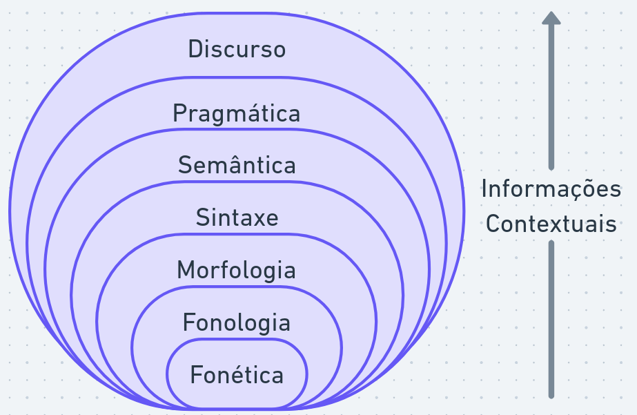

# Aula 2: palavras, morfemas e tokens

## Obtendo dados textuais

-   *Obtenção de dados textuais*
-   Pré-processamento
-   Exploração e modelagem
-   Interpretação e visualização

> Quais são fontes interessantes para estudos políticos?

Tipos de fontes de dados textuais:

-   *Banco de dados*: dados já organizados e estruturados para análise.

    Muitas vezes inclúem metadados (informações adicionais sobre os textos, ex: dada, interlocutor, local etc).

    Como o custo de manutenção é alto, o acesso geralmente é fechado para colaboradores.

-   *APIs*: interfaces de programação que permitem acessar dados textuais de forma automatizada, como APIs de redes sociais (Twitter, Facebook) e dados governamentais (dados.gov.br)

    O formato dos dados varia para cada fonte (JSON ou XML), mas geralmente inclui metadados e o texto em si.

    O acesso pode ser fechado (chave de API) ou limitado (limite de requisições por dia).

-   *Arquivos de texto*: dados em formato bruto, como arquivos de texto (TXT, CSV) e texto com formatação (Markdown, HTML, RTF)

    A leitura desses arquivos por programas é fácil, mas pode exigir pré-processamento para lidar com formatação e metadados.

-   *Arquivos não estruturados*: dados em formatos não estruturados, como PDFs, documentos Word, planilhas, imagens e vídeos.

    PDFs e imagens e vídeos podem ser convertidos em texto utilizando técnicas de OCR (Optical Character Recognition) ou transcrição automática.

    O processamento pode ser custoso e gerar ruídos.

-   *Web scraping*: extração de dados textuais de sites da internet utilizando ferramentas como `rvest` em R.

    O acesso é aberto, mas pode ser limitado por políticas de uso do site ou por medidas de segurança (CAPTCHA, bloqueio de IP).

    O formato dos dados varia para cada site e pode exigir pré-processamento para lidar com formatação e metadados. Alterações no site podem quebrar o processo de extração.

### Exemplo: Obtendo Discursos da Câmara dos Deputados

A Câmara dos Deputados disponibiliza um banco de dados de discursos em formato XML, que pode ser acessado por meio de uma API.

A documentação da API com exemplos está disponível em: <https://www2.camara.leg.br/transparencia/dados-abertos/dados-abertos-legislativo/webservices/sessoesreunioes-2>

Para isso, vamos utilizar a biblioteca `httr` para fazer requisições HTTP e as bibliotecas `xml2` e `tidyverse` para ler e manipular os dados XML.

```{r}
if (!"httr" %in% installed.packages()) {
  install.packages("httr")
}
if (!"xml2" %in% installed.packages()) {
  install.packages("xml2")
}
if (!"tidyverse" %in% installed.packages()) {
  install.packages("tidyverse")
}
library(httr)
library(xml2)
library(tidyverse)
```

Vamos obter os dados de sessões do mês de abril de 2025:

```{r}
data_inicial <- "01/04/2025"
data_final <- "30/04/2025"
codigo_sessao <- ""
parte_nome_parlamentar <- ""
sigla_partido <- ""
sigla_uf <- ""

url_base <- "https://www.camara.leg.br/sitcamaraws/SessoesReunioes.asmx/ListarDiscursosPlenario"

endereco <- str_c(url_base, 
                  "?codigoSessao=", codigo_sessao,
                  "&parteNomeParlamentar=", parte_nome_parlamentar,
                  "&siglaPartido=", sigla_partido,
                  "&siglaUF=", sigla_uf,
                  "&dataIni=", data_inicial,
                  "&dataFim=", data_final)

print(endereco)
```

-   Como a requisição a ser feita é do tipo GET, os parâmetros são passados na URL. O endereço completo da requisição é construído concatenando a URL base com os parâmetros utilizando a função `str_c` do pacote `stringr`.

```{r cache=TRUE}
dados_sessoes <- httr::GET(endereco) |>         # realizar requisição
  httr::content(as = "text") |>                 # obter resposta como texto
  xml2::read_xml() |>                           # ler texto como XML
  xml2::xml_find_all("//sessoesDiscursos") |>   # obter todos os elementos dentro de <sessoesDiscursos>
  xml2::as_list()                               # converter XML para lista

print(length(dados_sessoes))
```

Os dados incluem informações sobre as sessões, fases das sessões e discursos, incluindo metadados como nome do orador, partido, estado, hora de início do discurso, sumário do discurso etc.

Vamos inspecionar a lista gerada para entender a estrutura:

```{r}
dados_primeiro_discurso <- dados_sessoes[[1]]$sessao$fasesSessao[[1]]$discursos[[1]]

print(dados_primeiro_discurso)
```

Podemos transformar os dados em data frame (`tibble`) para facilitar a manipulação:

```{r}
df_sessoes <- dados_sessoes[[1]] |>
  map(as_tibble) |>   # converter cada elemento da lista em tibble
  bind_rows()         # combinar os tibbles em um único tibble

print(df_sessoes)
```

Como os dados estão aninhados (sessões \> fases \> discursos), precisamos expandir os dados em linhas e colunas:

```{r}
df_sessoes <- df_sessoes |>
  unnest_wider(fasesSessao, names_sep = '_') |>                  # expandir a dados de fases em colunas 
  unnest(fasesSessao_discursos) |>                               # expandir discursos em linhas
  unnest_wider(fasesSessao_discursos, names_sep = '_') |>        # expandir dados de discurso em colunas
  unnest_wider(fasesSessao_discursos_orador, names_sep = '_') |> # expandir dados de orador em colunas separadas
  mutate_all(compose(str_trim, unlist))                          # remover espaços em branco e converter listas em caracteres

print(df_sessoes)
```

Renomeando as colunas para facilitar a leitura:

```{r}
df_sessoes <- df_sessoes |>
  rename(
    text = fasesSessao_discursos_sumario,
    cod_sessao = fasesSessao_codigo,
    fase_sessao = fasesSessao_descricao,
    num_orador = fasesSessao_discursos_orador_numero,
    nome_orador = fasesSessao_discursos_orador_nome,
    partido_orador = fasesSessao_discursos_orador_partido,
    uf_orador = fasesSessao_discursos_orador_uf,
    hora_inicio_discurso = fasesSessao_discursos_horaInicioDiscurso,
    indexacao = fasesSessao_discursos_txtIndexacao,
    num_quarto = fasesSessao_discursos_numeroQuarto,
    num_insercao = fasesSessao_discursos_numeroInsercao
  ) |>
  mutate(
    doc_id = str_c(cod_sessao, num_quarto, num_orador, num_insercao, sep = "_")
  )

print(df_sessoes)
```

-   o padrão Text Interchange Formats (TIF) foi criado para padronizar objetos de análise textual (<https://github.com/ropenscilabs/tif>). Para seguir o padrão, armazenamos o texto principal (sumário do discurso) na coluna `text` e um identificador único de cada texto (combinação de sessao, quarto, orador e num_insercao) na coluna `doc_id`.

Algumas estatísticas básicas sobre os discursos:

```{r}
print(str_c("Número total de discursos: ", nrow(df_sessoes)))
print(str_c("Número total de oradores: ", n_distinct(df_sessoes$nome_orador)))
print(str_c("Número total de partidos: ", n_distinct(df_sessoes$partido_orador)))
print(str_c("Número total de estados: ", n_distinct(df_sessoes$uf_orador)))
```

Principais oradores:

```{r}
df_sessoes |>
  group_by(nome_orador) |>           # agrupar por nome do orador
  summarise(num_discursos = n()) |>  # contar número de discursos por orador
  arrange(desc(num_discursos)) |>    # ordenar por número de discursos em ordem decrescente
  head(5)                            # mostrar os 5 oradores com mais discursos
```

Principais partidos:

```{r}
df_sessoes |>
  group_by(partido_orador) |>        # agrupar por nome do partido
  summarise(num_discursos = n()) |>  # contar número de discursos por orador
  arrange(desc(num_discursos)) |>    # ordenar por número de discursos em ordem decrescente
  head(5)                            # mostrar os 5 oradores com mais discursos
```

Para facilitar novos processamentos, podemos salvar os dados em formato CSV:

```{r}
write_csv(df_sessoes, "data/dados_sessoes.csv")
```

Da mesma forma, podemos ler arquivos CSV utilizando a função `read_csv` do pacote `readr`, incluído na coleção `tidyverse`:

```{r}
df_sessoes <- read_csv("data/dados_sessoes.csv")
```

### Criando objeto corpus

*Corpus* é um termo utilizado para se referir a um conjunto de textos que serão analisados.

O corpus é a base para muitas análises de PLN, pois é a partir dele que os modelos aprendem padrões e estruturas da linguagem.

O termo *corpora* se refere à uma coleção de corpus.

A biblioteca `quanteda` possui diversas funções para criar e manipular corpora, como `corpus()`:

```{r}
if (!"quanteda" %in% installed.packages()) {
  install.packages("quanteda")
}
library(quanteda)
```

Por padrão, o corpus é criado utilizando a coluna `text` como texto principal e a coluna `doc_id` como identificador único de cada texto:

```{r}
corpus_sessoes <- corpus(df_sessoes, text_field = "text", docid_field = "doc_id")

print(corpus_sessoes)
```

Os metadados (informações adicionais sobre os textos) são armazenados como atributos do corpus e podem ser acessados utilizando a função `docvars()`:

```{r}
metadados <- corpus_sessoes |>
  docvars() |>                                   # obter metadados do corpus
  select(nome_orador, partido_orador, uf_orador) # selecionar colunas de interesse

print(head(metadados)) # head mostra as primeiras linhas do data frame
```

Assim como `filter`, podemos obter subconjuntos de `corpus_sessoes` com a função `corpus_subset()`:
```{r}
corpus_sessoes_pt <- corpus_subset(corpus_sessoes, partido_orador == "PT")

print(corpus_sessoes_pt)
```


A biblioteca `quanteda.textstats` possui diversas funções para calcular estatísticas de texto, como frequência de palavras, diversidade lexical, legibilidade etc.

```{r}
if (!"quanteda.textstats" %in% installed.packages()) {
  install.packages("quanteda.textstats")
}
library(quanteda.textstats)
```

Da mesma forma, `quatenda.textplots` possui diversas funções para visualização de texto, como nuvens de palavras, gráficos de frequência, gráficos de coocorrência etc.

```{r}
if (!"quanteda.textplots" %in% installed.packages()) {
  install.packages("quanteda.textplots")
}
library(quanteda.textplots)
```

A seguir, vamos utilizar `corpus_sessoes`, as bibliotecas `quanteda` e relacionadas para realizar as análises de palavras.

## Palavras, morfemas, lemas e stems

O estudo da língua é dividido em diversas subáreas:

{fig-align="center" width="60%"}

-   **fonética** e **fonologia**: sons e sua organização

-   **morfologia**: como mofemas se organizam para formar palavras

-   **sintaxe**: como palavras se organizam para formar sintagmas e orações

-   **semântica**: significado de palavras e frases

-   **pragmática**: organização de orações para fins comunicativos

-   **discurso**: estruturas do texto como todo

O estudo de PLN geralmente tem foco no *texto escrito* (e.g morfologia, sintaxe, semântica, discurso).

Porém, fonética e fonologia também são importantes para PLN, especialmente em tarefas que envolvem *fala* (e.g. reconhecimento de fala, síntese de fala).

Além disso, dada a natureza multimodal da análise de discurso a fala também é relevante. Por exemplo:

<iframe src="https://www.camara.leg.br/internet/sitaqweb/TextoHTML.asp?etapa=5&amp;nuSessao=64.2025&amp;nuQuarto=4327701&amp;nuOrador=1&amp;nuInsercao=1&amp;dtHorarioQuarto=09:32&amp;sgFaseSessao=BC&amp;Data=30/04/2025&amp;txApelido=Otoni%20de%20Paula&amp;txFaseSessao=Breves%20Comunica%C3%A7%C3%B5es&amp;txTipoSessao=Ordin%C3%A1ria%20-%20CD&amp;dtHoraQuarto=09:32&amp;txEtapa=" width="100%" height="400px" frameborder="0">

</iframe>

<https://www.camara.leg.br/internet/sitaqweb/TextoHTML.asp?etapa=5&nuSessao=64.2025&nuQuarto=4327701&nuOrador=1&nuInsercao=1&dtHorarioQuarto=09:32&sgFaseSessao=BC&Data=30/04/2025&txApelido=Otoni%20de%20Paula&txFaseSessao=Breves%20Comunica%C3%A7%C3%B5es&txTipoSessao=Ordin%C3%A1ria%20-%20CD&dtHoraQuarto=09:32&txEtapa=>

> Que tipo de informação é transmitida por meio da fala, além do conteúdo semântico? Quais estão destacadas no texto taquigrafado?

A unidade mínima de informação para PLN depende do nível de análise:

-   partes de palavras (como morfemas, lemas ou stems) são uteis para "unir" signicados entre palavras relacionadas
-   palavras são uteis para análise sintática e semântica
-   frases e parágrafos são uteis para análise de modelos de discurso

Por exemplo "beija-flor" e "escova de dente" podem ser consideradas palavras compostas ou não.

Na morfologia, a unidade mínima de significado é o **morfema**:

-   "casa" tem um morfema (casa)
-   "casas" tem dois morfemas (casa + s)
-   "casinha" tem dois morfemas (casa + inha)
-   "casinhas" tem três morfemas (casa + inha + s)

A **lematização** é o processo de reduzir uma palavra ao seu lema (ou forma canônica). Ex.:

-   "gatos" -\> "gato"
-   "gata" -\> "gato"
-   "gatinhas" -\> "gato"

A **stemização** é o processo (menos preciso) de reduzir uma palavra ao seu radical (ou raiz). Ex.:

-   "gatos" -\> "gat"
-   "gata" -\> "gat"
-   "gatinhas" -\> "gat"

### Obtendo informações morfológicas de palavras

Separar palavras em subunidades pode ser útil em análises:

-   dividir palavras compostas

-   tratar palavras novas ou desconhecidas

-   analisar palavras incorretas

-   avaliar complexidade do texto

Por exemplo, @moffitt2016 destaca o uso de neologismos em performances populistas (*refudiate* por Sarah Palin). Outros estudos comparam morfemas em diferentes estilos de texto, como jornalístico e literário.

A biblioteca `morphemepiece` é uma ferramenta para segmentação de palavras em morfemas da língua inglesa.

```{r}
if (!"morphemepiece" %in% installed.packages()) {
  install.packages("morphemepiece")
}
library(morphemepiece)

print(morphemepiece_tokenize("houses"))
print(morphemepiece_tokenize("orderly"))
print(morphemepiece_tokenize("paradoxical"))
print(morphemepiece_tokenize("discoursal"))
```

Existem ferramentas baseadas em dicionários e língua portuguesa do Brasil, por exemplo o projeto MorphoBR [https://github.com/LR-POR/MorphoBr](#0){.uri}

```         
echo "fortinho" | flookup -i morphobr.bin
fortinho    forte+N+DIM+M+SG
fortinho    forte+A+DIM+M+SG
```

-   lema: forte
-   N: nome
-   A: adjetivo
-   DIM: diminutivo
-   M: masculino
-   SG: singular

### Stemming

Stemming é um processo mais simples e menos preciso do que lematização, mas pode ser útil para algumas tarefas de PLN, como análise de sentimentos ou classificação de texto.

Exemplos utilizando a biblioteca `quanteda`:

```{r}
stems_testar <- char_wordstem(c("testar", "testando", "testarei"), language = "pt")

print(stems_testar)
```

```{r}
stems_love <- char_wordstem(c("love", "loving", "loved"), language = "en")

print(stems_love)
```

Stemming vai reduzir o vocabulário do texto, facilitando algumas análises de frequência, mas pode gerar ambiguidades e perder informações importantes sobre o significado das palavras.

### Caracteres

A menor unidade de informação em um texto _computacional_ (ou string) é o **caractere** (ou símbolo).

O padrão *Unicode* cataloga e codifica caracteres de diferentes linguagens, incluindo linguagens extintas como sumério e cuneiforme:

<iframe src="https://www.unicode.org/charts/" width="100%" height="500px" frameborder="0">

</iframe>

Ver: \<`https://www.unicode.org/charts/`{=html}\>

A **codificação (encoding)** de textos se refere a como os caracteres são representados em números binários no computador (bytes).

O padrão mais comum é o **UTF-8** que utiliza tamanho variável de caracteres.

A biblioteca `quanteda` possui funções para separação de caracteres, como `tokenize_character`:

```{r}
print(tokenize_character("avião = 飞机"))
print(tokenize_character("#feliz! \U0001f600"))
```

### Tokenização

Não há consenso sobre a definição de *palavra* na linguística. Em PLN, a separação do texto em palavras depende do contexto da aplicação.

O problema de separar palavras (ou unidades mínimas de significado) em um texto é conhecido como **tokenização** e é uma etapa fundamental para muitas tarefas de PLN.

Note que o problema não é muito simples. O chinês, por exemplo, não utiliza espaço para separar palavras e cada caractere representa um morfema.

A biblioteca `quanteda` possui a função `tokens()` para realizar a tokenização de um texto, com diversas opções para personalizar o processo:
```{r}
texto <- 'Ele disse: "Uh, são 13 horas. Não está na hora de almoçar?"'

tokens_padrao <- tokens(texto)

print(tokens_padrao)
```

```{r}
texto <- 'Ele disse: "Uh, são 13 horas. Não está na hora de almoçar?"'

tokens <- tokens(texto, remove_punct = TRUE, remove_numbers = TRUE)

print(tokens)
```

```{r}
texto <- 'Ele disse: "Uh, são 13 horas. Não está na hora de almoçar?". Não, ela disse.'

tokens <- tokens(texto, what = "sentence")

print(tokens)
```

A tokenização em palavras é útil para análise sintática e semântica, enquanto a tokenização em sentenças é útil para análise de modelos de discurso.

Em algumas aplicações, como modelos de linguagem, a tokenização é um processo essencial na contrução do **vocabulário**. O vocabulário é a coleção de todas as palavras conhecidas do modelo.

Uma estrutura útil npara análise de texto é a **matriz de documentos e termos (Document-Feature Matrix, DFM)**, que representa a frequência de cada palavra em cada documento:
```{r}
dfm_sessoes <- corpus_sessoes |>
  tokens(remove_punct = TRUE, remove_numbers = TRUE) |> # tokenizar texto
  tokens_tolower() |>                                   # converter palavras para minúsculo
  dfm()                                                 # criar matriz de documentos e termos

print(dfm_sessoes)
```

Cada linha é um documento e cada coluna é uma palavra. O valor em cada célula representa a frequência da palavra no documento.
```{r}
print(dfm_sessoes[3, "presidente"])
```

Por exemplo, para contar quantas vezes a palavra "presidente" é mencionada em todos os discursos, podemos somar os valores da coluna correspondente:
```{r}
sum(dfm_sessoes[, "presidente"])
```


### Byte Pair Encoding (BPE)

A divisão em simples palavras tem um problema com palavras desconhecidas (*out-of-vocabulary*).

Uma solução que busca o "meio-termo" entre a separação entre palavras e a separação entre caracteres é o **Byte Pair Encoding (BPE)**.

O BPE é um algoritmo de compressão de dados que pode ser adaptado para tokenização. Ele funciona substituindo pares caracteres mais frequentes por um token único, recursivamente, criando assim um vocabulário de subpalavras.

```{r}
if (!"tokenizers.bpe" %in% installed.packages()) {
  install.packages("tokenizers.bpe")
}
library(tokenizers.bpe)
```

```{r}
model <- bpe(
  df_sessoes$text,
  vocab_size = 200000,
  threads = 1,
  model_path = "data/bpe_tokenizer"
)
```

```{r}
bpe_encode(model, c("adultização", "adulto", "eleitoreado", "eleitor", "sexta-feira", "sextou"))
```

Note que os tokens gerados pelo BPE não necessáriamente correspontem "significados".

Porém, são muito útens em modelos que consideram sequências como entrada e modelos multi-línguas.

### Stopwords

**Stopwords** são palavras comuns que geralmente não carregam muito significado semântico, como "o", "a", "de", "e" em português. Elas são frequentemente removidas em tarefas de PLN para reduzir o ruído e melhorar a eficiência do modelo.

Uma prática comum no processamento de textos é remover as stopwords antes de realizar análises, como contagem de palavras ou análise de sentimentos.

Podemos encontrar listas de stopwords em português e outras línguas na Internet, por exemplo, utilizando o pacote `stopwords`.

```{r}
if (!"stopwords" %in% installed.packages()) {
  install.packages("stopwords")
}
library(stopwords)
```

```{r}
stopwords_portugues <- stopwords(language = "pt")

print(stopwords_portugues[1:10])
```

A remoção de stopwords pode não ser adequada para todas as tarefas, especialmente aquelas que dependem do contexto ou da estrutura do texto (análise sintática, partes de discurso, etc).

## Exemplo: Palavras mais Utilizadas em Discursos

Primeiro, vamos tokenizar os discursos utilizando a função `spacy_tokenize` e expandir os tokens em linhas utilizando a função `unnest` do pacote `tidyverse`:

```{r}
tokens_sessoes <- corpus_sessoes |>
  tokens(remove_punct = TRUE, remove_symbols = TRUE, remove_numbers = TRUE)
 
print(tokens_sessoes)
```

Agora vamos transformar todas as palavras em minúsculo e remover stopwords utilizando a função `tokens_remove`:

```{r}
stopwords_portugues <- stopwords(language = "pt")

tokens_sessoes <- tokens_sessoes |>
  tokens_tolower() |>
  tokens_remove(stopwords_portugues)

print(tokens_sessoes)
```

Agora vamos construir a DFM:
```{r}
dfm_sessoes <- dfm(tokens_sessoes)

print(dfm_sessoes)
```

Para extrair algumas estatísticas básicas, como as palavras mais comuns, podemos utilizar a função `topfeatures`:
```{r}
palavras_mais_comuns <- textstat_frequency(dfm_sessoes, n = 10)

print(palavras_mais_comuns)
```

Podemos remover mais palavras que não colaboram para a interpretação dos dados, da mesma forma que removemos stopwords:

```{r}
palavras_irrelevantes <- c("senhor", "senhora", "sobre", "presidente", "deputado", "deputada", "lei", "nº", "projeto", "é")

dfm_sessoes <- dfm_remove(dfm_sessoes, palavras_irrelevantes)

palavras_mais_comuns <- textstat_frequency(dfm_sessoes, n = 10)

print(palavras_mais_comuns)
```


```{r}
textplot_wordcloud(dfm_sessoes, max_words = 100)
```

Agrupando por partido:
```{r}
palavras_por_partido <- textstat_frequency(dfm_sessoes, n = 5, groups = partido_orador)

print(palavras_por_partido)
```

Para comparar as palavras mais comuns entre partidos, podemos utilizar a função `textplot_wordcloud` com o argumento `comparison = TRUE`:
```{r}
dfm_sessoes |>
  dfm_subset(partido_orador %in% c("PT", "PL")) |>       # filtrar partidos PT e PL
  dfm_group(groups = partido_orador) |>                  # agrupar por partido
  textplot_wordcloud(comparison = TRUE, max_words = 50)  # gerar wordcloud comparativo
```

## Para saber mais

Explore a documentação da API de dados abertos da Câmara dos Deputados: <https://www2.camara.leg.br/transparencia/dados-abertos/dados-abertos-legislativo/webservices/sessoesreunioes-2>.

Leia mais sobre morfemas, tokenização no Capítulo 2 do livro "Speech and Language Processing" [@jurafsky_speech_2026] e os Capítulos 4 e 5 do livro "Processamento de Linguagem Natural" [@processa2024].

Estude os tutoriais da biblioteca `quanteda` em <https://tutorials.quanteda.io/>. Saiba mais sobre a biblioteca lendo o artigo de @benoit2018.

## Atividade prática

1.  Obtenha os discursos do plenário da Câmara dos Deputados utilizando a API para um período de sua escolha.
2.  Realize a tokenização e remova stopwords dos discursos.
3.  Conte as palavras mais comuns e visualize os resultados utilizando uma nuvem de palavras (word cloud).
4.  Compare as palavras mais comuns entre diferentes partidos ou oradores.
5.  Utilize o argumento `groups` para construir o `dfm(..., groups = "partido_orador")` e `textplot_wordcloud(..., comparison = TRUE)` para gerar wordclouds comparativos.
