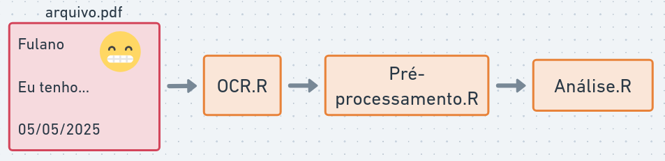
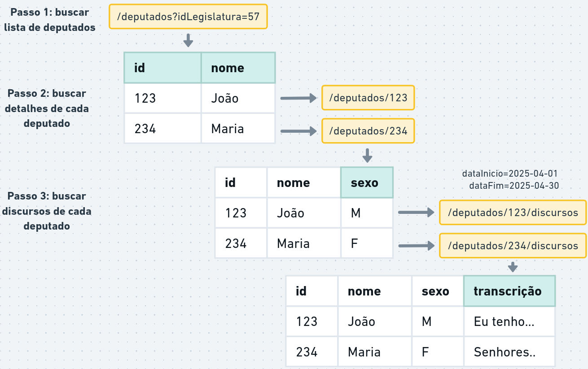

# Palavras, morfemas e tokens

::: callout-note
## Nesta aula

-   Otendo dados textuais

-   Biblioteca *quanteda*

-   Palavras, morfemas e tokens

-   *Stopwords* (Palavras vazias)

-   *Keyword-in-context* (Palavras em contexto)

Link para Google Colab: TODO
:::

## Obtendo dados textuais


> Quais são as fontes de textos interessantes para estudos políticos?

### Tipos de fontes de dados textuais

#### Banco de dados

-   São coleções onde os textos já vêm organizados e prontos para análise.

-   Eles costumam incluir "metadados", que são informações valiosas de contexto sobre o texto (como a data, quem falou, o partido e o local).

-   O acesso pode ser restrito por conta do alto custo de manutenção dessas plataformas.


#### APIs (Interface de Programação de Aplicações)

-   São ferramentas que nos permitem extrair dados de redes sociais e sites do governo (como o dados.gov.br) de forma automática.

-   O acesso pode exigir um cadastro prévio ou ter um limite de buscas por dia.

-   O formato dos dados varia para cada fonte (JSON ou XML).


#### Arquivos de texto

-   Formatos brutos (como planilhas CSV e arquivos TXT) que são muito fáceis de serem lidos pelo computador.

-   No entanto, eles são estáticos e podem precisar de ajustes manuais de formatação.


#### Arquivos não estruturados

-   Documentos em PDF, Word, imagens e vídeos. O conteúdo de imagens e vídeos pode ser transformado em texto através de técnicas de transcrição automática.

-   O processamento pode ser custoso e gerar ruídos.



#### Web scraping

-   Extração de textos diretamente das páginas da internet utilizando ferramentas automatizadas.

-   O formato dos dados muda de site para site e exige preparação prévia para organizar as informações.

-   Se os criadores do site mudarem o layout da página, o processo de coleta pode parar de funcionar.


### Exemplo: Obtendo Discursos da Câmara dos Deputados

A Câmara dos Deputados disponibiliza dados de discursos por meio de um sistema automatizado (API).

A documentação da API com exemplos está disponível em: <https://dadosabertos.camara.leg.br/>

Para baixar e organizar esses dados, utilizamos pacotes da linguagem R:

-   `httr2` para fazer requisições na API

-   `tidyverse` para organizar e tratar os dados

```{r}
if (!"tidyverse" %in% installed.packages()) {
  install.packages("tidyverse")
}
library(tidyverse)

if (!"httr2" %in% installed.packages()) {
  install.packages("httr2")
}
library(httr2)
```

{width="100%"}

Primeiro, vamos montar uma requisição (função `request`) para obter dados dos deputados na legislatura 57 (atual):

```{r}
url_api <- "https://dadosabertos.camara.leg.br/"

requisicao_deputados <- request(url_api) |>
  req_url_path("api", "v2", "deputados") |>
  req_url_query(
    idLegislatura = 57, # número da legislatura
    nome = "",          # parte do nome
    siglaUF = "",       # sigla UF eleito
    siglaPartido = "",  # sigla do partido
    siglaSexo = "",     # sexo (M ou F)
  )

print(requisicao_deputados)
```

Executamos a requisição (`req_perform`) para obter a resposta do serviço de dados abertos:

```{r cache=TRUE}
resp_deputados <- req_perform(requisicao_deputados)

print(resp_deputados)
```

Os dados retornados estão no formato JSON, que é representado no R como uma lista aninhada (lista com elementos de lista).

```{r}
dados_resposta <- resp_body_json(resp_deputados)
dados_resposta <- dados_resposta$dados   # acessa elemento "dados" da lista

print(length(dados_resposta))     # número de elementos
print(dados_resposta[[1]])  # primeiro elemento
```

-   `$dados` acesso o elemento "dados" da lista, `[[1]]` acessa o primeiro elemento da lista.

Transformamos a lista em dataframe com o código comentado abaixo:

```{r}
df_deputados_partido <- dados_resposta |>
  tibble() |>                               # transformar em dataframe
  unnest_wider("dados_resposta") |>         # desaninhar em colunas
  select(                                   # seleciona colunas relevantes
    id,
    nome,
    uf = siglaUf,
    partido = siglaPartido,
    uri
  )

head(df_deputados_partido) # head mostra as primeiras linhas do data frame
```

Note que existem repetições, quando um deputado pertenceu a mais de um partido:

```{r}
deputados_multiplos_partidos <- df_deputados_partido |>
  group_by(nome) |>  # agrupar por nome
  filter(n() > 1)    # filtrar grupos com mais de um elemento

head(deputados_multiplos_partidos)
```

A coluna `uri` contém o endereço para buscarmos detalhes sobre o deputado, como sexo, data de nascimento, situação atual, etc.

Para cada deputado, vamos fazer a requisição que retorna os detalhes. Para isso, vamos mapear cada elemento da coluna `uri` em uma requisição:

```{r cache=TRUE}
df_deputados_detalhes <- df_deputados_partido |>
  mutate(req_detalhes = map(uri, request)) |>                # montar requisições
  mutate(resp_detalhes = req_perform_parallel(req_detalhes)) # buscar detalhes e armazena a resposta na coluna resp_detalhes

head(df_deputados_detalhes)
```

-   `req_perform_parallel` executa múltiplas requisições em paralelo (cada requisição da coluna `req_detalhes`).

Vamos extrair os detalhes da coluna `resp_detalhes` e organizar os dados na tabela.

```{r}
df_deputados <- df_deputados_detalhes |>
  mutate(detalhes = map(resp_detalhes, resp_body_json)) |>            # ler dados da resposta
  unnest_wider(detalhes) |> unnest_wider("dados", names_sep = "_") |> # desaninhar coluna "dados" (novas colunas são nomeadas dados_)
  unnest_wider("dados_ultimoStatus", names_sep = "_") |>              # desaninhar ultimoStatus
  select(                                                             # selecionar colunas
    # colunas antigas
    colnames(df_deputados_partido),
    # novas colunas
    nome_civil = dados_nomeCivil,
    sexo = dados_sexo,
    cpf = dados_cpf,
    data_nascimento = dados_dataNascimento,
    data_falecimento = dados_dataFalecimento,
    uf_nascimento = dados_ufNascimento,
    municipio_nascimento = dados_municipioNascimento,
    escolaridade = dados_escolaridade,
    situacao = dados_ultimoStatus_situacao,
    data_situacao = dados_ultimoStatus_data,
    ultimo_partido = dados_ultimoStatus_siglaPartido
  ) |>
  filter(partido == ultimo_partido) |>   # considerar apenas último partido
  distinct()                             # filtrar dados duplicados

head(df_deputados)
```

Para obter os discursos, vamos definir uma função que monta a requisição para um deputado (por número identificador):

```{r}
req_discursos_deputado <- function(id_deputado) {
  req <- request(url_api) |>
    req_url_path("api", "v2", "deputados", id_deputado, "discursos") |>
    req_url_query(
      dataInicio = "2025-04-01",
      dataFim = "2025-04-30",
      itens=100
    )
  return(req)
}

print(req_discursos_deputado(160575))
```

Da mesma forma que obtemos os dados dos deputados, vamos fazer requisições para obter discursos de cada deputado:

```{r cache=TRUE}
df_discursos <- df_deputados |>
  mutate(req_discursos = map(id, req_discursos_deputado)) |>      # montar a requisição chamando req_discursos_deputado para cada id
  mutate(resp_discursos = req_perform_parallel(req_discursos)) |> # executar requisições em paralelo
  mutate(dados_discursos = map(resp_discursos, resp_body_json))   # ler dados das respostas

print(df_discursos$dados_discursos[[2]])
```

Por fim, vamos extrair dos dados em colunas:

```{r}
df_discursos <- df_discursos |>
  unnest_wider(dados_discursos) |>             # desaninhar resposta em colunas (dados e links)
  unnest(dados) |>                             # desaninhar dados de discursos em linha (um discurso por linha)
  unnest_wider(dados) |>                       # desaninhar dados em colunas
  unnest_wider(faseEvento, names_sep = "_") |> # desaninhar "faseEvento"
  select(
    # colunas anteriores
    colnames(df_deputados),
    # novas colunas
    hora_inicio = dataHoraInicio,
    fase_evento = faseEvento_titulo,
    tipo_discurso = tipoDiscurso,
    keywords,
    sumario,
    transcricao
  )

head(df_discursos)
```

Por fim, podemos extrair estatísticas sobre os oradores e salvar os dados em uma planilha CSV para usos futuros.

```{r}
print(str_c("Número total de discursos: ", nrow(df_discursos)))
print(str_c("Número total de oradores: ", df_discursos |> select(nome) |> n_distinct()))
print(str_c("Número total de partidos: ", df_discursos |> select(partido) |> n_distinct()))
print(str_c("Número total de estados: ", df_discursos |> select(uf) |> n_distinct()))
```

Principais oradores:

```{r}
df_discursos |>
  group_by(nome) |>  # agrupar por nome do orador
  count(sort = TRUE) # contar e ordenar
```

Principais partidos:

```{r}
df_discursos |>
  group_by(partido) |>  # agrupar por partido do orador
  count(sort = TRUE)    # contar e ordenar
```

Para facilitar novos processamentos, podemos salvar os dados em formato CSV:

```{r}
write_csv(df_discursos, "discursos.csv")
```

Da mesma forma, podemos ler arquivos CSV utilizando a função `read_csv` do pacote `readr`, incluído na coleção `tidyverse`:

```{r}
df_discursos <- read_csv("discursos.csv")
```

#### Criando o corpus

Na análise de textos, chamamos de **corpus** o conjunto de textos que vamos estudar.

É a partir dele que os programas de computador identificam padrões na linguagem.

Quando temos várias coleções, utilizamos o termo **corpora**.

A biblioteca `quanteda` do R possui diversas funções para criar e manipular esse material.

```{r}
if (!"quanteda" %in% installed.packages()) {
  install.packages("quanteda")
}
library(quanteda)
```

O corpus é criado a partir de uma tabela (data frame) especificando o texto principal (`text`) e uma coluna (`doc_id`) como identificador único de cada texto:

```{r}
num_discurso <- 1:nrow(df_discursos)

df_discursos <- df_discursos |>
  mutate(doc_id = str_c(num_discurso, nome, hora_inicio, sep = " "))  # concatenar "nome", "hora início"

corpus_discursos <- corpus(df_discursos, text_field = "transcricao", docid_field = "doc_id")

print(corpus_discursos)
```

As informações extras sobre os textos (os metadados, como nome do orador e partido) ficam salvas junto com o corpus e podem ser consultadas facilmente utilizando a função `docvars()`:

```{r}
metadados <- corpus_discursos |>
  docvars() |>              # obter metadados do corpus
  select(nome, partido, uf) # selecionar colunas de interesse

head(metadados)
```

Assim como `filter`, podemos obter subconjuntos de `corpus_discursos` com a função `corpus_subset()`:

```{r}
corpus_discursos_pt <- corpus_discursos |>
  corpus_subset(partido == "PT")

print(corpus_discursos_pt)
```

Outras bibliotecas relacionadas que vamos utilizar são: `quanteda.textstats`, para gerar estatísticas a partir de corpus, e `quatenda.textplots`, para visualizações gráficas como núvens de palavras.

```{r}
if (!"quanteda.textstats" %in% installed.packages()) {
  install.packages("quanteda.textstats")
}
library(quanteda.textstats)

if (!"quanteda.textplots" %in% installed.packages()) {
  install.packages("quanteda.textplots")
}
library(quanteda.textplots)
```

## Níveis de análise textual

O estudo da língua é dividido em diversas subáreas:

{fig-align="center" width="60%"}

-   **fonética** e **fonologia**: sons e sua organização

-   **morfologia**: como mofemas se organizam para formar palavras

-   **sintaxe**: como palavras se organizam para formar sintagmas e orações

-   **semântica**: significado de palavras e frases

-   **pragmática**: organização de orações para fins comunicativos

-   **discurso**: estruturas do texto como todo

O processamento de textos pelo computador foca principalmente no texto escrito (sintaxe, semântica e discurso).

Contudo, a fala e a entonação também são importantes, principalmente em estudos que envolvem áudio.

Além disso, dada a natureza multimodal da análise de discurso a fala também é relevante. Por exemplo:

<iframe src="https://www.camara.leg.br/internet/sitaqweb/TextoHTML.asp?etapa=5&amp;nuSessao=64.2025&amp;nuQuarto=4327701&amp;nuOrador=1&amp;nuInsercao=1&amp;dtHorarioQuarto=09:32&amp;sgFaseSessao=BC&amp;Data=30/04/2025&amp;txApelido=Otoni%20de%20Paula&amp;txFaseSessao=Breves%20Comunica%C3%A7%C3%B5es&amp;txTipoSessao=Ordin%C3%A1ria%20-%20CD&amp;dtHoraQuarto=09:32&amp;txEtapa=" width="100%" height="400px" frameborder="0">

</iframe>

<https://www.camara.leg.br/internet/sitaqweb/TextoHTML.asp?etapa=5&nuSessao=64.2025&nuQuarto=4327701&nuOrador=1&nuInsercao=1&dtHorarioQuarto=09:32&sgFaseSessao=BC&Data=30/04/2025&txApelido=Otoni%20de%20Paula&txFaseSessao=Breves%20Comunica%C3%A7%C3%B5es&txTipoSessao=Ordin%C3%A1ria%20-%20CD&dtHoraQuarto=09:32&txEtapa=>

> Que tipo de informação é transmitida por meio da fala, além do conteúdo semântico? Quais estão destacadas no texto taquigrafado?

## A estrutura das palavras: morfemas, lemas e radicais

A forma como dividimos o texto depende do nível da nossa análise:

-   partes de palavras: palavras relacionadas e significados
-   palavras: análise sintática e semântica
-   frases e parágrafos: entidades e modelos de discurso

Separar palavras em subunidades pode ser útil para:

-   neologismos, palavras incorretas ou desconhecidas
-   complexidade do texto
-   regionalismos e dialetos antigos
-   generos literários alternativos (poemas, músicas etc)

Por exemplo, @moffitt2016 destaca o uso de neologismos em performances populistas (*refudiate* por Sarah Palin). Outros estudos comparam morfemas em diferentes estilos de texto, como jornalístico e literário.

### Morfemas

Na morfologia, a unidade mínima de significado é o **morfema**:

-   "casa" tem um morfema (casa)
-   "casas" tem dois morfemas (casa + s)
-   "casinha" tem dois morfemas (casa + inha)
-   "casinhas" tem três morfemas (casa + inha + s)

A biblioteca `morphemepiece` possui funções para segmentação de palavras em morfemas da língua inglesa.

```{r}
if (!"morphemepiece" %in% installed.packages()) {
  install.packages("morphemepiece")
}
library(morphemepiece)
```

Exemplos de uso:

```{r}
print(morphemepiece_tokenize("houses"))
print(morphemepiece_tokenize("orderly"))
print(morphemepiece_tokenize("paradoxicity"))
print(morphemepiece_tokenize("discoursal"))
```

Existem ferramentas baseadas em dicionários e língua portuguesa do Brasil, por exemplo o projeto MorphoBR [https://github.com/LR-POR/MorphoBr](#0){.uri}

```         
echo "fortinho" | flookup -i morphobr.bin
fortinho    forte+N+DIM+M+SG
fortinho    forte+A+DIM+M+SG
```

-   lema: forte
-   N: nome
-   A: adjetivo
-   DIM: diminutivo
-   M: masculino
-   SG: singular

### Stemização (Corte do radical)

A **stemização** é o processo de reduzir uma palavra ao seu radical (ou raiz).

Exemplos utilizando a biblioteca `quanteda`:

```{r}
stems_testar <- char_wordstem(c("testar", "testando", "testarei"), language = "portuguese")

print(stems_testar)
```

```{r}
stems_love <- char_wordstem(c("love", "loving", "loved"), language = "english")

print(stems_love)
```

Stemming pode ser útil para algumas tarefas de PLN, como análise de sentimentos ou classificação de texto.

Stemming vai reduzir o vocabulário do texto, facilitando também análises de frequência.

Porém, os radicais gerados pode gerar ambiguidades e perder informações importantes sobre o significado das palavras.

A **lematização** é o processo (mais preciso) de reduzir uma palavra à sua forma original de dicionário (ex: "gatos" e "gata" são convertidos para "gato").

### Caracteres

A menor unidade de informação em um texto digital é o **caractere** (ou símbolo).

O computador usa códigos, como o padrão Unicode, para entender e catalogar caracteres de todas as linguagens.

<iframe src="https://www.unicode.org/charts/" width="100%" height="500px" frameborder="0">

</iframe>

Ver: \<`https://www.unicode.org/charts/`{=html}\>

A **codificação (encoding)** de textos se refere a como os caracteres são representados em números binários no computador (bytes).

O padrão mais comum é o **UTF-8** que utiliza tamanho variável de caracteres.

A biblioteca `quanteda` possui funções para separação de caracteres, como `tokenize_character`:

```{r}
print(tokenize_character("avião = 飞机"))
print(tokenize_character("#feliz! \U0001f600"))
```

## Tokenização (Dividindo o texto)

Não há consenso sobre a definição de *palavra* na linguística. Em PLN, a separação do texto em palavras depende do contexto da aplicação.

O problema de separar palavras (ou unidades mínimas de significado) em um texto é conhecido como **tokenização** e é uma etapa fundamental para muitas tarefas de PLN.

Note que o problema não é muito simples. O chinês, por exemplo, não utiliza espaço para separar palavras e cada caractere representa um morfema.

A biblioteca `quanteda` possui a função `tokens()` para realizar a tokenização de um texto, com diversas opções para personalizar o processo:

```{r}
texto <- 'Ele disse: "Uh, são 13 horas. Não está na hora de almoçar?"'

tokens_padrao <- tokens(texto)

print(tokens_padrao)
```

```{r}
texto <- 'Ele disse: "Uh, são 13 horas. Não está na hora de almoçar?"'

tokens <- tokens(texto, remove_punct = TRUE, remove_numbers = TRUE)

print(tokens)
```

```{r}
texto <- 'Ele disse: "Uh, são 13 horas. Não está na hora de almoçar?". Não, ela disse.'

tokens <- tokens(texto, what = "sentence")

print(tokens)
```

A tokenização em palavras é útil para análise sintática e semântica, enquanto a tokenização em sentenças é útil para análise de modelos de discurso.

```{r}
tokens_discursos <- corpus_discursos |>
  tokens(remove_punct = TRUE, remove_numbers = TRUE) |> # tokenizar texto
  tokens_tolower()

tokens_discursos
```

Em algumas aplicações, como modelos de linguagem, a tokenização é um processo essencial na contrução do vocabulário. O **vocabulário** é a coleção de todas as palavras conhecidas (em geral, do texto ou do modelo).

Uma estrutura útil npara análise de texto é a **matriz de documentos e termos (Document-Feature Matrix, DFM)**, que representa a frequência de cada palavra em cada documento:

```{r}
dfm_discursos <- corpus_discursos |>
  tokens(remove_punct = TRUE, remove_numbers = TRUE) |> # tokenizar texto
  tokens_tolower() |>                                   # converter palavras para minúsculo
  dfm()                                                 # criar matriz de documentos e termos

dfm_discursos
```

Cada linha é um documento e cada coluna é uma palavra. O valor em cada célula representa a frequência da palavra no documento.

```{r}
print(dfm_discursos[6, "presidente"])
```

Por exemplo, para contar quantas vezes a palavra "presidente" é mencionada em todos os discursos, podemos somar os valores da coluna correspondente:

```{r}
print(dfm_discursos[, "presidente"])
print(sum(dfm_discursos[, "presidente"]))
```

## Stopwords

**Stopwords** são palavras comuns que geralmente não carregam muito significado semântico, como "o", "a", "de", "e" em português. Elas são frequentemente removidas em tarefas de PLN para reduzir o ruído e melhorar a eficiência do modelo.

Uma prática comum no processamento de textos é remover as stopwords antes de realizar análises, como contagem de palavras ou análise de sentimentos.

Podemos encontrar listas de stopwords em português e outras línguas na Internet, por exemplo, utilizando o pacote `stopwords`.

```{r}
if (!"stopwords" %in% installed.packages()) {
  install.packages("stopwords")
}
library(stopwords)
```

```{r}
stopwords_portugues <- stopwords(language = "pt")

print(stopwords_portugues[1:10])
```

A remoção de stopwords pode não ser adequada para todas as tarefas, especialmente aquelas que dependem do contexto ou da estrutura do texto (análise sintática, reconhecimento de entidades, etc).

## Palavras no contexto (Keywords-in-context)

**Keywords-in-context (KWIC)** é um método de indexação que busca uma palavra juntamente com seu contexto.

O **contexto** se refere à palavras próximas. O tamanho do contexto é o número de palavras antes e depois.

```{r}
kwic_anistia <- corpus_discursos |>
  tokens() |>
  kwic("anistia") |>
  head(15) 

kwic_anistia
```

-   ser ve para analisar termos específicos e seu significado no texto

-   é útil para analisar marcadores de discurso (ex: porque, assim, portanto, etc) e identificar estratégias e intensões

-   desvantagem: o tamanho do contexto é limitado

```{r}
golp_kwic <- corpus_discursos |>
  tokens() |>
  kwic("golp*", window = 3) |>
  head(15)

golp_kwic
```

```{r}
kwic_defendeu_acusou <- corpus_discursos |>
  tokens() |>
  kwic(c("portanto", "dessa forma", "assim", "porém")) |>
  head(15)

kwic_defendeu_acusou
```

```{r}
kwic_nomes <- corpus_discursos |>
  head(n = 50) |>
  tokens() |>
  kwic(phrase("Deputad[ao] [A-Z][a-z]+ [A-Z][a-z]+"), valuetype = "regex", case_insensitive = FALSE)

kwic_nomes
```

## Exemplo: Palavras mais Utilizadas em Discursos

Primeiro, vamos tokenizar os discursos utilizando a função `tokens`:

```{r}
tokens_discursos <- corpus_discursos |>
  tokens(remove_punct = TRUE, remove_symbols = TRUE, remove_numbers = TRUE)
 
tokens_discursos
```

Agora vamos transformar todas as palavras em minúsculo e remover *stopwords* utilizando a função `tokens_remove`:

```{r}
stopwords_portugues <- stopwords(language = "pt")

tokens_discursos <- tokens_discursos |>
  tokens_tolower() |>
  tokens_remove(stopwords_portugues)

print(tokens_discursos)
```

Agora vamos construir a DFM:

```{r}
dfm_discursos <- dfm(tokens_discursos)

print(dfm_discursos)
```

Para extrair algumas estatísticas básicas, como as palavras mais comuns, podemos utilizar a função `topfeatures`:

```{r}
palavras_mais_comuns <- dfm_discursos |>
  textstat_frequency(n = 10)

palavras_mais_comuns
```

Podemos remover mais palavras que não colaboram para a interpretação dos dados, da mesma forma que removemos stopwords:

```{r}
partidos <- docvars(dfm_discursos) |> select(partido) |> distinct() |> pull()
estados <- docvars(dfm_discursos) |> select(uf) |> distinct() |> pull()

palavras_irrelevantes <- c("senhor", "sr", "senhora", "sra", "sobre", "presidente", "deputado", "deputada", "lei", "nº", "projeto", "é", "bloco", partidos, estados)

dfm_discursos <- dfm_discursos |>
  dfm_remove(palavras_irrelevantes)

palavras_mais_comuns <- dfm_discursos |>
  textstat_frequency(n = 10)

palavras_mais_comuns
```

```{r}
suppressWarnings({ # desabilitar mensagens de aviso (warning)

dfm_discursos |>
  textplot_wordcloud()

})
```

```{r}
suppressWarnings({ # desabilitar mensagens de aviso (warning)

dfm_discursos |>
  dfm_weight("logcount") |>  # aplicar logaritmo às contagens
  textplot_wordcloud(max_words = 200)

})
```

Aplicando stematização:

```{r}
suppressWarnings({ # desabilitar mensagens de aviso (warning)

dfm_discursos |>
  dfm_wordstem(language = "portuguese") |>
  textplot_wordcloud(max_words = 100)

})
```

Agrupando por partido:

```{r}
palavras_por_partido <- dfm_discursos |>
  textstat_frequency(n = 5, groups = partido)

palavras_por_partido
```

Para comparar as palavras mais comuns entre partidos, podemos utilizar a função `textplot_wordcloud` com o argumento `comparison = TRUE`:

```{r}
suppressWarnings({ # desabilitar mensagens de aviso (warning)

dfm_discursos |>
  dfm_subset(partido %in% c("PT", "PL")) |>       # filtrar partidos PT e PL
  dfm_group(groups = partido) |>                  # agrupar por partido
  textplot_wordcloud(comparison = TRUE, color = c("blue", "red"), min_count = 2)  # gerar wordcloud comparativo

})
```

## Para saber mais

Explore a documentação da API de dados abertos da Câmara dos Deputados: <https://www2.camara.leg.br/transparencia/dados-abertos/dados-abertos-legislativo/webservices/sessoesreunioes-2>.

Leia mais sobre morfemas, tokenização no Capítulo 2 do livro "Speech and Language Processing" [@jurafsky_speech_2026] e os Capítulos 4 e 5 do livro "Processamento de Linguagem Natural" [@processa2024].

Estude os tutoriais da biblioteca `quanteda` em <https://tutorials.quanteda.io/>. Saiba mais sobre a biblioteca lendo o artigo de @benoit2018.

## Atividade prática

1.  Obtenha os discursos do plenário da Câmara dos Deputados utilizando a API para um período de sua escolha.
2.  Realize a tokenização e remova stopwords dos discursos.
3.  Conte as palavras mais comuns e visualize os resultados utilizando uma nuvem de palavras (word cloud).
4.  Compare as palavras mais comuns entre diferentes gêneros de oradores.
5.  Utilize o argumento `groups` para construir o `dfm(..., groups = "partido_orador")` e `textplot_wordcloud(..., comparison = TRUE)` para gerar wordclouds comparativos.
