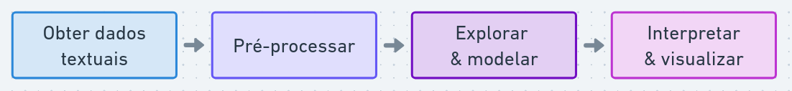
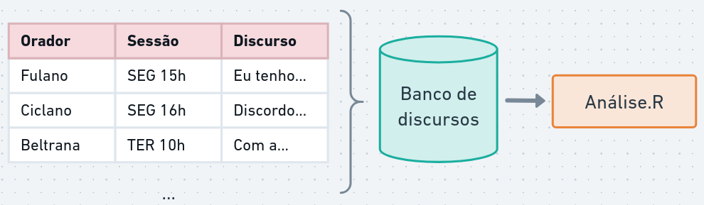
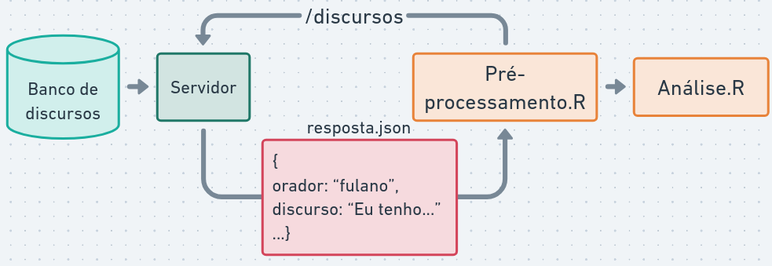
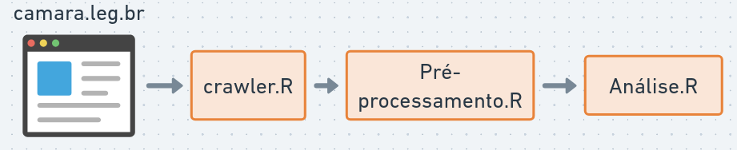
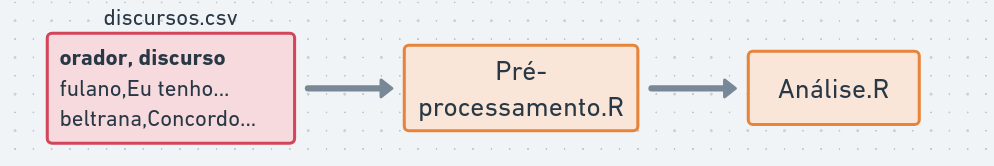
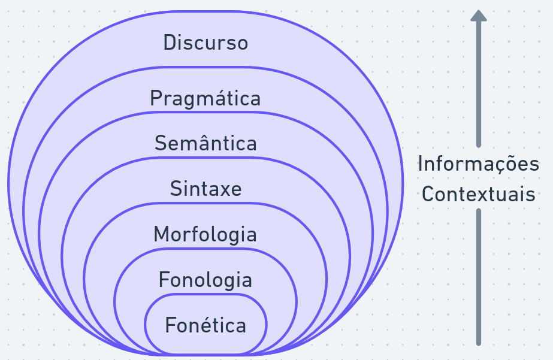

# Palavras, morfemas e tokens

::: callout-note
## Nesta aula

-   Fontes de dados textuais para política.
-   O conceito de **Corpus** e a biblioteca *quanteda*.
-   Níveis de análise: de caracteres a discursos.
-   Processamento básico: Tokenização, *Stopwords* e *Stemming*.
-   Exploração inicial: *Keyword-in-context* (KWIC) e Nuvens de Palavras.

Link para o Google Colab: <https://colab.research.google.com/drive/1bOM77Nea3m4OLQSDMUz4k-yj9Qq9q0Zk>
:::

```{r}
# instalando pacotes utilizados nesta aula
if (!"tidyverse" %in% installed.packages()) {
  install.packages("tidyverse")
}
if (!"quanteda" %in% installed.packages()) {
  install.packages("quanteda")
}
if (!"quanteda.textstats" %in% installed.packages()) {
  install.packages("quanteda.textstats")
}
if (!"quanteda.textplots" %in% installed.packages()) {
  install.packages("quanteda.textplots")
}
if (!"stopwords" %in% installed.packages()) {
  install.packages("stopwords")
}
```

## Obtendo dados textuais

Para realizar uma análise de discurso mediada por computador, o primeiro passo é transformar o material empírico (discursos, leis, posts em redes sociais) em um formato que o computador consiga processar.



> Quais são as fontes de textos interessantes para estudos políticos?

### Tipos de fontes de dados textuais

-   **Banco de dados e APIs**: Muitas instituições (como a Câmara dos Deputados) oferecem **APIs**, que permitem baixar dados automaticamente com **metadados** valiosos: quem falou, quando, partido, etc.



**APIs** permitem fazer requisições e coletar dados semi-estruturados (JSON ou XML).



**Web scraping e OCR**: Técnicas para extrair textos diretamente de sites ou PDFs. Útil quando os dados não estão organizados em bancos.



**Arquivos estruturados (CSV, Excel)**: Forma comum de trabalhar com dados já coletados.



### Exemplo: Carregando Discursos da Câmara

Nesta aula, para focar na análise textual, utilizaremos um conjunto de dados já extraído da API da Câmara dos Deputados, contendo discursos de parlamentares organizados em um arquivo CSV.

Para manipular esses dados, utilizaremos o pacote `tidyverse`, que é o padrão para organização de dados na linguagem R.

```{r}
#| message: false
library(tidyverse)

# Carregando os dados
df_discursos <- read_csv("discursos.csv")

# Visualizando as primeiras linhas e colunas mais relevantes
df_discursos |> select(nome, partido, uf, transcricao) |> head()
```

### Criando o corpus

Na análise de textos, chamamos de **corpus** o conjunto de documentos que pretendemos estudar. Um corpus não é apenas uma "pilha de textos", mas uma coleção organizada que preserva o vínculo entre o texto e seus **metadados** (as variáveis que contextualizam a fala, como o orador ou o partido).

Utilizaremos a biblioteca `quanteda`, uma das mais robustas para análise quantitativa de textos.

```{r}
#| message: false
library(quanteda)

# Criando um identificador único para cada discurso
df_discursos <- df_discursos |>
  mutate(doc_id = str_c(row_number(), nome, partido, sep = "_"))

# Criando o objeto de corpus
corpus_discursos <- corpus(df_discursos, 
                          text_field = "transcricao", 
                          docid_field = "doc_id")

summary(corpus_discursos, n = 5)
```

As informações extras (metadados) ficam armazenadas como **docvars** (variáveis de documento).

```{r}
docvars(corpus_discursos) |> head()
```

Podemos filtrar o corpus com base nelas, o que é essencial para análises comparativas em ciência política:

```{r}
# Exemplo: Criar um sub-corpus apenas com discursos de parlamentares do PT
corpus_pt <- corpus_subset(corpus_discursos, partido == "PT")
print(corpus_pt)
```

Outras bibliotecas relacionadas que vamos utilizar são: `quanteda.textstats`, para gerar estatísticas, e `quanteda.textplots`, para visualizações gráficas.

```{r}
#| message: false
library(quanteda.textstats)
library(quanteda.textplots)
```

## Níveis de análise textual

O estudo da língua é dividido em diversas subáreas:

{fig-align="center" width="60%"}

-   **fonética** e **fonologia**: sons e sua organização
-   **morfologia**: como morfemas se organizam para formar palavras
-   **sintaxe**: como palavras se organizam para formar sintagmas e orações
-   **semântica**: significado de palavras e frases
-   **pragmática**: organização de orações para fins comunicativos
-   **discurso**: estruturas do texto como todo

O processamento de textos pelo computador (PLN) foca principalmente no texto escrito (sintaxe, semântica e discurso). Contudo, a fala e a entonação também são vitais. Dada a natureza multimodal da análise de discurso, as marcas de oralidade carregam forte peso interpretativo.

Observe o exemplo abaixo das notas taquigráficas da Câmara:

<https://www.camara.leg.br/internet/sitaqweb/TextoHTML.asp?etapa=5&nuSessao=64.2025&nuQuarto=4327701&nuOrador=1&nuInsercao=1&dtHorarioQuarto=09:32&sgFaseSessao=BC&Data=30/04/2025>

> Que tipo de informação é transmitida por meio da fala, além do conteúdo semântico? A transcrição em texto consegue capturar sarcasmo, exaltação ou hesitação? Perceba como os taquígrafos utilizam parênteses e marcadores para tentar registrar reações do plenário.

## A estrutura das palavras: morfemas, lemas e radicais

A forma como dividimos o texto depende do objetivo da nossa análise. Separar palavras em subunidades pode ser útil para lidar com: - neologismos, palavras incorretas ou desconhecidas; - complexidade do texto ou dialetos; - generos literários alternativos.

Por exemplo, @moffitt2016 destaca o uso de neologismos em performances populistas. Na morfologia, a unidade mínima de significado é o **morfema** (ex: "casinhas" = casa + inha + s).

### Lematização e Anotação Morfossintática

A **lematização** é o processo de reduzir uma palavra à sua forma original de dicionário (seu "lema"). Por exemplo, "gatos" e "gata" são convertidos para "gato", e "fui" é convertido para o verbo "ir".

No português, esse processo é complexo e exige dicionários e ferramentas avançadas (como o projeto MorphoBR ou a biblioteca `spacyr`), pois depende do contexto (ex: "canto" pode ser o verbo cantar ou o substantivo).

Isso enriquece a análise de discurso ao agrupar flexões verbais e nominais sob um mesmo guarda-chuva.

### Stemização (Corte do radical)

Uma alternativa mais simples (e crua) muito usada computacionalmente é a **stemização** (Stemming), que é o processo de cortar as desinências da palavra, mantendo apenas o seu radical (raiz).

Isso reduz drasticamente o vocabulário do texto, facilitando análises de frequência, mas as palavras geradas podem ser ambíguas ou perder nuances de gênero/número que seriam relevantes para a análise.

Exemplo utilizando a biblioteca `quanteda`:

```{r}
stems_testar <- char_wordstem(c("testar", "testando", "testarei"), language = "portuguese")
print(stems_testar)
```

### Caracteres e Codificação

A menor unidade de informação em um texto digital é o **caractere** (ou símbolo). O computador usa padrões, como o **UTF-8**, para catalogar caracteres (incluindo emojis e acentuação gráfica, essenciais em português).

```{r}
print(tokenize_character("#feliz! \U0001f600"))
```

## Tokenização (Dividindo o texto)

O problema de separar o texto em unidades mínimas para análise é conhecido como **tokenização**. Em geral, quebramos os discursos em palavras, mas podemos tokenizar por frases se o objetivo for analisar sentenças inteiras.

```{r}
texto <- 'A deputada disse: "Não aceitaremos cortes". A oposição concordou.'

# Tokenização removendo pontuação
tokens_palavras <- tokens(texto, remove_punct = TRUE)
print(tokens_palavras)

# Tokenização por sentenças
tokens_frases <- tokens(texto, what = "sentence")
print(tokens_frases)
```

### A Matriz de Documentos e Termos (DFM)

Para o computador fazer contagens, ele precisa organizar os tokens em uma estrutura chamada **Matriz de Documentos e Termos (Document-Feature Matrix, DFM)**.

Pense no DFM como uma grande planilha: cada **linha** é um discurso e cada **coluna** é uma palavra do vocabulário. A célula contém a quantidade de vezes que aquela palavra apareceu naquele discurso.

```{r}
dfm_discursos <- corpus_discursos |>
  tokens(remove_punct = TRUE, remove_numbers = TRUE) |> 
  tokens_tolower() |>  # converter para minúsculo
  dfm()

print(dfm_discursos)
```

Por exemplo, para ver a frequência da palavra "presidente":

```{r}
print(sum(dfm_discursos[, "presidente"]))
```

A partir da DFM, podemos extrair estatísticas sobre os discursos, como `textstat_frequency` para contar palavras.

```{r}
dfm_discursos |>
  textstat_frequency() |>
  head(50)
```

Agrupando por partidos:

```{r}
dfm_discursos |>
  textstat_frequency(10, groups = partido)
```

## Stopwords

**Stopwords** são palavras funcionais muito comuns (como "o", "a", "de", "e", "mas") que, isoladamente, não ajudam a diferenciar os temas dos discursos. Elas são frequentemente removidas para reduzir o "ruído" nos gráficos e nas contagens.

No R, podemos usar o pacote `stopwords` para obter listas pré-definidas em português:

```{r}
#| message: false
library(stopwords)
stopwords_portugues <- stopwords(language = "portuguese")
print(stopwords_portugues[1:10])
```

> **Atenção:** A remoção de stopwords é ótima para descobrir os *temas* de um texto, mas pode ser problemática se você estiver analisando *estilos* ou *marcadores conversacionais* (o uso excessivo do pronome "nós" vs "eu", por exemplo, desapareceria se você os tratasse como stopwords).

Vamos ver a diferença nas frequências após remover as stopwords:

```{r}
dfm_discursos |>
  dfm_remove(stopwords_portugues) |>
  textstat_frequency(10, groups = partido)
```

## Palavras no contexto (Keywords-in-context)

**Keywords-in-context (KWIC)** é um método qualitativo excelente para a Análise de Discurso. Ele busca um termo específico e exibe a palavra central cercada pelas palavras que vêm antes e depois (o seu contexto).

Isso nos permite analisar os *enquadramentos* (frames) e *associações* feitas pelos oradores.

```{r}
# Buscando o termo "anistia" e observando 3 palavras de contexto
kwic_anistia <- corpus_discursos |>
  tokens() |>
  kwic("anistia", window = 3) |>
  head(10) 

kwic_anistia
```

Você também pode usar o curinga `*` para buscar variações (ex: "golp\*" pegará "golpe" e "golpista"):

```{r}
golp_kwic <- corpus_discursos |>
  tokens() |>
  kwic("golp*", window = 3) |>
  head(10)

golp_kwic
```

## Exemplo Prático: Nuvem de Palavras por Partido

Vamos consolidar tudo que aprendemos criando uma visualização que compara as palavras mais ditas pelos deputados do PT e do PL.

**Passo 1: Tokenização e Limpeza** Vamos quebrar em palavras, remover pontuação, converter para minúsculo e remover stopwords do português.

```{r}
tokens_limpos <- corpus_discursos |>
  tokens(remove_punct = TRUE, remove_symbols = TRUE, remove_numbers = TRUE) |>
  tokens_tolower() |>
  tokens_remove(stopwords(language = "portuguese"))
```

**Passo 2: Criando o DFM e removendo jargões políticos** O plenário da Câmara é cheio de vícios de linguagem ("senhor", "presidente", "deputado"). Se não os removermos, a nossa análise será engolida por eles.

```{r}
dfm_final <- dfm(tokens_limpos)

# Criando lista de palavras "irrelevantes" para o nosso contexto
palavras_irrelevantes <- c("senhor", "sr", "senhora", "sra", "sobre", "presidente", 
                           "deputado", "deputada", "lei", "nº", "projeto", "é", "nesta", "desta")

dfm_final <- dfm_final |> dfm_remove(palavras_irrelevantes)
```

```{r}
dfm_final |>
  textstat_frequency(10, groups = partido)
```

**Passo 3: Visualizando a Diferença (Wordcloud)** Wordclouds são visualizações úteis para análise de frequências. As palavras maiores representam os termos mais frequentes.

```{r}
#| warning: false
dfm_final |>
  textplot_wordcloud(max_words = 300)
```

```{r}
#| warning: false
dfm_final |>
  dfm_weight("logcount") |>
  textplot_wordcloud(max_words = 300)
```

Vamos filtrar os partidos de interesse, agrupar o DFM por partido e gerar a nuvem de comparação.

```{r}
#| warning: false
dfm_final |>
  dfm_remove(c("pt", "pl")) |>
  dfm_subset(partido %in% c("PT", "PL")) |>       # filtrar partidos 
  dfm_group(groups = partido) |>                  # agrupar matriz por partido
  textplot_wordcloud(comparison = TRUE,           # modo comparativo
                     color = c("red", "blue"),    # cores PT (red) e PL (blue)
                     min_count = 5,
                     max_words = 300)
```

## Para saber mais

-   Leia mais sobre morfemas, tokenização no Capítulo 2 do livro "Speech and Language Processing" [@jurafsky_speech_2026] e os Capítulos 4 e 5 do livro "Processamento de Linguagem Natural" [@processa2024].
-   Estude os tutoriais completos da biblioteca `quanteda` em <https://tutorials.quanteda.io/>. Saiba mais sobre a biblioteca lendo o artigo de @benoit2018.

## Estudos guidados

### Criando corpus a partir de uma planilha CSV

```{r}
library(tidyverse)
library(quanteda)
# caso não tenha as bibliotecas instaladas, execute install.packages(c("tidyverse", "quanteda"))

# Ler arquivo discursos_camara_abril_2025.csv (planilha) em uma tabela do R
# Imprimindo detalhes sobre a leitura do arquivo (show_col_types)
tabela_discursos <- read_csv("discursos_camara_abril_2025.csv", show_col_types = TRUE)

# Criar coluna identificador do texto "doc_id", contendo o nome e partido do discurso
tabela_discursos <- tabela_discursos |>
  mutate(doc_id = str_c(row_number(), nome, partido, sep = "_"))

# Criar corpus, indicando a coluna com texto (transcricao) e identificador (doc_id)
corpus_discursos <- corpus(
  tabela_discursos, 
  text_field = "transcricao", 
  docid_field = "doc_id"
)

# Imprimir um resumo do corpus carregado
print(corpus_discursos)
```

### Quebrando o corpus em palavras (tokens)

```{r}
library(tidyverse)
library(quanteda)
# caso não tenha as bibliotecas instaladas, execute install.packages(c("tidyverse", "quanteda"))

# Ler arquivo discursos_camara_abril_2025.csv (planilha) em uma tabela do R
tabela_discursos <- read_csv("discursos_camara_abril_2025.csv", show_col_types = FALSE)

# Criar coluna identificador do texto "doc_id", contendo o nome e partido do discurso
tabela_discursos <- tabela_discursos |>
  mutate(doc_id = str_c(row_number(), nome, partido, sep = "_"))

# Criar corpus, indicando a coluna com texto (transcricao) e identificador (doc_id)
corpus_discursos <- corpus(
  tabela_discursos, 
  text_field = "transcricao", 
  docid_field = "doc_id"
)

# Criar tokens
tokens_discursos <- corpus_discursos |>
  tokens()

# Imprimir tokens do primeiro discurso
print(tokens_discursos)
```

### Pré-processamento de tokens: removendo stopwords e stematização

```{r}
library(tidyverse)
library(quanteda)
library(stopwords)
# caso não tenha as bibliotecas instaladas, execute install.packages(c("tidyverse", "quanteda"))

# Ler arquivo discursos_camara_abril_2025.csv (planilha) em uma tabela do R
tabela_discursos <- read_csv("discursos_camara_abril_2025.csv", show_col_types = FALSE)

# Criar coluna identificador do texto "doc_id", contendo o nome e partido do discurso
tabela_discursos <- tabela_discursos |>
  mutate(doc_id = str_c(row_number(), nome, partido, sep = "_"))

# Criar corpus, indicando a coluna com texto (transcricao) e identificador (doc_id)
corpus_discursos <- corpus(
  tabela_discursos, 
  text_field = "transcricao", 
  docid_field = "doc_id"
)

# Criar lista de stopwords comuns em português
lista_stopwords <- stopwords("portuguese")

# Adicionar novas palavras comuns de discursos na lista de stopwords
lista_stopwords <- c(lista_stopwords, "é", "sr", "sra", "senhor", "senhora", "senhores", "senhoras", "obrigado", "obrigada", "presidente")

# Criar tokens:
# removendo pontuação (remove_punct), números (remove_numbers) e símbolos (remove_symbols)
# transformando tokens para minúsculo (tokens_tolower)
# removendo stopwords (tokens_remove)
# stematizando palavras (tokens_wordstem)
tokens_discursos <- corpus_discursos |>
  tokens(remove_punct = TRUE, remove_numbers = TRUE, remove_symbols = TRUE) |> 
  tokens_tolower() |>
  tokens_remove(lista_stopwords) |>
  tokens_wordstem(language = "portuguese")

# Imprimir tokens do primeiro discurso
print(tokens_discursos)
```

### Construindo DFM a partir de tokens:

```{r}
library(tidyverse)
library(quanteda)
library(quanteda.textstats)
library(stopwords)
# caso não tenha as bibliotecas instaladas, execute install.packages(c("tidyverse", "quanteda"))

# Ler arquivo discursos_camara_abril_2025.csv (planilha) em uma tabela do R
tabela_discursos <- read_csv("discursos_camara_abril_2025.csv", show_col_types = FALSE)

# Criar coluna identificador do texto "doc_id", contendo o nome e partido do discurso
tabela_discursos <- tabela_discursos |>
  mutate(doc_id = str_c(row_number(), nome, partido, sep = "_"))

# Criar corpus, indicando a coluna com texto (transcricao) e identificador (doc_id)
corpus_discursos <- corpus(
  tabela_discursos, 
  text_field = "transcricao", 
  docid_field = "doc_id"
)

# Criar lista de stopwords comuns em português
lista_stopwords <- stopwords("portuguese")

# Adicionar novas palavras comuns de discursos na lista de stopwords
lista_stopwords <- c(lista_stopwords, "é", "sr", "sra", "senhor", "senhora", "senhores", "senhoras", "obrigado", "obrigada", "presidente")

# Criar tokens:
# removendo pontuação (remove_punct), números (remove_numbers) e símbolos (remove_symbols)
# transformando tokens para minúsculo (tokens_tolower)
# removendo stopwords (tokens_remove)
tokens_discursos <- corpus_discursos |>
  tokens(remove_punct = TRUE, remove_numbers = TRUE, remove_symbols = TRUE) |> 
  tokens_tolower() |>
  tokens_remove(lista_stopwords)

# Construir DFM:
dfm_discursos <- dfm(tokens_discursos)

# Imprimir DFM:
print(dfm_discursos)
```

### Contando palavras mais utilizadas (em todos os discursos)

```{r}
library(tidyverse)
library(quanteda)
library(quanteda.textstats)
library(stopwords)
# caso não tenha as bibliotecas instaladas, execute install.packages(c("tidyverse", "quanteda"))

# Ler arquivo discursos_camara_abril_2025.csv (planilha) em uma tabela do R
tabela_discursos <- read_csv("discursos_camara_abril_2025.csv", show_col_types = FALSE)

# Criar coluna identificador do texto "doc_id", contendo o nome e partido do discurso
tabela_discursos <- tabela_discursos |>
  mutate(doc_id = str_c(row_number(), nome, partido, sep = "_"))

# Criar corpus, indicando a coluna com texto (transcricao) e identificador (doc_id)
corpus_discursos <- corpus(
  tabela_discursos, 
  text_field = "transcricao", 
  docid_field = "doc_id"
)

# Criar lista de stopwords comuns em português
lista_stopwords <- stopwords("portuguese")

# Adicionar novas palavras comuns de discursos na lista de stopwords
lista_stopwords <- c(lista_stopwords, "é", "sr", "sra", "senhor", "senhora", "senhores", "senhoras", "obrigado", "obrigada", "presidente")

# Criar tokens:
# removendo pontuação (remove_punct), números (remove_numbers) e símbolos (remove_symbols)
# transformando tokens para minúsculo (tokens_tolower)
# removendo stopwords (tokens_remove)
tokens_discursos <- corpus_discursos |>
  tokens(remove_punct = TRUE, remove_numbers = TRUE, remove_symbols = TRUE) |> 
  tokens_tolower() |>
  tokens_remove(lista_stopwords)

# Construir DFM:
dfm_discursos <- dfm(tokens_discursos)

# Construir tabela com 20 palavras mais utilizadas:
palavras_discursos <- dfm_discursos |>
  textstat_frequency(n = 20)

# Imprimir tabela:
print(palavras_discursos)
```

### Contando palavras mais utilizadas por grupos (ex: partido)

```{r}
library(tidyverse)
library(quanteda)
library(quanteda.textstats)
library(stopwords)
# caso não tenha as bibliotecas instaladas, execute install.packages(c("tidyverse", "quanteda"))

# Ler arquivo discursos_camara_abril_2025.csv (planilha) em uma tabela do R
tabela_discursos <- read_csv("discursos_camara_abril_2025.csv", show_col_types = FALSE)

# Criar coluna identificador do texto "doc_id", contendo o nome e partido do discurso
tabela_discursos <- tabela_discursos |>
  mutate(doc_id = str_c(row_number(), nome, partido, sep = "_"))

# Criar corpus, indicando a coluna com texto (transcricao) e identificador (doc_id)
corpus_discursos <- corpus(
  tabela_discursos, 
  text_field = "transcricao", 
  docid_field = "doc_id"
)

# Criar lista de stopwords comuns em português
lista_stopwords <- stopwords("portuguese")

# Adicionar novas palavras comuns de discursos na lista de stopwords
lista_stopwords <- c(lista_stopwords, "é", "sr", "sra", "senhor", "senhora", "senhores", "senhoras", "obrigado", "obrigada", "presidente")

# Criar tokens:
# removendo pontuação (remove_punct), números (remove_numbers) e símbolos (remove_symbols)
# transformando tokens para minúsculo (tokens_tolower)
# removendo stopwords (tokens_remove)
tokens_discursos <- corpus_discursos |>
  tokens(remove_punct = TRUE, remove_numbers = TRUE, remove_symbols = TRUE) |> 
  tokens_tolower() |>
  tokens_remove(lista_stopwords)

# Construir DFM:
dfm_discursos <- dfm(tokens_discursos)

# Construir tabela com 3 palavras mais utilizadas por partidos:
palavras_discursos <- dfm_discursos |>
  textstat_frequency(n = 3, groups = partido)

# Imprimir tabela:
print(palavras_discursos)
```

### Núvem de palavras

```{r}
library(tidyverse)
library(quanteda)
library(quanteda.textstats)
library(quanteda.textplots)
library(stopwords)
# caso não tenha as bibliotecas instaladas, execute install.packages(c("tidyverse", "quanteda", ...))

# Ler arquivo discursos_camara_abril_2025.csv (planilha) em uma tabela do R
tabela_discursos <- read_csv("discursos_camara_abril_2025.csv", show_col_types = FALSE)

# Criar coluna identificador do texto "doc_id", contendo o nome e partido do discurso
tabela_discursos <- tabela_discursos |>
  mutate(doc_id = str_c(row_number(), nome, partido, sep = "_"))

# Criar corpus, indicando a coluna com texto (transcricao) e identificador (doc_id)
corpus_discursos <- corpus(
  tabela_discursos, 
  text_field = "transcricao", 
  docid_field = "doc_id"
)

# Criar lista de stopwords comuns em português
lista_stopwords <- stopwords("portuguese")

# Adicionar novas palavras comuns de discursos na lista de stopwords
lista_stopwords <- c(lista_stopwords, "é", "sr", "sra", "senhor", "senhora", "senhores", "senhoras", "obrigado", "obrigada", "presidente")

# Criar tokens:
# removendo pontuação (remove_punct), números (remove_numbers) e símbolos (remove_symbols)
# transformando tokens para minúsculo (tokens_tolower)
# removendo stopwords (tokens_remove)
tokens_discursos <- corpus_discursos |>
  tokens(remove_punct = TRUE, remove_numbers = TRUE, remove_symbols = TRUE) |> 
  tokens_tolower() |>
  tokens_remove(lista_stopwords)

# Construir DFM:
dfm_discursos <- dfm(tokens_discursos)

# Desenhar núvem de palavras:
textplot_wordcloud(dfm_discursos, max_words = 100)
```

### Núvem de palavras comparativa

```{r}
#| warning: false

library(tidyverse)
library(quanteda)
library(quanteda.textstats)
library(quanteda.textplots)
library(stopwords)
# caso não tenha as bibliotecas instaladas, execute install.packages(c("tidyverse", "quanteda", ...))

# Ler arquivo discursos_camara_abril_2025.csv (planilha) em uma tabela do R
tabela_discursos <- read_csv("discursos_camara_abril_2025.csv", show_col_types = FALSE)

# Criar coluna identificador do texto "doc_id", contendo o nome e partido do discurso
tabela_discursos <- tabela_discursos |>
  mutate(doc_id = str_c(row_number(), nome, partido, sep = "_"))

# Criar corpus, indicando a coluna com texto (transcricao) e identificador (doc_id)
corpus_discursos <- corpus(
  tabela_discursos, 
  text_field = "transcricao", 
  docid_field = "doc_id"
)

# Criar lista de stopwords comuns em português
lista_stopwords <- stopwords("portuguese")

# Adicionar novas palavras comuns de discursos na lista de stopwords
lista_stopwords <- c(lista_stopwords, "é", "sr", "sra", "senhor", "senhora", "senhores", "senhoras", "obrigado", "obrigada", "presidente", "orador", "oradora")

# Criar tokens:
# removendo pontuação (remove_punct), números (remove_numbers) e símbolos (remove_symbols)
# transformando tokens para minúsculo (tokens_tolower)
# removendo stopwords (tokens_remove)
tokens_discursos <- corpus_discursos |>
  tokens(remove_punct = TRUE, remove_numbers = TRUE, remove_symbols = TRUE) |> 
  tokens_tolower() |>
  tokens_remove(lista_stopwords)

# Construir DFM:
dfm_discursos <- dfm(tokens_discursos) |>
  dfm_group(groups = sexo)

# Desenhar núvem de palavras comparando grupos (gêneros):
textplot_wordcloud(
  dfm_discursos, 
  comparison = TRUE,
  max_words = 100,
  color = c("red", "blue"),
)
```

## Atividade prática

1.  Carregue o arquivo `discursos.csv` e familiarize-se com as colunas.
2.  Crie um *corpus* filtrando apenas os discursos de deputados de um gênero ou estado.
3.  Realize a tokenização e remova as *stopwords*.
4.  Crie uma Matriz de Documentos e Termos (DFM).
5.  Conte as palavras mais comuns utilizando `textstat_frequency` e visualize os resultados utilizando uma nuvem de palavras.
6.  *Desafio*: Tente utilizar a função `kwic` para descobrir em que contexto os parlamentares do gênero ou estado utilizaram a palavra "saúde" ou "educação".
