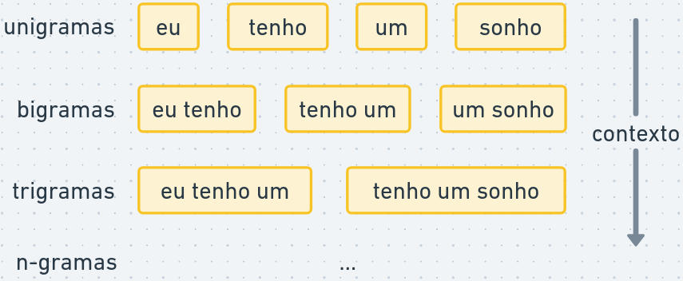

::: callout-note
## Nesta aula

-   Dicionários.
-   N-gramas e Skip-gramas
-   Collocations.
-   Estatísticas textuais: TF-IDF, diversidade léxica, leiturabilidade, keyness.

Link para o Google Colab: <https://colab.research.google.com/drive/10yt3BrJ7XV97xgv8ivNdILTJT6x9jnNS?usp=sharing>
:::

Carregando as bibliotecas necessárias:

```{r}
if (!"tidyverse" %in% installed.packages()) {
  install.packages("tidyverse")
}
library(tidyverse)

if (!"quanteda" %in% installed.packages()) {
  install.packages("quanteda")
}
library(quanteda)

if (!"quanteda.textstats" %in% installed.packages()) {
  install.packages("quanteda.textstats")
}
library(quanteda.textstats)

if (!"quanteda.textplots" %in% installed.packages()) {
  install.packages("quanteda.textplots")
}
library(quanteda.textplots)

if (!"stopwords" %in% installed.packages()) {
  install.packages("stopwords")
}
library(stopwords)
```

Carregando dados de discursos parlamentares de abril de 2025:

```{r}
dados_discursos <- read_csv("discursos_camara_abril_2025.csv") |>
  mutate(doc_id = str_c(row_number(), nome, partido, sep = "_"))

corpus_discursos <- dados_discursos |>
  corpus(text_field = "transcricao")
```

## Dicionários

Dicionários são listas pré-definidas de palavras ou expressões associadas organizadas em uma hierarquia ou taxonomia.

Por exemplo, localizações geográficas podem ser organizadas em níveis para análise de mensões em diferentes níveis: setores, bairros, cidades, estados, países etc. Vejamos um exemplo de análise de mensões de regiões administrativas em planos de governo no DF:

```{r}
dados_csv <- 'ano,candidato,plano
2014,Candidato A,"Vamos investir muito em Ceilândia e melhorar o transporte no Plano Piloto. Taguatinga também receberá atenção especial. O Jardim Botânico também deve receber melhorias."
2018,Candidato B,"A saúde em Samambaia é a nossa prioridade. Ceilândia precisa de mais escolas e o Gama de mais hospitais. O novo bairro no Setor Tororó é a segunda prioridade."
2022,Candidato C,"Nosso plano de governo foca no desenvolvimento do Gama e de Sobradinho. O Plano Piloto terá novas ciclovias e Taguatinga um novo viaduto."'

dados <- read_csv(I(dados_csv)) |> mutate(doc_id = str_c(ano, candidato))

corpus_planos <- corpus(dados, text_field = "plano")

tokens_planos <- tokens(corpus_planos, remove_punct = TRUE) |>
  tokens_tolower()

tokens_planos
```

Podemos montar um dicionário para representar diferentes regiões administrativas, incluíndo setores, diferentes grafias e, possívelmente, ruas, quadras, viadutos, locais comuns, etc.

```{r}
dicionario_ras <- dictionary(list(
  ceilandia = c("ceilândia", "ceilandia"),
  plano_piloto = c("plano piloto", "brasília", "brasilia"),
  taguatinga = c("taguatinga"),
  samambaia = c("samambaia"),
  gama = c("gama"),
  sobradinho = c("sobradinho"),
  jardim_botanico = c("jardim botânico", "jardim botanico", "mangueiral", "tororó")
))

# Buscar os tokens que correspondem ao dicionário
tokens_ras <- tokens_lookup(tokens_planos, dictionary = dicionario_ras)

# Criar a DFM para contabilizar as menções
matriz_contagem <- dfm(tokens_ras)

matriz_contagem
```

Dicionários também podem conter múltiplos níveis de hierarquia. Por exemplo:

```{r}
pol_dict <- dictionary(list(
  Esquerda = list(
    Economia = c("redistribuição", "estatização", "direitos trabalhistas", "justiça social", "pobreza", "desigualdade"),
    Social = c("inclusão", "minorias", "diversidade", "identidade", "coletivo", "direitos humanos"),
    Papel_Estado = c("estado indutor", "serviços públicos", "bem-estar social", "regulação")
  ),
  Direita = list(
    Economia = c("livre mercado", "privatização", "responsabilidade fiscal", "eficiência", "meritocracia", "empreendedorismo"),
    Social = c("família", "valores", "segurança", "tradição", "liberdade individual", "pátria"),
    Papel_Estado = c("estado mínimo", "desestatização", "desburocratização", "parceria público-privada")
  )
))

corpus_discursos |>
  tokens() |>
  tokens_tolower() |>
  tokens_lookup(pol_dict, levels = 1:2) |>
  dfm() |>
  colSums()
```

Existem vários dicionários disponíveis para análise de texto, como dicionários de sentimentos, dicionários de categorias temáticas, dicionários de palavras positivas e negativas, entre outros. Veremos mais exemplos nas próximas aulas.

A Câmara dos Deputados mantém um dicionário de temas para classificar os discursos em diferentes categorias temáticas. O dicionário é organizado em uma hierarquia de temas e subtemas, permitindo uma análise detalhada dos tópicos abordados nos discursos.

<https://dadosabertos.camara.leg.br/swagger/api.html?tab=staticfile#tesauro>

## N-gramas

Na aula anterior, vimos como criar um corpus a partir de dados de texto e como separar o texto em palavras ou partes de palavras.

Por mais que palavras isoladas possuam significados interessantes, o significado de um texto é mais do que a soma das palavras que o compõem. Por exemplo, a expressão "teto de vidro" tem um significado diferente da soma dos significados de "teto", "de" e "vidro".

Os *n-gramas* consistem em sequências contíguas de "n" palavras. Por exemplo, na frase "eu tenho um sonho":

{fig-align="center" width="70%"}

#### Exemplo

```{r}
bigramas_discursos <- corpus_discursos |>
  tokens(remove_punct = TRUE) |>
  tokens_ngrams(3)

bigramas_discursos |>
  dfm() |>
  textstat_frequency(n = 200)
```

\* É possível passar um vetor de números para o tamanho do n-grama. Ex: `2:4` geraria bigramas, trigramas e quadrigramas.

Vantagens de utilizar n-gramas:

-   Capturam expressões e frases comuns que podem ter significados específicos.
-   Adicionam mais contexto ao modelo, o que pode melhorar a precisão em tarefas como classificação de texto ou análise de sentimentos.
-   Identificam negações, como "não gosto", que podem alterar o significado de uma frase.

Desvantagens de utilizar n-gramas:

-   Há um retorno decrescente. Como há muitas combinações possíveis de palavras, os dados podem ficar esparsos (muitos casos raros).
-   Rigidez estrutural e semântica. "Devemos focar na economia" e "Precisamos focar na economia" têm o mesmo significado, mas são quadrigramas distintos.

### Skip-grams: ngramas com saltos

Outra limitação dos n-gramas é que as palavras sejam adjacentes. A linguagem é rica em intercalações e modalizações.

*Skip-grams* permitem "pular" palavras intermediárias para capturar contexto com relações estruturais e semânticas de longa distância.

```{r}
skipgramas_discursos <- corpus_discursos |>
  tokens(remove_punct = TRUE) |>
  tokens_remove(stopwords("portuguese"), padding = TRUE) |>
  tokens_ngrams(2, skip = 0:6)

skipgramas_discursos |>
  tokens_select("*lula*") |>
  dfm() |>
  textstat_frequency(n = 100)
```

-   `padding = TRUE` faz com que o `tokens_remove` deixe espaços vazios no lugar de stopwords. Isso é interessante para manter a adjacência das palavras.

### Matriz de Co-orrência de Características (Feature Co-occurrence Matrix, FCM)

Uma FCM é uma matriz que representa a frequência com que diferentes características (palavras, n-gramas, etc) coocorrem em um conjunto de documentos.

Acmatriz possui palavras como linhas e colunas, e cada célula contém a contagem de vezes que as palavras correspondentes coocorrem em um contexto específico (por exemplo, em um mesmo documento ou em uma janela de palavras).

```{r}
fcm_discursos <- corpus_discursos |>
  tokens(remove_punct = TRUE, remove_symbols = TRUE, remove_numbers = TRUE) |>
  tokens_remove(c(stopwords("portuguese"), "é", "porque", "aqui")) |>
  dfm() |>
  fcm()

fcm_discursos
```

FCMs podem ser utilizadas para construção de *redes semânticas*, onde as palavras são representadas como nós e as coocorrências como arestas.

```{r}
palavras_com_mais_coocorrencia <- fcm_discursos |>
  colSums() |>                # somar colunas
  sort(decreasing = TRUE) |>  # ordenar em ordem decrescente
  head(50) |>                 # pegar as 50 palavras com mais coocorrências
  names()                     # pegar os nomes das palavras (colunas)

fcm_discursos |>
  fcm_select(palavras_com_mais_coocorrencia) |>
  textplot_network(min_freq = 0.95, edge_alpha = 0.5)
```

Isso pode ajudar a identificar clusters de palavras relacionadas e a visualizar as relações entre diferentes termos em um corpus.

## Collocations

Collocations são combinações de palavras que coocorrem com mais frequência do que seria esperado por acaso. Por exemplo, "distrito federal" é uma collocation comum em português, enquanto "distrito superior" não é.

> Intuição:
>
> -   Em um corpus com 1000 palavras
> -   "distrito" aparece 50 vezes
> -   "federal" aparece 30 vezes
> -   "distrito federal" aparece 20 vezes
> -   A frequência esperada de "distrito federal" por acaso seria (50/1000) \* (30/1000) = 1.5 vezes. Portanto, "distrito federal" é uma collocation, pois ocorre muito mais frequentemente do que o esperado por acaso.

### Exemplo

```{r}
collocations_discursos <- corpus_discursos |>
  tokens() |>
  tokens_remove(stopwords("portuguese"), padding = TRUE) |>
  textstat_collocations()

collocations_discursos |>
  head(100)
```

Além das collocations, a tabela gerada retorna:

-   `count`: a contagem de ocorrências
-   `count_nested`: a contagem de ocorrências com tamanho menor
-   `length`: o tamanho da colocations em número de palavras
-   `lambda`: indica o quão fortemente as palavras da colocação estão relacionadas
-   `z`: estatística do valor `lambda`, corrigido de acordo com o erro padrão (quanto maior `z`, maior a confiança em `lambda`)

## TF-IDF

Até agora, falamos sobre a frequência de palavras em um texto (TF, do inglês *term-frequency*).

Em certas análises, é importante considerar o quão comum ou rara uma palavra é em um corpus.

Por exemplo, a palavra "presidente" é mencionada por todos os discursos. Porém, palavras como "macroeconomia" e "transfobia" são particulares de determinados partidos e ideologias.

TF-IDF (Term Frequency-Inverse Document Frequency) é uma métrica de importância de termos que considera:

-   TF (Term Frequency): A frequência de uma palavra (ou n-grama) em um documento.

    Por exemplo, se a palavra "sonho" aparece 5 vezes em um documento com 100 palavras, a TF seria 5/100 = 0.05.

-   IDF (Inverse Document Frequency): Uma medida de quão comum ou rara uma palavra é em um corpus.

    É calculada como $log(N/n)$, onde $N$ é o número total de documentos e $n$ é o número de documentos que contêm a palavra.

    Por exemplo, se temos 1000 documentos e a palavra "sonho" aparece em 100 deles, a IDF seria log(1000/100) = log(10) ≈ 1.

O TF-IDF é calculado multiplicando a TF pela IDF. No exemplo acima, o TF-IDF para a palavra "sonho" seria 0.05 \* 1 = 0.05.

### Exemplo

Vamos utilizar TF-IDF para comparar discursos de três parlamentares: Sóstenes Cavalcante (PL), Lindbergh Farias (PT) e Antonio Brito (PSD).

```{r}
tokens_nomes <- docvars(corpus_discursos) |> pull(nome) |> tokens()

tfidf_discursos <- corpus_discursos |>
  corpus_subset(nome %in% c("Sóstenes Cavalcante", "Lindbergh Farias",
                             "Antonio Brito")) |>
  corpus_group(nome) |>
  tokens(remove_punct = T) |>
  tokens_remove(tokens_nomes) |>
  dfm() |>
  dfm_tfidf()

tfidf_discursos
```

Para facilitar a análise, vamos transformar a DFM em tabela:

```{r}
df_tfidf <- tfidf_discursos |>
  convert(to = "data.frame") |>  # converter em tabela
  pivot_longer(                  # transformar colunas (palavras) em linhas
    cols = -doc_id,
    names_to = "termo",
    values_to = "tfidf"
  )

head(df_tfidf)
```

Vamos extrair os 10 termos com maior TF-IDF para cada deputado:

```{r}
df_tfidf |>
  group_by(doc_id) |>
  slice_max(tfidf, n = 10)
```

E plotar os termos mais importantes para cada deputado em um gráfico de barras:

```{r}
df_tfidf |>
  group_by(doc_id) |>
  slice_max(tfidf, n = 10, with_ties = F) |>
  ggplot(aes(x = reorder(termo, tfidf), y = tfidf)) +
  geom_bar(stat = "identity") +
  facet_wrap(~ doc_id, scales = "free") +
  coord_flip() +
  labs(x = "Termo", y = "TF-IDF", title = "Top 10 termos por TF-IDF") +
  theme_minimal()
```

## Diversidade léxica (lexical diversity)

A diversidade léxica é uma medida da variedade de palavras utilizadas em um texto.

Uma medida comum de diversidade léxica é o Type-Token Ratio (TTR), que é a razão entre o número de tipos (palavras únicas) e o número de tokens (total de palavras) em um texto.

```{r}
corpus_discursos |>
  tokens() |>
  textstat_lexdiv() |>   # calcula a diversidade léxica
  arrange(desc(TTR)) |>  # ordena por Type-Token Ratio (TTR) em ordem decrescente
  head(20)
```

O TTR é uma medida simples, mas pode ser influenciada pelo tamanho do texto. Textos mais longos tendem a ter um TTR mais baixo, pois é mais provável que palavras sejam repetidas.

Existem outras métricas de diversidade léxica que tentam corrigir essa influência do tamanho do texto, como o MTLD (Measure of Textual Lexical Diversity).

A função `textstat_lexdiv` possui várias outras métricas implementadas. Podemos encontrá-las na documentação do parâmetro "measure" em <https://quanteda.io/reference/textstat_lexdiv.html>.

## Leiturabilidade (readability)

Assim como a diversidade léxica, a leiturabilidade é uma medida da complexidade de um texto. Existem várias fórmulas para calcular a leiturabilidade, como o Índice de Flesch, o Índice de Gunning Fog, o Índice de Coleman-Liau, entre outras.

O Índice de Flesch calcula um valor de 0 a 100 para a facilidade de leitura. A métrica considera dois fatores:

-   o número de palavras por frase
-   o número de sílabas por palavra

Na biblioteca quanteda, utilizamos a função `textstat_readability`, que por padrão retorna o Índice de Flesch:

```{r}
corpus_discursos |>
  textstat_readability() |>
  arrange(desc(Flesch)) |>
  head(20)
```

Métricas de leiturabilidade podem ser úteis para comparar a complexidade de discursos de diferentes parlamentares, partidos ou temas. Por exemplo, podemos comparar a leiturabilidade de discursos sobre economia e saúde para verificar se há diferenças na complexidade dos textos.

Outras métricas de leiturabilidade disponíveis na função `textstat_readability` estão descritas na documentação da função: <https://quanteda.io/reference/textstat_readability.html>.

## Palavras-chave (Keyness)

Em estudos quantitativos, *palavras-chaves (keyness)* do texto são aquelas quais a frequência é significativamente diferente entre grupos de documentos.

Por exemplo, quais palavras são mais associadas a discursos do PT em comparação com outros partidos?

Primeiro, separamos os discursos em grupos: discursos do PT (alvo) e discursos de outros partidos (referência).

Em seguida, a função `textstat_keyness` analisa as frequências de uma DFM em cada grupo e compara, utilizando um teste estatístico, se a frequência é maior no grupo alvo. Quanto maior a certeza do teste, maior a tendência de palavra-chave.

```{r}
partidos <- docvars(corpus_discursos) |> pull(partido)

keyness_pt <- corpus_discursos |>
  tokens() |>
  tokens_tolower() |>
  tokens_remove(c(stopwords("portuguese"), partidos)) |>
  dfm() |>
  textstat_keyness(target = partidos == 'PT')

keyness_pt |> head(n = 20)
```

Podemos plotar as palavras-chave com maiores e menores keyness com a função `textplot_keyness`:

```{r}
keyness_pt |>
  textplot_keyness(labelsize = 3)
```

## Para saber mais

Leia mais sobre TF-IDF e N-gramas nos capítulos 3 e 4 do livro Text Mining with R [@silge2017].

Veja como collocations são utilizadas para estudos sociais no artigos:

-   A useful methodological synergy? Combining critical discourse analysis and corpus linguistics to examine discourses of refugees and asylum seekers in the UK press de @baker_useful_2008.

-   Indicador de similaridade do discurso parlamentar: análise do comportamento das coalizões partidárias de @schwartz2022.

## Atividade prática

Analise os discursos vistos em aula utilizando:

-   Crie um dicionário de termos com temas de seu interesse e analise a frequência nos discursos da câmara
-   Busque collocations com 3 ou 4 palavras
-   TF-IDF, analizando as diferenças entre um partido de direita e um partido de esquerda
-   Compare palavras-chave (keyness) de diferentes gêneros
