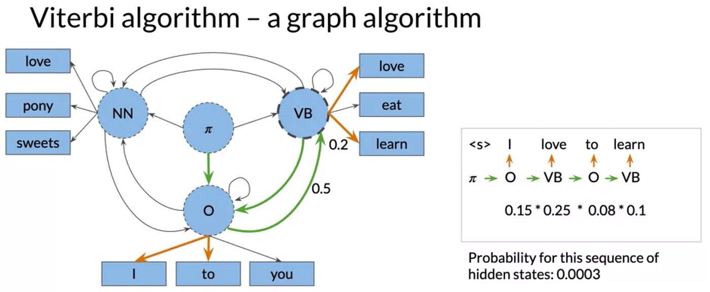

# Análise sintática, Embeddings e Similaridade de Documentos

## Análise sintática

TODO: motivação (pesquisa de verbos, pronomes, etc)

TODO: lista de tipos POS

@nivre2020 propõe o Universal Dependencies v2, uma base anotada com notações gramaticais universais, muito útil para treinar e construir de anotação.

Os tipos de classes gramaticais são:

| Anotação | Nome (inglês) | Nome (português) | Exemplo |
|------------------|------------------|------------------|------------------|
| [ADJ](https://universaldependencies.org/u/pos/ADJ.html "u-pos ADJ") | adjective | Adjetivo | *feliz, grande, azul, rápido, inteligente, cansado*. (Atribuem características aos substantivos) |
| [ADP](https://universaldependencies.org/u/pos/ADP.html "u-pos ADP") | adposition | Adposição/Preposição | *de, em, para, com, por, sem, sob*. (Ligam palavras estabelecendo relação de sentido entre elas) |
| [ADV](https://universaldependencies.org/u/pos/ADV.html "u-pos ADV") | adverb | Advérbio |  |
| [AUX](https://universaldependencies.org/u/pos/AUX_.html "u-pos AUX") | auxiliary | Verbo auxiliar |  |
| [CCONJ](https://universaldependencies.org/u/pos/CCONJ.html "u-pos CCONJ") | coordinating conjunction | Conjunção coordenativa |  |
| [DET](https://universaldependencies.org/u/pos/DET.html "u-pos DET") | determiner | Determinante |  |
| [INTJ](https://universaldependencies.org/u/pos/INTJ.html "u-pos INTJ") | interjection | Interjeição |  |
| [NOUN](https://universaldependencies.org/u/pos/NOUN.html "u-pos NOUN") | noun | Substantivo |  |
| [NUM](https://universaldependencies.org/u/pos/NUM.html "u-pos NUM") | numeral | Numeral |  |
| [PART](https://universaldependencies.org/u/pos/PART.html "u-pos PART") | particle | Partícula |  |
| [PRON](https://universaldependencies.org/u/pos/PRON.html "u-pos PRON") | pronoun | Pronome |  |
| [PROPN](https://universaldependencies.org/u/pos/PROPN.html "u-pos PROPN") | proper noun | Substantivo próprio |  |
| [PUNCT](https://universaldependencies.org/u/pos/PUNCT.html "u-pos PUNCT") | punctuation | Pontuação |  |
| [SCONJ](https://universaldependencies.org/u/pos/SCONJ.html "u-pos SCONJ") | subordinating conjunction | Conjunção subordinativa |  |
| [SYM](https://universaldependencies.org/u/pos/SYM.html "u-pos SYM") | symbol | Símbolo |  |
| [VERB](https://universaldependencies.org/u/pos/VERB.html "u-pos VERB") | verb | Verbo |  |
| [X](https://universaldependencies.org/u/pos/X.html "u-pos X") | other | Outro |  |

TODO: intuição com HMM

TODO: exemplo com spacy

## Embeddings

TODO: motivação vetores densos

TODO: intuição word2vec

TODO: exemplo com ??

TODO: mencionar embeddings contextualizados

## Similaridade de Documentos

TODO: motivação (clusterização, busca semântica)

TODO: tipos de métricas: cosseno, jaccard

## Exemplo: Similaridades de Discursos na Câmara dos Deputados

TODO: construir corpus, medir ditância entre pares de discursos, mostrar discursos diferentes. Calcular distância média entre partidos

TODO: mencionar paper prof. Fabiano
