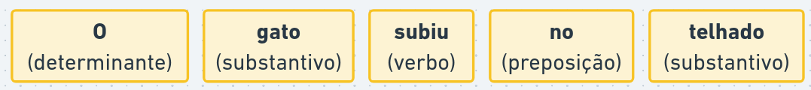
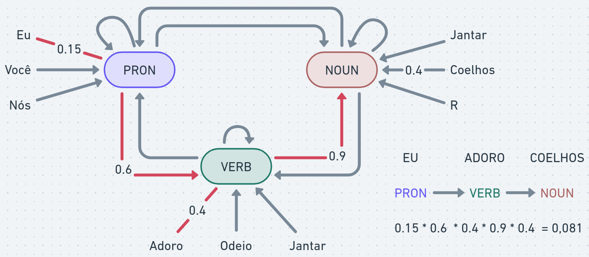
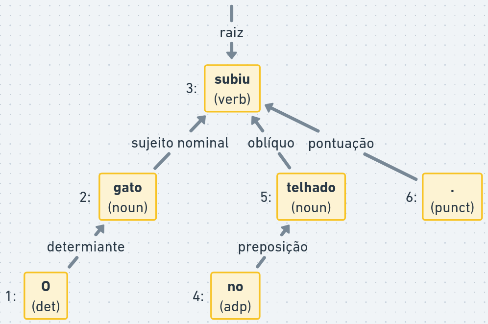
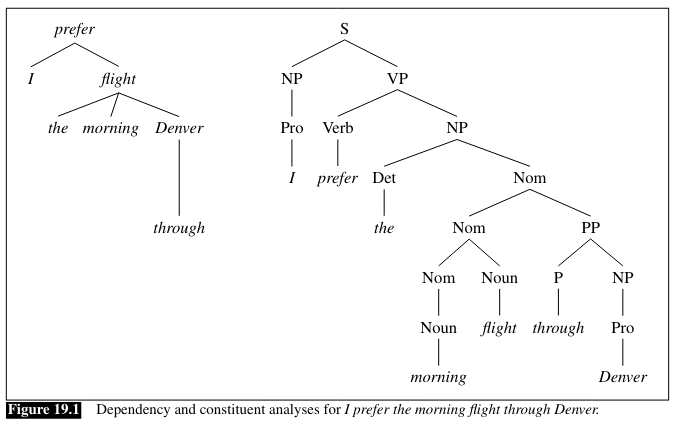
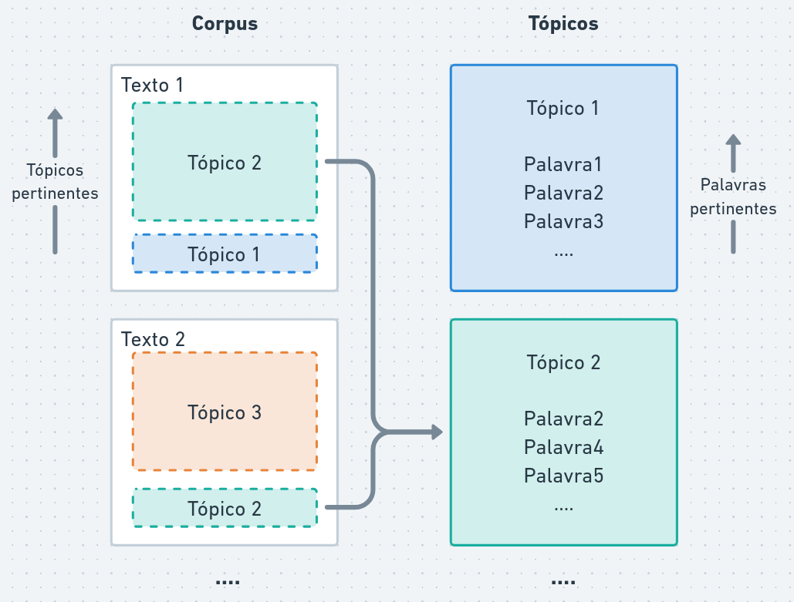

::: callout-note
## Nesta aula

-   Análise sintática
-   Modelos de tópicos

Link para o Google Colab: <https://drive.google.com/file/d/1RlbTbNNC2JLMvYxenrzCH1Vyw3AR70oy/view?usp=sharing>
:::

```{r}
if (!"tidyverse" %in% installed.packages()) {
  install.packages("tidyverse")
}
library(tidyverse)

if (!"quanteda" %in% installed.packages()) {
  install.packages("quanteda")
}
library(quanteda)

if (!"quanteda.textstats" %in% installed.packages()) {
  install.packages("quanteda.textstats")
}
library(quanteda.textstats)

if (!"quanteda.textplots" %in% installed.packages()) {
  install.packages("quanteda.textplots")
}
library(quanteda.textplots)

if (!"stopwords" %in% installed.packages()) {
  install.packages("stopwords")
}
library(stopwords)

if (!"spacyr" %in% installed.packages()) {
  install.packages("spacyr")
}
library(spacyr)

if (!"seededlda" %in% installed.packages()) {
  install.packages("seededlda")
}
library(seededlda)
```

```{r}
dados_discursos <- read_csv("discursos_camara_abril_2025.csv") |>
  mutate(doc_id = str_c(row_number(), nome, partido, sep = "_"))

corpus_discursos <- dados_discursos |>
  corpus(text_field = "transcricao")
```

## Análise sintática: classes gramaticais

**Classes gramaticais**, classes de palavras ou partes do discurso (em inglês *parts of speech*) é a forma como categorizamos palavras com base em sua função. Por exemplo: substantivos, verbos, adjetivos, advérbios, pronomes, etc.



A tarefa de atribuir uma classe para cada palavra de um texto é chamada de **rotulagem de sequência**. Existem diversos algoritmos para rotulagem de classes gramaticais.

Com classes anotadas, podemos fazer análises mais aprofundadas, como:

-   investigar os principais verbos, substantivos e adjetivos utilizados por determinado grupo

-   comparar contagens de cada classe para métricas de complexidade gramatical

-   identificar nominalizações: transformação de verbos em substantivos para ocultar atores (ex: "a polícia repreendeu os manifestantes de forma violenta" vs "a repressão violenta contra os manifestantes").

Para construir e avaliar modelos para rotulagens de sequência, pesquisadores de linguística computacional criaram diversas bases de anotação e esquemas de rotulação. Os mais utilizados são: Penn Treebank e Universal Dependencies.

O padrão de rótulos proposto por @marcus1993 foi utilizado para criar a base anotada **Penn Treebank**:

+--------------------+------------------------------------------+--------------------+---------------------------------------+
| **Anotação (tag)** | **Descrição**                            | **Anotação (tag)** | **Descrição**                         |
+--------------------+------------------------------------------+--------------------+---------------------------------------+
| CC                 | Coordinating conjunction                 | PRP\$              | Possessive pronoun                    |
+--------------------+------------------------------------------+--------------------+---------------------------------------+
| CD                 | Cardinal number                          | RB                 | Adverb                                |
+--------------------+------------------------------------------+--------------------+---------------------------------------+
| DT                 | Determiner                               | RBR                | Adverb, comparative                   |
+--------------------+------------------------------------------+--------------------+---------------------------------------+
| EX                 | Existential *there*                      | RBS                | Adverb, superlative                   |
+--------------------+------------------------------------------+--------------------+---------------------------------------+
| FW                 | Foreign word                             | RP                 | Particle                              |
+--------------------+------------------------------------------+--------------------+---------------------------------------+
| IN                 | Preposition or subordinating conjunction | SYM                | Symbol                                |
+--------------------+------------------------------------------+--------------------+---------------------------------------+
| JJ                 | Adjective                                | TO                 | *to*                                  |
+--------------------+------------------------------------------+--------------------+---------------------------------------+
| JJR                | Adjective, comparative                   | UH                 | Interjection                          |
+--------------------+------------------------------------------+--------------------+---------------------------------------+
| JJS                | Adjective, superlative                   | VB                 | Verb, base form                       |
+--------------------+------------------------------------------+--------------------+---------------------------------------+
| LS                 | List item marker                         | VBD                | Verb, past tense                      |
+--------------------+------------------------------------------+--------------------+---------------------------------------+
| MD                 | Modal                                    | VBG                | Verb, gerund or present participle    |
+--------------------+------------------------------------------+--------------------+---------------------------------------+
| NN                 | Noun, singular or mass                   | VBN                | Verb, past participle                 |
+--------------------+------------------------------------------+--------------------+---------------------------------------+
| NNS                | Noun, plural                             | VBP                | Verb, non-3rd person singular present |
+--------------------+------------------------------------------+--------------------+---------------------------------------+
| NNP                | Proper noun, singular                    | VBZ                | Verb, 3rd person singular present     |
+--------------------+------------------------------------------+--------------------+---------------------------------------+
| NNPS               | Proper noun, plural                      | WDT                | Wh-determiner                         |
+--------------------+------------------------------------------+--------------------+---------------------------------------+
| PDT                | Predeterminer                            | WP                 | Wh-pronoun                            |
+--------------------+------------------------------------------+--------------------+---------------------------------------+
| POS                | Possessive ending                        | WP\$               | Possessive wh-pronoun                 |
+--------------------+------------------------------------------+--------------------+---------------------------------------+
| PRP                | Personal pronoun                         | WRB                | Wh-adverb                             |
+--------------------+------------------------------------------+--------------------+---------------------------------------+

@nivre2020 propõe o **Universal Dependencies v2**, uma base anotada com notações gramaticais universais:

+---------------------------------------------------------------------------+---------------------------+-------------------------+---------------------------------------------------------------------------------------------------------------------------+-------------------------------------------------------------+
| Anotação                                                                  | Nome (inglês)             | Nome (português)        | Função                                                                                                                    | Exemplo                                                     |
+===========================================================================+===========================+=========================+===========================================================================================================================+=============================================================+
| [ADJ](https://universaldependencies.org/u/pos/ADJ.html "u-pos ADJ")       | adjective                 | Adjetivo                | Atribuem características aos substantivos                                                                                 | *feliz, grande, azul, rápido, inteligente, cansado*         |
+---------------------------------------------------------------------------+---------------------------+-------------------------+---------------------------------------------------------------------------------------------------------------------------+-------------------------------------------------------------+
| [ADP](https://universaldependencies.org/u/pos/ADP.html "u-pos ADP")       | adposition                | Adposição/              | Ligam palavras estabelecendo relação de sentido entre elas                                                                | *de, em, para, com, por, sem, sob*                          |
|                                                                           |                           |                         |                                                                                                                           |                                                             |
|                                                                           |                           | Preposição              |                                                                                                                           |                                                             |
+---------------------------------------------------------------------------+---------------------------+-------------------------+---------------------------------------------------------------------------------------------------------------------------+-------------------------------------------------------------+
| [ADV](https://universaldependencies.org/u/pos/ADV.html "u-pos ADV")       | adverb                    | Advérbio                | Modificam verbos, adjetivos ou outros advérbios                                                                           | *não, muito, aqui, rapidamente, ontem, sempre, talvez*      |
+---------------------------------------------------------------------------+---------------------------+-------------------------+---------------------------------------------------------------------------------------------------------------------------+-------------------------------------------------------------+
| [AUX](https://universaldependencies.org/u/pos/AUX_.html "u-pos AUX")      | auxiliary                 | Verbo auxiliar          | Complementar verbos: "tenho feito", "está chovendo", "foi construído", "vou estudar"                                      | ter, haver, ser, estar, ir                                  |
+---------------------------------------------------------------------------+---------------------------+-------------------------+---------------------------------------------------------------------------------------------------------------------------+-------------------------------------------------------------+
| [CCONJ](https://universaldependencies.org/u/pos/CCONJ.html "u-pos CCONJ") | coordinating conjunction  | Conjunção coordenativa  | Ligam orações ou termos de mesma função sintática                                                                         | e, ou, mas, porém, contudo, todavia                         |
+---------------------------------------------------------------------------+---------------------------+-------------------------+---------------------------------------------------------------------------------------------------------------------------+-------------------------------------------------------------+
| [DET](https://universaldependencies.org/u/pos/DET.html "u-pos DET")       | determiner                | Determinante            | Acompanham o substantivo para especificá-lo, incluindo artigos e pronomes adjetivos                                       | o, a, um, umas, este, meu, alguns, qualquer                 |
+---------------------------------------------------------------------------+---------------------------+-------------------------+---------------------------------------------------------------------------------------------------------------------------+-------------------------------------------------------------+
| [INTJ](https://universaldependencies.org/u/pos/INTJ.html "u-pos INTJ")    | interjection              | Interjeição             | Expressam emoções repentinas                                                                                              | ah!, uau!, eita!, oxalá!, nossa!, ai!.                      |
+---------------------------------------------------------------------------+---------------------------+-------------------------+---------------------------------------------------------------------------------------------------------------------------+-------------------------------------------------------------+
| [NOUN](https://universaldependencies.org/u/pos/NOUN.html "u-pos NOUN")    | noun                      | Substantivo             | Nomeiam seres, objetos, sentimentos ou conceitos                                                                          | livro, amor, cachorro, ideia, tempo, água                   |
+---------------------------------------------------------------------------+---------------------------+-------------------------+---------------------------------------------------------------------------------------------------------------------------+-------------------------------------------------------------+
| [NUM](https://universaldependencies.org/u/pos/NUM.html "u-pos NUM")       | numeral                   | Numeral                 | Indicam quantidade exata, ordem ou fração                                                                                 | um, dois, mil, primeiro, segundo, dobro, metade             |
+---------------------------------------------------------------------------+---------------------------+-------------------------+---------------------------------------------------------------------------------------------------------------------------+-------------------------------------------------------------+
| [PART](https://universaldependencies.org/u/pos/PART.html "u-pos PART")    | particle                  | Partícula               | Palavras invariáveis que não se encaixam perfeitamente nas outras classes, geralmente com função de realce ou apassivação | apassivadora: "vende-se". realce: "ele é que sabe"          |
+---------------------------------------------------------------------------+---------------------------+-------------------------+---------------------------------------------------------------------------------------------------------------------------+-------------------------------------------------------------+
| [PRON](https://universaldependencies.org/u/pos/PRON.html "u-pos PRON")    | pronoun                   | Pronome                 | Substituem o substantivo                                                                                                  | eu, você, eles, quem, que (pronome relativo) , alguém, nada |
+---------------------------------------------------------------------------+---------------------------+-------------------------+---------------------------------------------------------------------------------------------------------------------------+-------------------------------------------------------------+
| [PROPN](https://universaldependencies.org/u/pos/PROPN.html "u-pos PROPN") | proper noun               | Substantivo próprio     | Nomeiam entidades específicas, sempre com letra maiúscula                                                                 | Brasil, Maria, Amazonas, São Paulo, Google                  |
+---------------------------------------------------------------------------+---------------------------+-------------------------+---------------------------------------------------------------------------------------------------------------------------+-------------------------------------------------------------+
| [PUNCT](https://universaldependencies.org/u/pos/PUNCT.html "u-pos PUNCT") | punctuation               | Pontuação               | Sinais gráficos usados na escrita                                                                                         | , . ? ! ; : ( ) " "                                         |
+---------------------------------------------------------------------------+---------------------------+-------------------------+---------------------------------------------------------------------------------------------------------------------------+-------------------------------------------------------------+
| [SCONJ](https://universaldependencies.org/u/pos/SCONJ.html "u-pos SCONJ") | subordinating conjunction | Conjunção subordinativa | Introduzem orações subordinadas, indicando dependência                                                                    | que, se, porque, embora, quando, conforme                   |
+---------------------------------------------------------------------------+---------------------------+-------------------------+---------------------------------------------------------------------------------------------------------------------------+-------------------------------------------------------------+
| [SYM](https://universaldependencies.org/u/pos/SYM.html "u-pos SYM")       | symbol                    | Símbolo                 | Caracteres ou símbolos não alfabéticos                                                                                    | %, \$, €, +, \@, =                                          |
+---------------------------------------------------------------------------+---------------------------+-------------------------+---------------------------------------------------------------------------------------------------------------------------+-------------------------------------------------------------+
| [VERB](https://universaldependencies.org/u/pos/VERB.html "u-pos VERB")    | verb                      | Verbo                   | Indicam ação, estado ou fenômeno da natureza; atuando como verbo principal da frase                                       | correr, falar, comer, pensar, agir, chover                  |
+---------------------------------------------------------------------------+---------------------------+-------------------------+---------------------------------------------------------------------------------------------------------------------------+-------------------------------------------------------------+
| [X](https://universaldependencies.org/u/pos/X.html "u-pos X")             | other                     | Outro                   | Palavras não classificáveis, como erros de digitação, URLs, palavras estrangeiras                                         | www, http, software, feedback                               |
+---------------------------------------------------------------------------+---------------------------+-------------------------+---------------------------------------------------------------------------------------------------------------------------+-------------------------------------------------------------+

Modelos ocultos de Markov (HMM, em inglês, *Hidden Markov Models*) são modelos estatísticos comuns para tarefas de rotulagem de sequência.

A ideia central do HMM é definir estados e transições probabilísticas.

Vejamos um exemplo com três classes de palavras:

{fig-align="center"}

No exemplo, a palavra "eu" tem 15% de chance de ser um pronome e a próxima palavra tem 60% de chance de ser verbo e 40% de chance de ser "adoro".

As probabilidades são acumuladas e o "caminho mais provável" é escolhido. A escolha de melhor caminho é feita, por exemplo, com o algoritmo de Viterbi.

HMMs não são a única abordagem para este tipo de problema:

-   **Gramáticas formais**: historicamente, gramáticas foram propostas para rotular frases e derivar árvores sintáticas. Gramáticas livres de contexto contêm uma série de regras determinísticas para derivar frases em diversas línguas. A complexidade das regras e questões como ambiguidade fizeram com que o uso de gramáticas seja mais restrito.

-   **Modelos estatísticos**: técnicas como HMMs, quando acrescidas de atributos adicionais (formas das palavras, dados morfológicos etc.) que são conhecidas como campos aleatórios condicionais (CRF, do inglês *conditional random fields*), possuem bom desempenho (96% de acurácia, o mesmo desempenho de anotadores humanos).

-   **Modelos de linguagem**: **Modelos de linguagem**: o uso de redes neurais para linguística computacional e processamento de linguagem natural é bastante difundido. Estes modelos se destacam principalmente em tarefas que exigem conhecimento sobre significados (semântica) e contexto externo. Veremos mais detalhes sobre estes modelos nas próximas aulas.

### Exemplo de análise sintática com Spacy

**Spacy** é uma biblioteca da linguagem python que foi adaptada pela bibliteca `spacyr` em R.

Spacy utiliza diversos componentes para analizar linguagem natural, como tokenizers, parsers, modelos de embedding etc. Estes componentes executam em sequência (*pipeline*) e são configuráveis.

Spacy utiliza diversos componentes para analisar linguagem natural, como tokenizers, parsers, modelos de embedding etc. Estes componentes executam em sequência (*pipeline*) e são configuráveis.

A configuração padrão que vamos utilizar é o *pipeline* para língua portuguesa, treinada a partir de textos de notícias: `pt_core_news_sm`.

O código abaixo baixa e inicializa os componentes:

```{r}
spacy_install()
spacy_download_langmodel("pt_core_news_sm")
spacy_initialize("pt_core_news_sm")
```

Para mais detalhes sobre a pipeline: <https://spacy.io/models/pt>

Com a biblioteca carregada, podemos processar os textos com a função `spacy_parse`:

```{r}
texto <- "O gato subiu no telhado." 

spacy_parse(texto)
```

A função `spacy_parse` também processa objetos `corpus` da biblioteca `quanteda`:

```{r}
frases_ulysses <- c(
  "A Nação quer mudar, a Nação deve mudar, a Nação vai mudar.",
  "O homem público é o cidadão de tempo inteiro, de quem as circunstâncias exigem o sacrifício da liberdade pessoal, mas a quem o destino oferece a mais confortadora das recompensas: a de servir à Nação em sua grandeza e projeção na eternidade."
)

corpus_ulysses <- corpus(frases_ulysses)

spacy_parse(frases_ulysses)
```

Por padrão, o resultado retorna:

-   `doc_id`: o identificador do documento

-   `sentence_id`: o identificador da frase

-   `token_id`: o identificador do token

-   `token`: o texto do token (palavra, pontuação, símbolo)

-   `lemma`: o lema do token (sua versão canônica)

-   `pos`: part-of-speech ou classe gramatical

-   `entity`: entidade nomeada identificada (pessoas, lugares, organizações, etc)

Vamos agora identificar estatísticas dos discursos de abril de 2025 da Câmara dos Deputados:

```{r}
amostra_discursos <- corpus_sample(corpus_discursos, 100) # amostra de 100 discursos (apenas para a análise não demorar muito)

dt_sintaxe_discursos <- spacy_parse(amostra_discursos, entity = FALSE) # processa discurso desconsiderando entidades

head(dt_sintaxe_discursos)
```

Contagem de classes gramaticais:

```{r}
dt_sintaxe_discursos |>
  count(pos, sort = TRUE) # contagem de classes gramaticais
```

Verbos mais utilizados:

```{r}
dt_sintaxe_discursos |>
  filter(pos == "VERB") |>
  count(lemma, sort = TRUE) |>
  head(10)
```

A função `as.tokens` permite converter a tabela novamente em objeto tokens da biblioteca `quanteda` concatenando a informação de classe gramatical (opcionalmente utilizando lemas no lugar do token original):

```{r}
tokens_sintaxe_discursos <- as.tokens(dt_sintaxe_discursos, include_pos = "pos", use_lemma = TRUE)

tokens_sintaxe_discursos |>
  tokens_select("*/VERB")
```

Por exemplo, para contar os substantivos próprios mais utilizados no PT e PL:

```{r}
tokens_sintaxe_discursos <- as.tokens(dt_sintaxe_discursos, include_pos = "pos")

docvars(tokens_sintaxe_discursos) <- docvars(amostra_discursos) # recupera metadados do corpus original

tokens_sintaxe_discursos |>
  tokens_subset(partido %in% c("PL", "PT")) |>
  tokens_select("*/PROPN") |>
  dfm() |>
  textstat_frequency(10, groups = partido)
```

## Análise sintática: relações de dependência

Além das classes gramaticais, também podemos gerar **relações de dependência** entre as palavras:

-   as relações de dependência determinam a função de uma palavra, representada pelo **tipo de relação de dependência**

-   a função é relativa a uma palavra "pai" dentro da frase, ligando o dependente à dependência

-   cada frase possui uma palavra raiz (geralmente o verbo principal)

Por exemplo:



As relações de dependência permitem análises mais aprofundadas, como:

-   qualificação: adjetivos relacionados a um objeto

-   identificação de atores e ações

-   atribuir agência: usos de voz ativa e passiva ou estruturas impessoais

Os dois últimos pontos fazem com que as relações de dependência formem uma hierarquia ou árvore. Estas regras não são universais, algumas relações e línguas são melhor representadas como redes de dependências ou grafos, onde qualquer palavra pode depender de outra.

As hierarquias das relações de dependências são similares, mas não equivalem às árvores sintáticas. Árvores sintáticas geram relações entre constituintes, que podem ser palavras ou sub-frases (ex: frase nominal, frase verbal etc).



Há duas vantagens de relações de dependência sobre árvores gramaticais:

-   relações de dependência são mais diretas, por exemplo, a palavra do sujeito é conectada diretamente ao verbo

-   gramáticas impõem ordem nas relações e algumas línguas são mais flexíveis quanto à ordem das palavras

Alguns exemplos de tipos de relações de dependência do padrão Universal Dependencies v2 são:

+-------------------+--------------------------+-------------------------------+-------------------------------------------------------+
| **Tag (dep_rel)** | **Nome (Inglês)**        | **Nome (Português)**          | **Exemplo Prático (O termo em negrito recebe a tag)** |
+-------------------+--------------------------+-------------------------------+-------------------------------------------------------+
| `root`            | Root                     | Raiz (Termo principal)        | O plenário **aprovou** a medida provisória.           |
+-------------------+--------------------------+-------------------------------+-------------------------------------------------------+
| `nsubj`           | Nominal subject          | Sujeito nominal               | O **ministro** discursou hoje.                        |
+-------------------+--------------------------+-------------------------------+-------------------------------------------------------+
| `nsubj:pass`      | Passive nominal subject  | Sujeito nominal passivo       | A **lei** foi sancionada ontem.                       |
+-------------------+--------------------------+-------------------------------+-------------------------------------------------------+
| `obj`             | Object                   | Objeto direto                 | O partido criticou a **reforma**.                     |
+-------------------+--------------------------+-------------------------------+-------------------------------------------------------+
| `iobj`            | Indirect object          | Objeto indireto               | O governo concedeu perdão **aos devedores**.          |
+-------------------+--------------------------+-------------------------------+-------------------------------------------------------+
| `obl`             | Oblique nominal          | Modificador oblíquo (prep.)   | O debate ocorreu **na comissão**.                     |
+-------------------+--------------------------+-------------------------------+-------------------------------------------------------+
| `amod`            | Adjectival modifier      | Modificador adjetival         | O país enfrenta uma crise **econômica**.              |
+-------------------+--------------------------+-------------------------------+-------------------------------------------------------+
| `nmod`            | Nominal modifier         | Modificador nominal           | É um projeto **de lei**.                              |
+-------------------+--------------------------+-------------------------------+-------------------------------------------------------+
| `advmod`          | Adverbial modifier       | Modificador adverbial         | O deputado votou **rapidamente**.                     |
+-------------------+--------------------------+-------------------------------+-------------------------------------------------------+
| `appos`           | Appositional modifier    | Aposto                        | Silva, o **relator**, pediu a palavra.                |
+-------------------+--------------------------+-------------------------------+-------------------------------------------------------+
| `cc`              | Coordinating conjunction | Conjunção coordenativa        | Senadores **e** deputados debateram.                  |
+-------------------+--------------------------+-------------------------------+-------------------------------------------------------+
| `conj`            | Conjunct                 | Elemento coordenado           | Senadores e **deputados** debateram.                  |
+-------------------+--------------------------+-------------------------------+-------------------------------------------------------+
| `case`            | Case marking             | Marca de caso (Preposição)    | Protestaram **contra** o corte.                       |
+-------------------+--------------------------+-------------------------------+-------------------------------------------------------+
| `mark`            | Marker                   | Marcador (Subordinação)       | Prometeu **que** reduziria impostos.                  |
+-------------------+--------------------------+-------------------------------+-------------------------------------------------------+
| `acl`             | Clausal modifier of noun | Oração adjetiva/modificadora  | O parlamentar, **que estava ausente**, justificou-se. |
+-------------------+--------------------------+-------------------------------+-------------------------------------------------------+
| `xcomp`           | Open clausal complement  | Complemento oracional aberto  | A oposição tentou **obstruir** a pauta.               |
+-------------------+--------------------------+-------------------------------+-------------------------------------------------------+
| `ccomp`           | Clausal complement       | Complemento oracional         | O relatório indica **que haverá déficit**.            |
+-------------------+--------------------------+-------------------------------+-------------------------------------------------------+
| `det`             | Determiner               | Determinante (Artigo/Pronome) | **Os** vetos foram mantidos.                          |
+-------------------+--------------------------+-------------------------------+-------------------------------------------------------+
| `nummod`          | Numeric modifier         | Modificador numérico          | O partido elegeu **quinze** prefeitos.                |
+-------------------+--------------------------+-------------------------------+-------------------------------------------------------+
| `punct`           | Punctuation              | Pontuação                     | Senhor presidente**,** peço a palavra**.**            |
+-------------------+--------------------------+-------------------------------+-------------------------------------------------------+

A lista completa de relações no padrão Universal Dependencies v2 está disponível em <https://universaldependencies.org/u/dep/index.html>.

### Exemplo de relações de dependência com Spacy

Podemos gerar relações de dependência com a biblioteca `spacyr` utilizando o parâmetro `dependency = TRUE` na função `spacy_parse`:

```{r}
texto <- "O gato subiu no telhado."

spacy_parse(texto, dependency = TRUE)
```

Os dados retornados agora incluem:

-   `head_token_id` : aponta para o token "pai" na árvore de dependências

-   `dep_rel`: o tipo da relação de dependência

```{r}
textos_exemplo <- c(
  doc1 = "O governo cortou os gastos públicos ontem.",
  doc2 = "Os gastos públicos foram cortados pela inflação.",
  doc3 = "A oposição propôs uma nova lei orçamentária."
)

sintaxe_exemplo <- spacy_parse(textos_exemplo, pos = TRUE, dependency = TRUE, nounphrase = TRUE)

sintaxe_exemplo
```

Para identificar atores podemos filtrar por tipo de relação "sujeito nominal" `nsubj:`

```{r}
atores <- sintaxe_exemplo |>
  filter(dep_rel == "nsubj") |> # sujeitos nominais
  select(doc_id, sentence_id, ator = token, verbo_id = head_token_id)

atores
```

Para associar às ações, precisamos obter o token relativo à `head_token_id` que aponta para o verbo do qual o sujeito nominal depende.

Utilizamos a função `left_join` do tidyverse para unir novamente as colunas da tabela original sem filtro (`sintaxe_exemplo`) de acordo com os critérios: mesmo documento, mesma frase, com o token identificado pela coluna `verbo_id`:

```{r}
acoes_atores <- atores |>
  left_join(sintaxe_exemplo, by = c( # juntando de volta para pegar o lema do verbo
      "doc_id" = "doc_id",
      "sentence_id" = "sentence_id",
      "verbo_id" = "token_id"
    )
  )

acoes_atores
```

Selecionando as colunas de interesse:

```{r}
acoes_atores |> 
  select(doc_id, sentence_id, ator, verbo_acao = lemma) |>
  mutate(ator = tolower(ator))
```

Vejamos outro exemplo de como detectar frases com linguagem passiva:

```{r}
sintaxe_exemplo |>
  filter(dep_rel == "nsubj:pass")
```

## Modelos de tópicos: Latent Dirichlet Allocation (LDA)

Em diversos cenários estamos analisando um conjunto de documentos e queremos identificar os temas ou tópicos principais presentes nesses documentos. Por exemplo:

-   quais temas foram discutidos no plenário da câmara em 2025?

-   quais os temas mais discutidos por um partido político?

-   quais os temas mais discutidos por um deputado?

A **análise de tópicos** é uma técnica de modelagem de texto que permite descobrir automaticamente os tópicos subjacentes em um conjunto de documentos.

A análise de tópicos é considerada uma técnica de **aprendizado não-supervisionado**. Os dados são apresentados e o modelo tenta encontrar padrões e estruturas subjacentes sem rótulos ou categorias pré-definidas.

O objetivo é identificar grupos de palavras que frequentemente coocorrem em documentos, sugerindo a presença de um tópico.



**Latent Dirichlet Allocation (LDA)** é um dos métodos mais populares para análise de tópicos. Ele assume que:

-   cada documento é uma mistura de vários tópicos

-   cada tópico é uma distribuição de palavras

### Exemplo de análise de tópicos com LDA

Primeiramente, vamos construir uma DFM com o corpus de interesse.

Para melhores resultados, vamos nos concentrar em palavras:

-   muito faladas em termos absolutos: 20% dos termos mais frequentes

-   concentradas em poucos discursos: termos que aparecem em até 10% dos discursos

```{r}
tm_dfm <- corpus_discursos |>
  tokens(remove_punct = TRUE, remove_symbols = TRUE) |>
  tokens_remove(stopwords("portuguese")) |>
  dfm() |>
  dfm_trim(
    min_termfreq = 0.8, # descarta os 80% de termos menos frequentes
    termfreq_type = "quantile",
    max_docfreq = 0.1,  # descarta palavras que apareçem em mais de 10% dos documentos
    docfreq_type = "prop"
  )

tm_dfm
```

Para construir o modelo utilizamos `textmodel_lda`:

```{r cache=TRUE}
set.seed(42) # semente para gerador de números aleatórios

numero_de_topicos <- 10

tmod_discursos <- textmodel_lda(tm_dfm, numero_de_topicos)
```

A função `terms` retorna a matriz com as palavras mais relevantes de cada tópico:

```{r}
terms(tmod_discursos) |>
  as.data.frame()
```

A função `topics` traz o tópico mais relevante para cada documento:

```{r}
topics(tmod_discursos) |> 
  as.data.frame() |> 
  head(30)
```

Podemos também investigar em mais detalhes os valores do modelo conforme duas matrizes de parâmetros:

-   `theta`: probabilidades de cada tópico por documento (linhas = documentos, colunas = tópicos)

-   `phi`: probabilidades de cada tópico por palavra (linhas = tópicos, colunas = palavras)

```{r}
tmod_discursos$theta |> 
  as.data.frame() |>
  head()
```

Por exemplo, para relacionar os discursos mais pertinentes ao tópico 4:

```{r}
tmod_discursos$theta |>
  as.data.frame() |>
  arrange(desc(topic4)) |>  # ordena documentos mais relevantes do tópico 4
  select(topic4) |>
  head(10)
```

Da mesma forma, podemos utilizar `phi` para investigar os tópicos mais relevantes para as palavras "católica" e "católico":

```{r}
tmod_discursos$phi |>
  as_tibble(rownames = "Tópico") |>
  select(Tópico, católica, católico)
```

## Modelos de tópicos: análise de tópicos guiada

A análise de tópicos com LDA descobre tópicos de forma automática e não supervisionada com base nas frequências de palavras nos documentos.

No entanto, às vezes, precisamos orientar a análise para focar em temas específicos ou para obter tópicos mais interpretáveis.

A **análise guiada de tópicos** (em inglês, *guided topic analysis* ou *seeded topic analysis*) é uma abordagem que permite incorporar conhecimento prévio ou restrições na modelagem de tópicos.

Neste método, precisamos fornecer um conjunto de palavras-chave "sementes" para cada tópico potencial.

O modelo usa estas palavras-chave para orientar a descoberta de tópicos mais alinhados com os temas de interesse.

### Exemplo de análise de tópicos guiada com seededlda

Para especificar as sementes, construímos um objeto dicionário da biblioteca `quanteda`:

```{r}
topicos <- list(
  "golpe" = c("anistia", "golp*", "ditatura", "stf", "janeiro"),
  "papa" = c("papa", "francisco", "igreja", "católica"),
  "glauber" = c("glauber", "cassação", "cpi", "ética", "mandato")
)

dicionario_topicos <- dictionary(topicos)
dicionario_topicos
```

As sementes são passadas como segundo argumento da função `textmodel_seededlda`:

```{r cache=TRUE}
set.seed(42)
stmod_discursos <- textmodel_seededlda(tm_dfm, dicionario_topicos)

terms(stmod_discursos)
```

De forma similar ao LDA, utlizamos `topics` para determinar o tópico de cada documento:

```{r}
topics(stmod_discursos) |>
  as.data.frame() |>
  head(20)
```

## Para saber mais

Para saber mais sobre análise sintática, gramáticas e relações de dependência, veja os capítulos 17, 18 e 19 do livro Speech and Language Processing [@jurafsky_speech_2026].

Sobre análise de tópicos e LDA, leia o capítulo 6 do livro [@silge2017].

Para uma discussão sobre análise de tópicos guiada em estudos sociais, veja o artigo de @schweinberger2025.

## Estudos guiados

### Inicialização do Spacy para Português

```{r}
library(spacyr)

# Instalar spacy (se necessário) e baixar modelo em português
# spacy_install()
# spacy_download_langmodel("pt_core_news_sm")

# Inicializar o spacy com o modelo de língua portuguesa
spacy_initialize(model = "pt_core_news_sm")

print(reticulate::py_config())
```

### Análise de classes gramaticais (POS Tagging)

```{r}
library(tidyverse)
library(quanteda)
library(spacyr)

spacy_initialize(model = "pt_core_news_sm")

nome_arquivo <- "discursos_camara_abril_2025.csv"

# Carregar dados e criar corpus (amostra para rapidez)
corpus_amostra <- read_csv(nome_arquivo, show_col_types = FALSE) |>
  head(50) |> # limitar a 50 discursos para este exemplo
  mutate(doc_id = str_c(row_number(), nome, partido, sep = "_")) |>
  corpus(text_field = "transcricao")

# Realizar análise sintática (extraindo classes gramaticais e lemas)
# Resultado é uma tabela, com um token por linha, o lemma e sua classe gramatical (pos)
analise_pos <- spacy_parse(corpus_amostra, pos = TRUE, lemma = TRUE, entity = FALSE)

# Filtrar e contar os substantivos próprios (PROPN) mais comuns
top_propn <- analise_pos |>
  filter(pos == "PROPN") |>     # filtra linhas de substantivos próprios
  count(token, sort = TRUE) |>  # conta cada token e ordena (maior para menor)
  head(20)                      # filtra 20 primeiras linhas

print(top_propn)
```

### Extraindo Relações de Dependência (Atores e Ações)

```{r}
library(tidyverse)
library(quanteda)
library(spacyr)

spacy_initialize(model = "pt_core_news_sm")

nome_arquivo <- "discursos_camara_abril_2025.csv"

# Carregar dados e criar corpus
corpus_amostra <- read_csv(nome_arquivo, show_col_types = FALSE) |>
  head(50) |>
  mutate(doc_id = str_c(row_number(), nome, partido, sep = "_")) |>
  corpus(text_field = "transcricao")

# Parse com relações de dependência
analise_dep <- spacy_parse(corpus_amostra, dependency = TRUE, pos = TRUE)

# Criar tabela com verbos
acoes <- analise_dep |>
  filter(dep_rel == "ROOT", pos == "VERB") |>
  select(doc_id, sentence_id, token_id, verbo = lemma)

atores <- analise_dep |>
  filter(dep_rel == "nsubj", pos %in% c("NOUN", "PROPN")) |>
  select(doc_id, sentence_id, ator = lemma, head_token_id)

# Criar tabela unindo sujeitos (atores) e seus respectivos verbos (ações)
 # unir (inner_join) verbos e atores do mesmo documento (doc_id), frase (sentence_id) e onde o ator aponta para o verbo pai (head_token_id do ator igual token_id do verbo)
atores_acoes <- atores |>
  inner_join(acoes, by = c("doc_id", "sentence_id", "head_token_id" = "token_id"))

# Criar tabela com 10 verbos principais mais frequentes
top_acoes <- acoes |>
  count(verbo, sort = TRUE) |>
  head(10)

# Criar tabela com 10 substantivos principais mais frequentes
top_atores <- atores |>
  count(ator, sort = TRUE) |>
  head(10)

# Criar tabela com 10 combinações ação-ator mais comuns
top_acoes_atores <- atores_acoes |>
  count(ator, verbo, sort = TRUE) |>
  head(10)

# Exibir os primeiros pares ator-ação encontrados
print("Principais ações:")
print(top_acoes)

print("Principais atores:")
print(top_atores)

print("Principais ações-atores:")
print(top_acoes_atores)
```

### Modelagem de Tópicos (LDA)

```{r cache=TRUE}
library(tidyverse)
library(quanteda)
library(seededlda)
library(stopwords)

nome_arquivo <- "discursos_camara_abril_2025.csv"

# Carregar dados e criar corpus
corpus_discursos <- read_csv(nome_arquivo, show_col_types = FALSE) |>
  mutate(doc_id = str_c(row_number(), nome, partido, sep = "_")) |>
  corpus(text_field = "transcricao")

# Criar tokens
tokens_discursos <- corpus_discursos |>
  tokens(remove_punct = TRUE, remove_numbers = TRUE, remove_symbols = TRUE) |>
  tokens_remove(stopwords("portuguese"))

# Criar DFM e aplicar filtros de frequência (80% das palavras mais frequentes, máximo de 50% dos documentos)
dfm_discursos <- tokens_discursos |>
  dfm() |>
  dfm_trim(
    min_termfreq = 0.8, termfreq_type = "quantile",
    max_docfreq = 0.1, docfreq_type = "prop"
  )

# Treinar modelo LDA com 5 tópicos
set.seed(123) # semente para reprodutibilidade
modelo_lda <- textmodel_lda(dfm_discursos, k = 5)

# Criar tabela com os 10 principais termos de cada tópico
termos_topicos <- modelo_lda |>
  terms(10) |>
  as.data.frame()

# Imprimir termos
print(termos_topicos)

# Atribuir o tópico mais provável a cada discurso
topicos_10_docs <- modelo_lda |>
  topics() |>
  as.data.frame() |>
  head(10)

# Imprimir tópicos dos discursos
print(topicos_10_docs)
```

### Modelagem de Tópicos Guiada (Seeded LDA)

```{r cache=TRUE}
library(tidyverse)
library(quanteda)
library(seededlda)
library(stopwords)

nome_arquivo <- "discursos_camara_abril_2025.csv"

# Carregar dados e criar corpus
corpus_discursos <- read_csv(nome_arquivo, show_col_types = FALSE) |>
  mutate(doc_id = str_c(row_number(), nome, partido, sep = "_")) |>
  corpus(text_field = "transcricao")

# Criar tokens
tokens_discursos <- corpus_discursos |>
  tokens(remove_punct = TRUE, remove_numbers = TRUE, remove_symbols = TRUE) |>
  tokens_remove(stopwords("portuguese"))

# Criar DFM
dfm_discursos <- tokens_discursos |>
  dfm() |>
  dfm_trim(
    min_termfreq = 0.8, termfreq_type = "quantile",
    max_docfreq = 0.1, docfreq_type = "prop"
  )

# Definir sementes para tópicos específicos
sementes <- dictionary(list(
  economia = c("inflação", "juros", "economia", "mercado", "fiscal"),
  seguranca = c("polícia", "crime", "segurança", "violência", "presídio"),
  saude = c("saúde", "hospital", "sus", "médico", "vacina")
))

# Treinar Seeded LDA
set.seed(123) # semente para reprodutibilidade
modelo_seeded <- textmodel_seededlda(dfm_discursos, dictionary = sementes)

# Criar tabela com os 10 principais termos de cada tópico (incluindo os descobertos pelo modelo)
termos_topicos <- modelo_seeded |>
  terms(10) |>
  as.data.frame()

# Imprimir termos de cada tópico
print(termos_topicos)

# Ver o tópico mais provável para os primeiros 10 documentos
topicos_seeded_10_docs <- topics(modelo_seeded) |>
  as.data.frame() |>
  head(10)

# Imprimir tópicos dos primeiros 10 discursos
print(topicos_seeded_10_docs)
```

## Atividade prática

Utilizando o corpus de discursos de abril de 2025 da câmara:

-   Utilize o procedimento para identificar atores e ações no corpus dos discursos da câmara e identifique os principais verbos relacionados ao governo.

-   Realize a análise de tópicos LDA com 4 e 15 tópicos

-   Crie um dicionário com palavras-chave de outros temas e realize a análise de tópicos guiada
