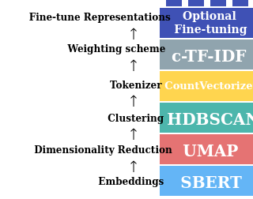

## Análise de tópicos estruturada

Na LDA assumimos que os tópicos advêm de uma mistura de palavras, mas não levamos em consideração outras informações que podem influenciar ou relevar determinados tópicos.

Outra extensão dos modelos de tópicos LDA são os Modelos de Tópicos Estruturados (STM, do inglês **structured topic models**). Este método incorpora informações adicionais (metadados, `docvars`) do texto para orientar a análise.

::: callout-tip
Quais outras variáveis que influenciam os tópicos dos discursos políticos?
:::

Algumas estruturas que podem influenciar análise de discurso político seriam, por exemplo:

-   Data do discurso: Tópicos podem variar ao longo do tempo, e a data que o discurso foi proferido pode ajudar a identificar tendências ou mudanças nos temas discutidos.
-   Locutor: diferentes políticos podem ter interesses ou perspectivas diferentes, e isso pode influenciar os temas debatidos.
-   Partido político: os partidos podem ter plataformas ou agendas diferentes, e isso pode influenciar os temas discutidos nos discursos dos seus membros.

Modelos de tópicos estruturados permitem:

-   incorporar informações qualitativas na análise
-   examinar o **efeito estimado** de uma ou mais variáveis nos tópicos: como uma variável influencia nos tópicos (ex: como o tema "saúde" é abordado ao longo do tempo)
-   examinar **perspectivas**: como palavras mudam de acordo com uma variável ou entre dois tópicos (ex: como partidos de esquerda e direita tratam o tema "segurança")
-   modelar **correlação entre tópicos** (em LDA, os tópicos geralmente são independentes)

{width="100%"}

Algumas fragilidades do STM, e também do LDA, são:

-   utilizam a abordagem "bag-of-words" (saco de palavras), ou seja, não há informação sobre a ordem, sintaxe ou semântica das palavras, apenas quantas vezes elas foram utilizadas em cada discurso
-   as escolhas de pré-processamento, número de tópicos, variáveis dependentes e interpretação dos termos é experimental e sujeitas à interpretação

Assim como em outros modelos, o resultado mostra uma visão ampla dos dados, cabe ao pesquisador investigar a fundo os discursos relevantes.

## BERTopic

O **BERTopic** é um modelo de tópicos baseado em embeddings, que utiliza técnicas de aprendizado profundo para gerar representações vetoriais dos textos (*embeddings*).

Embeddings podem capturar relações semânticas entre palavras e documentos, o que pode levar a uma melhor identificação de tópicos.

Seu funcionamento é baseado em três etapas principais:

1.  Geração de embeddings: os textos são convertidos em vetores de alta dimensão utilizando modelos pré-treinados, como BERT ou outros modelos de linguagem.
2.  Redução de dimensionalidade: os embeddings são reduzidos para um espaço de menor dimensão utilizando técnicas como (UMAP), facilitando a visualização e a identificação de tópicos.
3.  Agrupamento: os vetores reduzidos são agrupados utilizando algoritmos de clustering, como HDBSCAN, para identificar os tópicos presentes nos textos.

{fig-align="center"}

As capacidades do BERTopic incluem:

-   *Tópicos guiados*: permite incorporar palavras-chave ou rótulos para orientar a identificação de tópicos.
-   *Tópicos supervisionados*: permite incorporar rótulos de tópicos pré-definidos para orientar a análise. Por exemplo: partidos, onde o modelo constrói palavras pertinentes de acordo com os discursos.
-   *Tópicos dinâmicos*: permite analisar a evolução dos tópicos ao longo do tempo, identificando como os temas mudam e se desenvolvem.
-   *Tópicos hierárquicos*: permite identificar sub-tópicos dentro de tópicos maiores, criando uma estrutura hierárquica de temas.
-   *Tópicos multimodais*: permite incorporar diferentes tipos de dados (texto, imagens, etc) para identificar tópicos que abrangem múltiplas modalidades.

Desvantagens de modelos de tópicos baseados em embeddings incluem:

-   menor interpretabilidade: os tópicos gerados podem ser mais difíceis de interpretar, especialmente se os embeddings não capturam bem as nuances semânticas dos textos.
-   maior complexidade computacional: requer mais recursos computacionais para gerar embeddings e realizar clustering.
-   configuração mais complexa: a escolha do modelo de linguagem, técnicas de redução de dimensionalidade e algoritmos de clustering pode ser mais complexa e exigir mais experimentação.
-   geralmente requerem mais dados para treinar adequadamente, o que pode ser um desafio em conjuntos de dados menores.

## Escalonamento de texto

**Escalonamento de texto** (text scaling) é a tarefa de derivar posições para textos ou autores ao longo de um contínuo ideológico ou temático.


Exemplos de aplicações em análise de conteúdo:

-   estimativa de posição ideológica: de partidos/políticos em um espectro de "progressista/esquerda" e "conservador/direita"
-   medir polarização política ao longo do tempo: como o conjunto de discursos são posicionados entre mais ou menos polarizados
-   analisar coesão de bancada: como os integrantes de um partido estão alinhados ideologicamente dentro de um partido
-   mudanças de agenda: como os discursos de um político ou grupo se alteram ao longo do tempo
-   enquadramento de assuntos: como um assunto é tratado por diferentes discursos (ex: reforma tributária é tratada como "carga tributária" ou "justiça fiscal")

Existem diversos métodos de estimar posicionamentos a partir de textos.

### Wordscore

O modelo **wordscore** é um método de escalonamento **supervisionado** de texto que atribui uma pontuação a cada palavra com base em sua frequência em um conjunto de textos de referência (seed).

O conjunto de referência possui uma pontuação (score) definido *a priori* pelo pesquisador. O modelo então estima a pontuação de outros textos não-pontuados (virgin), com base nas palavras contidas.

As pontuações de cada palavra são estimadas com probabilidade condicional Bayesiana simples. Cada texto é estimado com a média ponderada da pontuação de cada palavra.

### Wordfish

Modelos **wordfish** são **não-supervisionados**, ou seja, não necessitam de um conjunto de referência. Eles estimam a posição ideológica dos textos com base na frequência das palavras, assumindo que as palavras mais frequentes em um texto são mais representativas do seu conteúdo.

O modelo estatístico do wordfish é baseado em um modelo de Poisson mais sofisticado, onde a frequência de cada palavra em um texto é modelada como uma função da posição ideológica do texto e da importância da palavra.

### Análise de correspondência

A **análise de correspondência** (CA, do inglês *correspondence analysis*) é uma técnica para redução de dimensionalidade que funciona com variáveis categóricas (tabela de contingência).

No caso de dados textuais, podemos aplicar a análise de correspondência a uma matriz de frequência de palavras, onde as linhas representam os textos e as colunas representam as palavras (transposta da DFM).

A análise de correspondência pode ser utilizada para identificar padrões de coocorrência entre palavras e textos, e para visualizar a relação entre eles em um espaço bidimensional.

## Similaridade textual

Uma tarefa comum em análise de conteúdo é medir a **similaridade entre textos**, ou seja, o quão semelhantes são dois ou mais textos em termos de conteúdo.

Existem diversas métricas para medir a similaridade textual, como:

-   *Correspondência de palavras*: textos similares utilizam as memas palavras.

$$
C(A, B) = |A \cap B|
$$

-   *Distância de Jaccard*: mede a similaridade entre dois conjuntos de palavras, calculando a razão entre a interseção e a união dos conjuntos.

$$
J(A, B) = \frac{|A \cap B|}{|A \cup B|}
$$

-   *Distância* euclidiana: mede distância entre dois vetores de palavras, calculando a raiz quadrada da soma das diferenças ao quadrado.

$$
E(A, B) = \sqrt{\sum_{i=1}^{n} (A_i - B_i)^2}
$$

-   *Similaridade de cosseno*: mede a similaridade entre dois vetores de palavras, calculando o cosseno do ângulo entre eles. Quanto mais próximo de 1, mais semelhantes são os textos.

$$
S(A, B) = cos(A,B) = \frac{A \cdot B}{\|A \| \|B\|}
$$

A **similaridade de cosseno** é muito utilizada em análise de conteúdo, especialmente quando os textos são representados como vetores de palavras (por exemplo, usando contagens, TF-IDF ou embeddings). Ela é útil para identificar textos que são semanticamente semelhantes, mesmo que não compartilhem muitas palavras em comum.

O resultado da similaridade textual pode ser utilizado para diversas análises, como:

-   Agrupamento de textos: textos similares podem ser agrupados para identificar temas ou tópicos comuns.
-   Análise de redes: textos similares podem ser conectados em uma rede para visualizar as relações entre eles.
-   Busca de documentos: textos similares podem ser utilizados para encontrar documentos relevantes em um grande conjunto de dados.

# Estudos guiados

## STM

O STM permite incorporar metadados. Aqui, usaremos o `partido` como uma variável que influencia a prevalência dos tópicos (o quanto cada partido fala de cada tema).

```{r cache=TRUE}
library(tidyverse)
library(quanteda)
library(stm)
library(stopwords)

nome_arquivo <- "discursos_camara_abril_2025.csv"

# Carregar dados e criar corpus
corpus_discursos <- read_csv(nome_arquivo, show_col_types = FALSE) |>
  filter(partido %in% c("PT", "PL", "PSOL", "REPUBLICANOS")) |>
  mutate(doc_id = str_c(row_number(), nome, partido, sep = "_")) |>
  corpus(text_field = "transcricao")

# Criar tokens
tokens_discursos <- corpus_discursos |>
  tokens(remove_punct = TRUE, remove_numbers = TRUE, remove_symbols = TRUE) |>
  tokens_remove(stopwords("portuguese"))

# Criar DFM, removendo palavras muito frequentes e muito raras 
dfm_discursos <- tokens_discursos |>
  dfm() |>
  dfm_trim(
    min_termfreq = 0.8, termfreq_type = "quantile",
    max_docfreq = 0.1, docfreq_type = "prop"
  )

# Converter DFM do quanteda para o formato esperado pelo pacote STM
stm_data <- convert(dfm_discursos, to = "stm")

# Treinar o modelo STM
# K = 5 tópicos para este exemplo
# prevalence =~ partido: indica que a escolha do tópico depende do partido
modelo_stm <- stm(
  documents = stm_data$documents, 
  vocab = stm_data$vocab,
  data = stm_data$meta, 
  K = 5, 
  prevalence = ~partido + fase_evento,
  verbose = FALSE
)

# Visualizar resumo dos tópicos e sua frequência relativa
plot(modelo_stm, type = "summary", main = "Principais Tópicos (Modelo STM)")
```

Continuando com o mesmo modelo, podemos invesgitar os textos mais pertinentes a cada tópico:

```{r}
library(stm)
# Imprimir os 2 textos mais relevantes do tópico 5
findThoughts(
  modelo_stm,
  texts = as.character(corpus_discursos), # vetor de textos
  topics = c(4), # tópicos
  n = 2 # número de textos
)
```

Estimando efeitos da variável dependente categórica (partidos) sobre um determinado tópico. O gráfico mostra proporção (e sua variância) que um tópico é coberto em cada partido.

```{r}
library(quanteda)

ee_partido <- estimateEffect(
  ~partido, 
  modelo_stm, 
  documents = stm_data, 
  metadata = docvars(corpus_discursos)
)

plot.estimateEffect(
  ee_partido,
  covariate = "partido",
  method = "pointestimate",
  topics = 5
)
```

Também podemos analisar a diferença entre dois polos (ex PT vs PL) em relação a cada tópico. Intervalos próximos de 0 (zero) são temas citados por ambos.

```{r}
plot.estimateEffect(
  ee_partido,
  covariate = "partido",
  method = "difference",
  cov.value1 = "PT",
  cov.value2 = "PL",
  topics = c(2, 4, 5),
  labeltype = "custom",
  custom.labels = c("INSS", "Papa", "Glauber"),
  xlab = "PT vs PL",
)
```

## BERTopic

O estudo guiado está disponível no Google Colab em: <https://colab.research.google.com/drive/1ZhOSzNBMEZWP5MVLnginDWyPEYSnLbQl?usp=sharing>

## Escalonamento não-supervisionado (Wordfish)

O Wordfish estima as posições ideológicas dos documentos apenas com base na frequência das palavras, sem precisar de rótulos prévios.

```{r cache=TRUE}
library(tidyverse)
library(quanteda)
library(quanteda.textmodels)
library(quanteda.textplots)
library(stopwords)

nome_arquivo <- "discursos_camara_abril_2025.csv"

# Carregar dados e criar corpus
corpus_discursos <- read_csv(nome_arquivo, show_col_types = FALSE) |>
  filter(partido %in% c("PT", "PL", "PSOL", "REPUBLICANOS")) |>
  mutate(doc_id = str_c(row_number(), nome, partido, sep = "_")) |>
  corpus(text_field = "transcricao")

# Criar tokens
tokens_discursos <- corpus_discursos |>
  tokens(remove_punct = TRUE, remove_numbers = TRUE, remove_symbols = TRUE) |>
  tokens_remove(stopwords("portuguese"))

# Criar DFM, removendo palavras muito frequentes e muito raras 
dfm_discursos <- tokens_discursos |>
  dfm() |>
  dfm_trim(
    min_termfreq = 0.8, termfreq_type = "quantile",
    max_docfreq = 0.1, docfreq_type = "prop"
  ) |>
  dfm_group(partido)

# Treinar modelo Wordfish
set.seed(42)
modelo_wf <- textmodel_wordfish(dfm_discursos)

# Visualizar o posicionamento médio dos partidos na dimensão estimada
textplot_scale1d(modelo_wf, groups = dfm_discursos$partido) +
  labs(title = "Posicionamento latente estimado a partir dos discursos")
```

## Escalonamento supervisionado (Wordscores)

No Wordscores, definimos pontuações para documentos de referência (ex: PT como esquerda e PL como direita) e o modelo estima a posição dos demais.

```{r}
library(tidyverse)
library(quanteda)
library(quanteda.textmodels)
library(quanteda.textplots)
library(stopwords)

nome_arquivo <- "discursos_camara_abril_2025.csv"

# Carregar dados
dados_discursos <- read_csv(nome_arquivo, show_col_types = FALSE) |>
  mutate(doc_id = str_c(row_number(), nome, partido, sep = "_"))

# Criar corpus
corpus_discursos <- dados_discursos |>
  corpus(text_field = "transcricao")

# Criar tokens
tokens_discursos <- corpus_discursos |>
  tokens(remove_punct = TRUE, remove_numbers = TRUE, remove_symbols = TRUE) |>
  tokens_remove(stopwords("portuguese"))

# Criar DFM, removendo palavras muito frequentes e muito raras 
dfm_discursos <- tokens_discursos |>
  dfm() |>
  dfm_trim(
    min_termfreq = 0.8, termfreq_type = "quantile",
    max_docfreq = 0.1, docfreq_type = "prop"
  ) |>
  dfm_group(partido)

# Criar vetor com referências
mapeamento <- c(
  "PSOL" = -1,
  "PT" = -1,
  "MDB" = 0,
  "PP" = 0.5,
  "NOVO" = 1,
  "PL" = 1
)
scores <- mapeamento[docid(dfm_discursos)]

# Treinar o modelo Wordscores
modelo_ws <- textmodel_wordscores(dfm_discursos, y = scores)

# Predizer posições para todos os discursos
pred_ws <- predict(modelo_ws, se.fit = TRUE)

# Visualizar resultados agrupados por partido
textplot_scale1d(pred_ws) +
  labs(title = "Escalonamento Wordscores", 
       x = "Score Estimado", y = "Densidade")
```

## Análise de Correspondência (CA)

A CA é uma técnica de redução de dimensionalidade que permite visualizar a "distância" entre categorias (ex partidos) e palavras em um espaço comum.

```{r}
library(tidyverse)
library(quanteda)
library(quanteda.textmodels)
library(quanteda.textplots)
library(stopwords)

nome_arquivo <- "discursos_camara_abril_2025.csv"

# Carregar dados
dados_discursos <- read_csv(nome_arquivo, show_col_types = FALSE) |>
  mutate(doc_id = str_c(row_number(), nome, partido, sep = "_"))

# Criar corpus
corpus_discursos <- dados_discursos |>
  corpus(text_field = "transcricao")

# Criar tokens
tokens_discursos <- corpus_discursos |>
  tokens(remove_punct = TRUE, remove_numbers = TRUE, remove_symbols = TRUE) |>
  tokens_remove(stopwords("portuguese"))

# Criar DFM, removendo palavras muito frequentes e muito raras 
dfm_discursos <- tokens_discursos |>
  dfm() |>
  dfm_trim(
    min_termfreq = 0.8, termfreq_type = "quantile",
    max_docfreq = 0.1, docfreq_type = "prop"
  ) |>
  dfm_group(partido)

# Executar Análise de Correspondência
modelo_ca <- textmodel_ca(dfm_discursos)

# Visualizar a primeira dimensão da CA
textplot_scale1d(modelo_ca) + 
  labs(title = "Análise de Correspondência: 1ª Dimensão",
       subtitle = "Agrupamento por partido")
```

CA permite extrair outras dimensões do modelo:

```{r}
coefs_ca_2d <- data_frame(
  partido = modelo_ca$rownames,
  x = coef(modelo_ca, doc_dim = 1)$coef_document,
  y = coef(modelo_ca, doc_dim = 2)$coef_document
)

ggplot(coefs_ca_2d) +
  geom_text(aes(x = x, y = y, label = partido), position = "nudge",
            check_overlap = TRUE)
```

## Similaridade Textual

A similaridade de cosseno mede o quão parecido é o vocabulário utilizado por diferentes grupos.

```{r}
library(tidyverse)
library(quanteda)
library(quanteda.textstats)
library(quanteda.textplots)
library(stopwords)

nome_arquivo <- "discursos_camara_abril_2025.csv"

# Carregar dados
dados_discursos <- read_csv(nome_arquivo, show_col_types = FALSE) |>
  mutate(doc_id = str_c(row_number(), nome, partido, sep = "_"))

# Criar corpus
corpus_discursos <- dados_discursos |>
  corpus(text_field = "transcricao")

# Criar tokens
tokens_discursos <- corpus_discursos |>
  tokens(remove_punct = TRUE, remove_numbers = TRUE, remove_symbols = TRUE) |>
  tokens_remove(stopwords("portuguese"))

# Criar DFM e calcular TF-IDF 
dfm_discursos <- tokens_discursos |>
  dfm() |>
  dfm_group(partido) |>
  dfm_tfidf()

# Calcular similaridade entre os textos cada partido
simil_cosseno <- textstat_simil(dfm_discursos, method = "cosine")

# Exibir como uma matriz de similaridade
matriz_simil <- as.matrix(simil_cosseno)

matriz_simil
```

A matriz de distâncias pode ser apresentada como um dendograma:

```{r fig.height=5}
# Construir agrupamentos
agrupamentos <- hclust(as.dist(matriz_simil))

# Desenhar dendograma a partir dos agrupamentos
plot(agrupamentos)
```

## Atividade prática

Utilizando o corpus de discursos de abril de 2025 da câmara:

-   Treine um modelo STM para analisar a influência do estado dos parlamentares (coluna "uf") e seu gênero (coluna "sexo")

-   Utilize diferentes distâncias de "textstat_dist" e "textstat_simil" da biblioteca quanteda para comparar discursos de diferentes estados. Existem relações entre distâncias geográficas e distâncias textuais?
