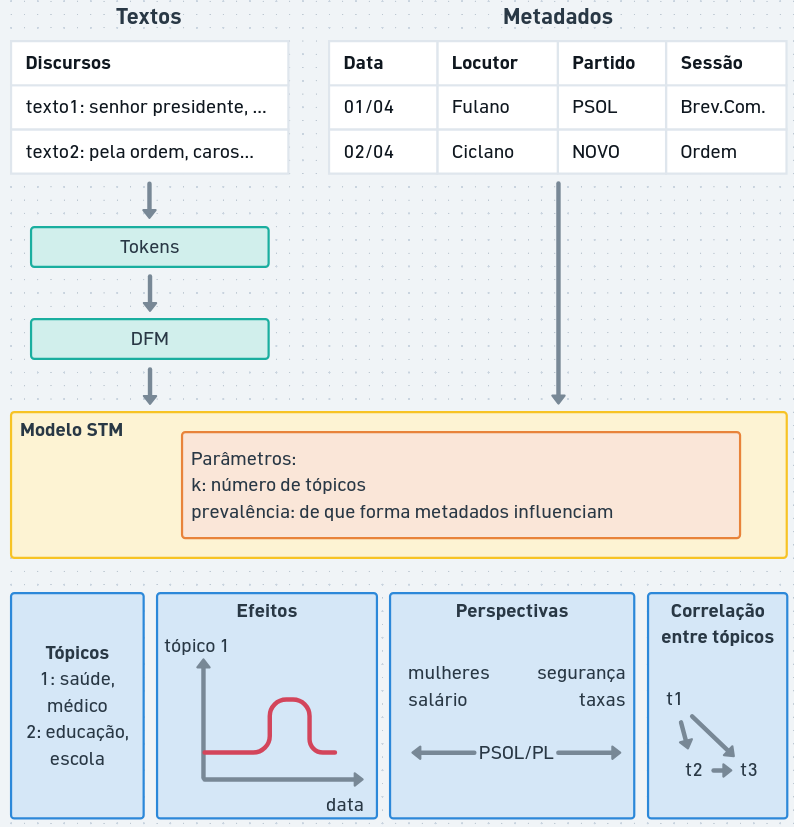
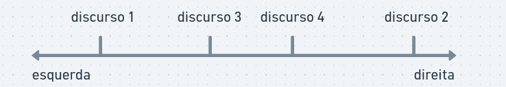

# Análise de tópicos estruturada e modelos de escala

## Análise de tópicos estruturada

Na LDA assumimos que os tópicos advém de uma mistura de palavras, mas não levamos em consideração outras informações que podem influenciar ou relevar determinados tópicos.

Outra extensão dos modelos de tópicos LDA são os Modelos de Tópicos Estruturados (STM, do inglês *structured topic models*). Este método incorpora informações adicionais (metadados, `docvars`) do texto para orientar a análise.

::: callout-tip
Quais outras variáveis que influenciam os tópicos dos discursos políticos?
:::

Algumas estruturas que podem influenciar análise de discurso político seriam, por exemplo:

-   data do discurso: Tópicos podem variar ao longo do tempo, e a data que o discurso foi proferido pode ajudar a identificar tendências ou mudanças nos temas discutidos.
-   locutor: diferentes políticos podem ter interesses ou perspectivas diferentes, e isso pode influenciar os temas debatidos
-   partido político: os partidos podem ter plataformas ou agendas diferentes, e isso pode influenciar os temas discutidos nos discursos dos seus membros.

Modelos de tópicos estruturados permitem:

-   incorporar informações qualitativas na análise
-   examinar o **efeito estimado** de uma ou mais variáveis nos tópicos: como uma variável influencia nos tópicos (ex: como o tema "saúde" é abordado ao longo do tempo)
-   examinar **perspectivas**: como palavras mudam de acordo com uma variável ou entre dois tópicos (ex: como partidos de esquerda e direita tratam o tema "segurança")
-   modelar **correlação entre tópicos** (em LDA, os tópicos geralmente são independentes)

{width="100%"}

Algumas fragilidades do STM, e também do LDA, são:

-   utilizam a abordagem "bag-of-words" (saco de palavras), ou seja, não há informação sobre a ordem, sintaxe ou semântica das palavras, apenas quantas vezes elas foram utilizadas em cada discurso
-   as escolhas de pré-processamento, número de tópicos, variáveis dependentes e interpretação dos termos é experimental e sujeitas à interpretação

Assim como em outros modelos, o resultado mostra uma visão ampla dos dados, cabe ao pesquisador investigar a fundo os discursos relevantes.

## Escalonamento de texto

**Escalonamento de texto** (text scalling) é a tarefa de derivar posições para textos ou autores ao longo de um contínuo ideológico ou temático.



Exemplos de aplicações em análise de conteúdo:

-   estimativa de posição ideológica: de partidos/políticos em um espectro de "progressista/esquerda" e "conservador/direita"
-   medir polarização política ao longo do tempo: como o conjunto de discursos são posicionados entre mais ou menos polarizados
-   analisar coesão de bancada: como os integrantes de um partido se estão alinhados ideologicamente dentro de um partido
-   mudanças de agenda: como os discursos de um político ou grupo se alteram ao longo do tempo
-   enquadramento de assuntos: como um assunto é tratado por diferentes discursos (ex: reforma tributária é tratada como "carga tributária" ou "justiça fiscal")

Existem diversos métodos de estimar posicionamentos a partir de textos.

### Wordscore

O modelo *wordscore* é um método de escalonamento *supervisionado* de texto que atribui uma pontuação a cada palavra com base em sua frequência em um conjunto de textos de referência (seed).

O conjuto de referência possui uma pontuação (score) definido _a priori_ pelo pesquisador. O modelo então estima a pontuação de outros textos não-pontuados (virgin), com base nas palavras contidas.

As pontuações de cada palavra são estimadas com probabilidade condicional Bayesiana simples. Cada texto é estimado com a média ponderada da pontuação de cada palavra.

### Wordfish

Modelos *wordfish* são *não-supervisionados*, ou seja, não necessitam de um conjunto de referência. Eles estimam a posição ideológica dos textos com base na frequência das palavras, assumindo que as palavras mais frequentes em um texto são mais representativas do seu conteúdo.

O modelo estatístico do wordfish é baseado em um modelo de Poisson mais sofisticado, onde a frequência de cada palavra em um texto é modelada como uma função da posição ideológica do texto e da importância da palavra.

### Análise de correspondência

A *análise de correspondência* (CA, do inglês _correspondence analysis_) é uma técnica para redução de dimensionalidade que funciona com variáveis categóricas (tabela de contingência).

caso de textos, podemos aplicar a análise de correspondência a uma matriz de frequência de palavras, onde as linhas representam os textos e as colunas representam as palavras (transposta da DFM).

A análise de correspondência pode ser utilizada para identificar padrões de coocorrência entre palavras e textos, e para visualizar a relação entre eles em um espaço bidimensional.

## Similaridade textual

Uma tarefa comum em análise de conteúdo é medir a similaridade entre textos, ou seja, o quão semelhantes são dois ou mais textos em termos de conteúdo.

Existem diversas métricas para medir a similaridade textual, como:

-   *Correspodência de palavras*: textos similares utilizam as memas palavras.
-   *Distância de Jaccard*: mede a similaridade entre dois conjuntos de palavras, calculando a razão entre a interseção e a união dos conjuntos.
-   *Similaridade de cosseno*: mede a similaridade entre dois vetores de palavras, calculando o cosseno do ângulo entre eles. Quanto mais próximo de 1, mais semelhantes são os textos.

A similaridade de cossenno é muito utilizada em análise de conteúdo, especialmente quando os textos são representados como vetores de palavras (por exemplo, usando TF-IDF ou embeddings). Ela é útil para identificar textos que são semanticamente semelhantes, mesmo que não compartilhem muitas palavras em comum.

O resultado da similaridade textual pode ser utilizado para diversas análises, como:

- Agrupamento de textos: textos similares podem ser agrupados para identificar temas ou tópicos comuns.
- Análise de redes: textos similares podem ser conectados em uma rede para visualizar as relações entre eles.
- Busca de documentos: textos similares podem ser utilizados para encontrar documentos relevantes em um grande conjunto de dados.

# Estudos guiados

## Preparação dos dados

Nesta aula, utilizaremos o pacote `stm` para modelos estruturados e `quanteda.textmodels` para modelos de escala e similaridade. Seguiremos o padrão de carregamento e pré-processamento visto na aula anterior.

```{r}
#| message: false
#| warning: false

# Instalação de pacotes necessários (caso não estejam presentes)
pacotes <- c("tidyverse", "quanteda", "quanteda.textstats", 
             "quanteda.textplots", "quanteda.textmodels", "stm", "stopwords")

for (pkg in pacotes) {
  if (!pkg %in% installed.packages()) install.packages(pkg)
}

library(tidyverse)
library(quanteda)
library(quanteda.textstats)
library(quanteda.textplots)
library(quanteda.textmodels)
library(stm)
library(stopwords)

# Carregamento consistente dos dados
dados_discursos <- read_csv("discursos_camara_abril_2025.csv", show_col_types = FALSE) |>
  mutate(doc_id = str_c(row_number(), nome, partido, sep = "_"))

# Criação do corpus
corpus_discursos <- corpus(dados_discursos, text_field = "transcricao")

# Pré-processamento e DFM
# Removemos pontuação, números, símbolos e stopwords
dfm_discursos <- corpus_discursos |>
  tokens(remove_punct = TRUE, remove_numbers = TRUE, remove_symbols = TRUE) |>
  tokens_remove(stopwords("portuguese")) |>
  dfm() |>
  # Filtramos palavras muito frequentes ou muito raras para otimizar os modelos
  dfm_trim(min_termfreq = 5, max_docfreq = 0.5, docfreq_type = "prop")

print(dfm_discursos)
```

## Modelo de Tópicos Estruturado (STM)

O STM permite incorporar metadados. Aqui, usaremos o `partido` como uma variável que influencia a prevalência dos tópicos (o quanto cada partido fala de cada tema).

```{r}
#| cache: true

# 1. Converter DFM do quanteda para o formato esperado pelo pacote STM
stm_data <- convert(dfm_discursos, to = "stm")

# 2. Treinar o modelo STM
# K = 5 tópicos para este exemplo
# prevalence =~ partido: indica que a escolha do tópico depende do partido
modelo_stm <- stm(
  documents = stm_data$documents, 
  vocab = stm_data$vocab,
  data = stm_data$meta, 
  K = 5, 
  prevalence =~ partido,
  verbose = FALSE
)

# 3. Visualizar resumo dos tópicos e sua frequência relativa
plot(modelo_stm, type = "summary", main = "Principais Tópicos (Modelo STM)")
```

## Escalonamento não-supervisionado (Wordfish)

O Wordfish estima as posições ideológicas dos documentos apenas com base na frequência das palavras, sem precisar de rótulos prévios.

```{r}
# 1. Treinar modelo Wordfish
modelo_wf <- textmodel_wordfish(dfm_discursos)

# 2. Visualizar o posicionamento médio dos partidos na dimensão estimada
textplot_scale1d(modelo_wf, groups = dfm_discursos$partido) +
  labs(title = "Escalonamento Wordfish por Partido", 
       subtitle = "Posicionamento latente estimado a partir dos discursos",
       x = "Dimensão Estimada (Ideologia)", y = "Densidade")
```

## Escalonamento supervisionado (Wordscores)

No Wordscores, definimos pontuações para documentos de referência (ex: PT como esquerda e PL como direita) e o modelo estima a posição dos demais.

```{r}
# 1. Definir scores de referência: PT (-1) e PL (1)
# NAs indicam documentos cuja posição queremos estimar
scores_referencia <- rep(NA, ndoc(dfm_discursos))
scores_referencia[docvars(dfm_discursos, "partido") == "PT"] <- -1
scores_referencia[docvars(dfm_discursos, "partido") == "PL"] <- 1

# 2. Treinar o modelo Wordscores
modelo_ws <- textmodel_wordscores(dfm_discursos, y = scores_referencia)

# 3. Predizer posições para todos os discursos
pred_ws <- predict(modelo_ws, se.fit = TRUE)

# 4. Visualizar resultados agrupados por partido
textplot_scale1d(pred_ws, groups = dfm_discursos$partido) +
  labs(title = "Escalonamento Wordscores", 
       subtitle = "Referência: PT (-1) e PL (1)",
       x = "Score Estimado", y = "Densidade")
```

## Análise de Correspondência (CA)

A CA é uma técnica de redução de dimensionalidade que permite visualizar a "distância" entre categorias (partidos) e palavras em um espaço comum.

```{r}
# 1. Agrupar discursos por partido para uma visualização mais clara
dfm_partidos <- dfm_group(dfm_discursos, groups = partido)

# 2. Executar Análise de Correspondência
modelo_ca <- textmodel_ca(dfm_partidos)

# 3. Visualizar a primeira dimensão da CA
textplot_scale1d(modelo_ca) + 
  labs(title = "Análise de Correspondência: 1ª Dimensão",
       subtitle = "Agrupamento por partido")
```

## Similaridade Textual

A similaridade de cosseno mede o quão parecido é o vocabulário utilizado por diferentes grupos.

```{r}
# 1. Calcular similaridade entre os 'centroids' de cada partido
simil_cosseno <- textstat_simil(dfm_partidos, method = "cosine")

# 2. Exibir como uma matriz de similaridade (ex: os 5 mais similares ao PT)
matriz_simil <- as.matrix(simil_cosseno)
print("Similaridade de Cosseno com o PT:")
sort(matriz_simil[, "PT"], decreasing = TRUE) |> head(5)
```


