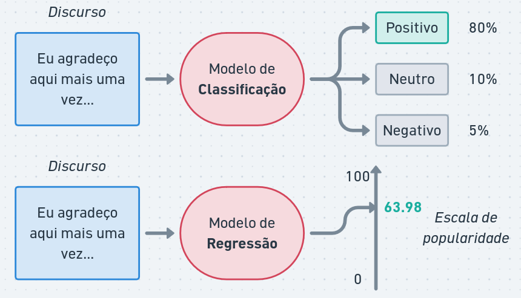
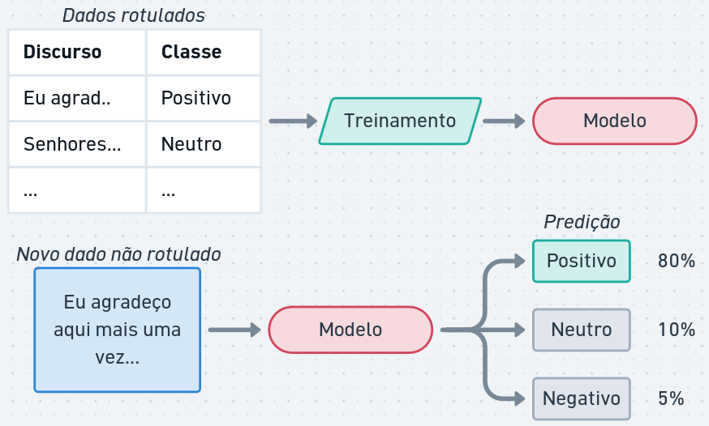
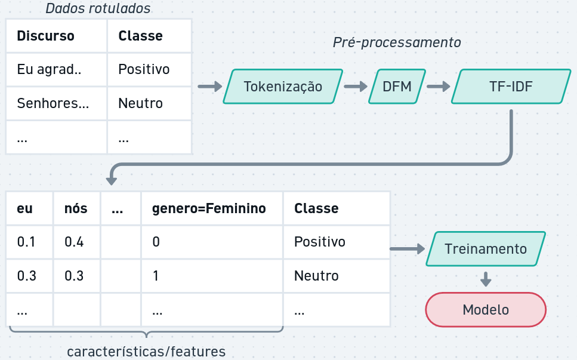
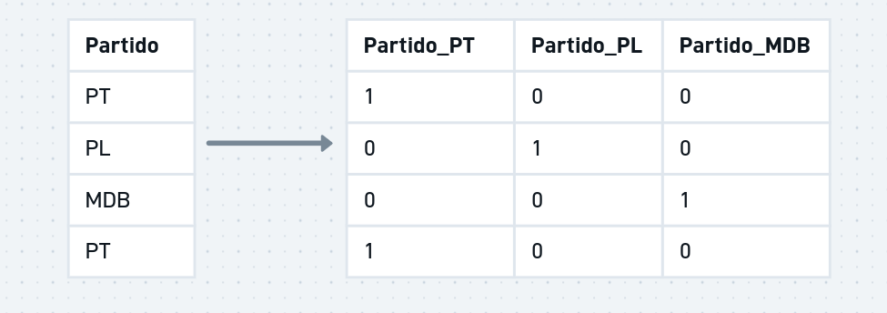
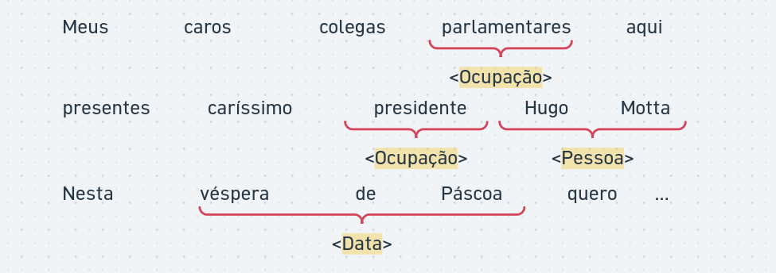
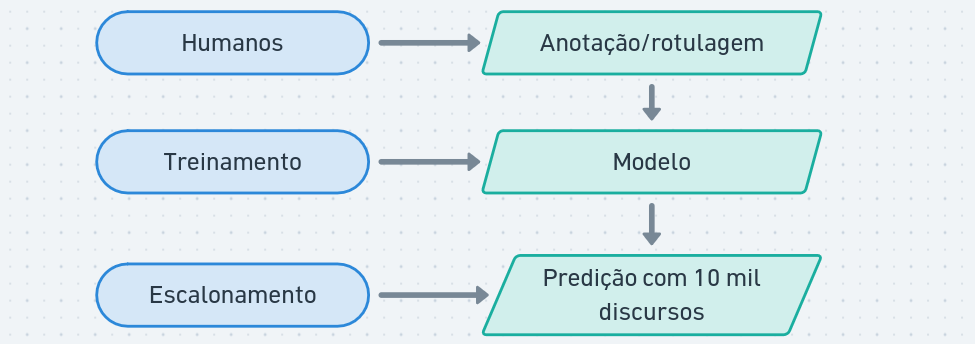
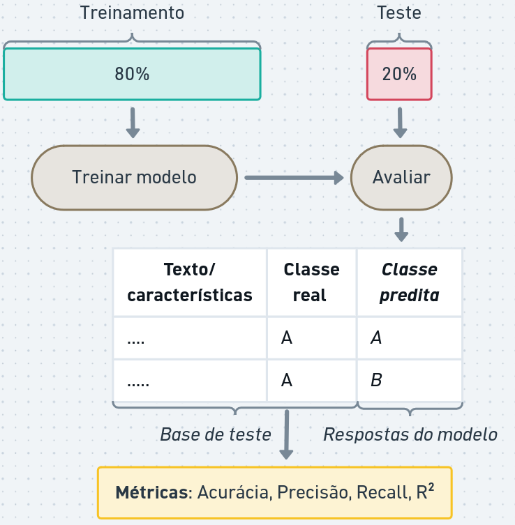
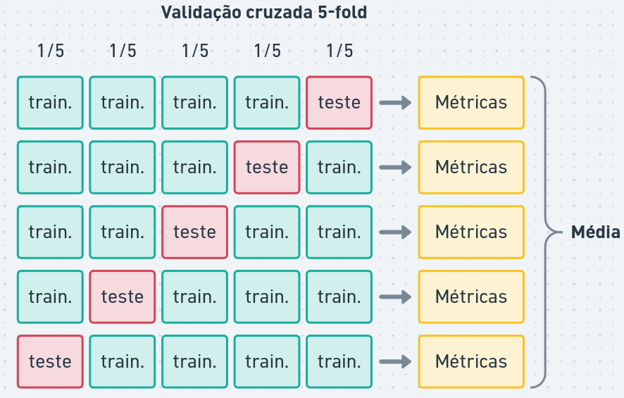
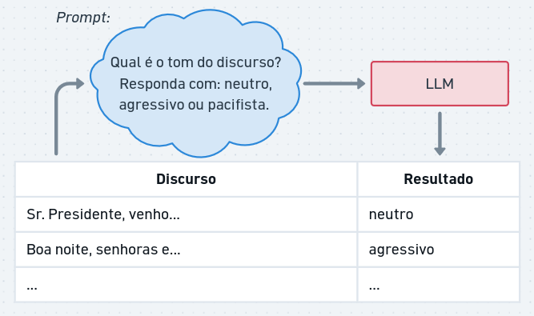
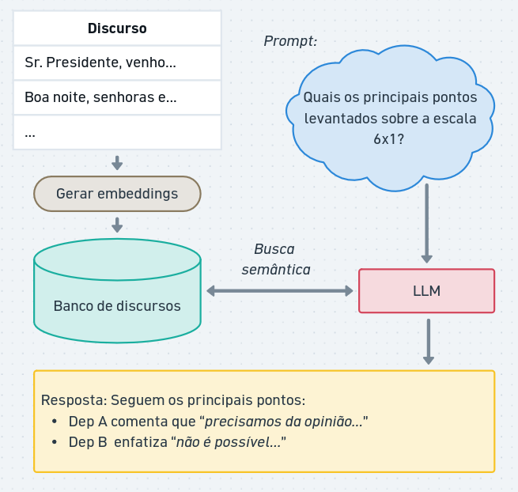

## Classificação e Regressão Textual

Modelos de **aprendizado supervisionado** são aqueles em que o modelo é treinado com um conjunto de dados rotulado, ou seja, cada exemplo de treinamento tem um rótulo associado.

-   **Classificação**: atribuir uma categoria a um texto. Exemplo: classificar discursos como "positivo", "negativo" ou "neutro" em relação a um tema específico.
-   **Regressão**: prever um valor numérico a partir de um texto. Exemplo: prever a popularidade de um discurso com base em seu conteúdo.



O treinamento **supervisionado** requer um conjunto de dados rotulados, também chamados de exemplos, onde cada exemplo de treinamento tem um rótulo associado. O modelo aprende a partir desses exemplos e é capaz de fazer previsões em novos dados.



Dependendo do modelo, os dados de texto precisam ser convertidos em uma representação numérica, como vetores de características (features) ou embeddings, para que o modelo possa processá-los.



Além disso, é possível adicionar metadados relacionados ao texto. Por exemplo, ao classificar discursos políticos, podemos incluir informações como o partido político do orador, a data do discurso ou o local onde foi proferido. Esses metadados podem fornecer contexto adicional que ajuda o modelo a fazer previsões mais precisas.

Dados categóricos, como o partido político, podem ser convertidos em **variáveis dummy (one-hot encoding)** para serem usadas como features no modelo. Por exemplo, se temos três partidos políticos (PT, PL e MDB), podemos criar três variáveis dummy: "Partido_PT", "Partido_PL" e "Partido_MDB". Se um discurso for do PT, a variável "Partido_PT" seria 1, enquanto as outras seriam 0.



### Classificação de sequências e tokens

Além da classificação de textos completos, podemos também realizar a classificação de tokens individuais ou trechos do texto.



Já vimos uma aplicação de classificação de tokens em aulas anteriores: a análise sintática.

Modelos de classificação/regressão de sequências podem utilizar informações como:

-   **Contexto**: a classificação de um token pode depender do contexto em que ele aparece. Por exemplo, a palavra "banco" pode se referir a uma instituição financeira ou a um objeto para sentar, dependendo do contexto.
-   **Características do token**: características morfológicas, sua posição na frase, ou se é uma palavra maiúscula podem ser úteis para a classificação.
-   **Metadados**: informações adicionais, como o tipo de documento ou o autor, podem fornecer contexto adicional para a classificação.

### Aplicações para Análise de Discurso

Modelos de aprendizado supervisionado de textos podem ser aplicados em diversas tarefas de análise de discurso, como:

-   **Análise de Sentimentos**: medir hostilidade, otimismo, teor populista, adversários ou instituições.

-   **Enquadramentos ideológicos**: identificar como determinado assunto é tratado no discurso. Por exemplo, discursos sobre a Amazônia enquadrados como "Soberania Nacional", "Preservação Ambiental" ou "Exploração Econômica".

-   **Detectar discurso de ódio**: mapear textos contendo intolerância, preconceito ou violência ao longo do tempo.

-   **Temática**: classificar discursos em temas como economia, meio ambiente, saúde, etc.

-   **Extração de informações**: identificar entidades, eventos ou relações mencionados em um discurso.

Assim como em outros métodos vistos nas aulas anteriores, é importante perceber como as ferramentas ajudariam na análise cuidadosa dos discursos.

A anotação prévia dos dados geralmente é complexa e exige esforço humano. Modelos de aprendizado ajudam a escalar a análise para corpora maiores.



### Algoritmos de aprendizado

Existem diversos algoritmos de aprendizado supervisionado que podem ser usados para classificação e regressão de textos, como:

-   **Naive Bayes**: um modelo probabilístico baseado no teorema de Bayes, que assume independência entre as features.
-   **Regressão Linear e Logística**: modelos lineares que podem ser usados para classificação (regressão logística) ou regressão (regressão linear).
-   **Árvores de Decisão**: modelos que dividem os dados em ramos com base em condições sobre as features.
-   **Redes Neurais**: modelos inspirados no funcionamento do cérebro humano, que podem capturar relações complexas entre as features.

Cada algoritmo possui características que influenciam o aprendizado. Um fator importante é a **interpretabilidade**. Em modelos como regressão linear e árvores de decisão, as predições podem ser explicadas a partir de dados do modelo (ex: por que o discurso X foi classificado como "neutro"?). Redes Neurais, por exemplo, geram boas métricas mas não são facilmente interpretadas.

### Treinamento, teste e validação

Para aprendizado supervisionado, é boa prática separar um conjunto dos dados rotulados para teste. A ideia é utilizar dados que não foram utilizados durante o treinamento para avaliar a generalização do modelo (isto é: como o modelo se comportaria com novos dados).

{fig-align="center" width="63%"}

Existem diversas métricas para avaliação de modelos de predição:

A **acurácia** de um classificador pode ser interpretada como o percentual de acerto:

$$
Acurácia = \frac{\text{número de predições corretas}}{\text{número total de exemplos}}
$$

**Precisão** é a proporção de predições corretas entre as predições de uma classe feitas pelo modelo:

$$
Precisão = \frac{\text{número de predições positivas corretas}}{\text{número total de predições positivas (corretas e incorretas)}}
$$

**Recall** (sensibilidade ou revocação) é a proporção de predições corretas entre os exemplos reais da classe:

$$
Recall = \frac{\text{número de predições positivas corretas}}{\text{número total de rótulos positivos}}
$$

O $R^2$ **(r-quadrado ou coeficiente de determinação)** é uma métrica usada para avaliar a qualidade de um modelo de regressão. Ele varia entre 0 e 1, onde valores mais próximos de 1 indicam que o modelo explica melhor a variabilidade dos dados.

$$
R^2 = \frac{\text{Variância explicada}}{\text{Variância total}}
$$

O treinamento também pode envolver esquemas de **validação cruzada (CV, do inglês cross-validation)**. Com CV, o conjunto anotado é dividido em partes iguais e o modelo é avaliado com todas as combinações de treinamento e teste. A CV gera métricas mais precisas, especialmente para escolher modelos e seus parâmetros.

{fig-align="center" width="80%"}

## Modelos de linguagem

**Modelos de Linguagem** são treinados para, dada uma sequência de palavras, prever a próxima palavra ou preencher lacunas em um texto. Eles aprendem a partir de grandes corpora de texto e capturam padrões linguísticos, semânticos e contextuais.

**Modelos de Linguagem Grandes (LLMs, do inglês Large Language Models)** são modelos de linguagem com um grande número de parâmetros (bilhões) e treinados em grandes quantidades de dados (trilhões). Estes modelos possuem capacidades para auxiliar em diversas tarefas relacionadas à linguagem.

Para análise de discurso, os LLMs podem ser usados para:

-   *Classificação*: classificar discursos em categorias temáticas, ideológicas ou de sentimento.

-   *Geração de texto*: gerar resumos, traduções, reformulações ou respostas a perguntas.

-   *Extração de informações*: identificar entidades, eventos ou relações mencionados em um discurso.

-   *Análise de uso da linguagem*: identificar padrões de linguagem, estratégias retóricas ou enquadramentos ideológicos.

{fig-align="center" width="80%"}

### Escolhas de modelo

**Tamanho do modelo**: modelos maiores geralmente têm melhor desempenho, mas exigem mais recursos computacionais e custo.

**Tamanho do contexto**: o contexto é a entrada que o modelo recebe para gerar uma resposta. Modelos com maior capacidade de contexto podem entender textos maiores.

**Fine-tuning**: é possível ajustar um modelo pré-treinado para uma tarefa específica, como classificação de sentimentos ou análise de discurso, usando um conjunto de dados rotulado.

LLMs de uso geral e ajustados são oferecidos como serviços em nuvem por empresas como OpenAI, Google, Microsoft, entre outras. Eles podem ser acessados por meio de bibliotecas, como ellmer e mall do R. Uma relação de modelos, custos e tamanhos de contexto está disponível em: <https://models.litellm.ai/>.

### Configuração e construção de prompts

**Temperatura e alucinações**: a temperatura é um parâmetro que controla a aleatoriedade das respostas geradas pelo modelo. Valores mais baixos resultam em respostas mais conservadoras e valores mais altos podem gerar respostas mais criativas, mas também mais propensas a **alucinações** (informações incorretas ou inventadas).

**Prompting**: a forma como a entrada é formulada pode influenciar significativamente as respostas do modelo. Prompts bem elaborados podem melhorar a qualidade das respostas.

Algumas boas práticas para construção de prompts incluem:

-   Enunciar ordens específicas (ex: "liste as principais ideias do discurso em até 3 itens").

-   Utilizar linguagem imperativa (ex: "responda com 'sim' ou 'não'", "não cite nomes de pessoas ou empresas").

-   Prover exemplos (ex: "busque por frases que indiquem sarcasmo, como 'claro, isso é ótimo' ou 'nossa, que surpresa'.").

-   *Chain-of-Thought (CoT)* é uma técnica que envolve a geração de uma cadeia de raciocínio para chegar a uma resposta. Em vez de fornecer uma resposta direta, o modelo é incentivado a pensar passo a passo. (ex: para responder "O discurso de um orador é otimista?", primeiro prompt seria "identifique palavras ou expressões positivas", depois "avalie o tom geral do discurso", então "o discurso é otimista? Responda com 'sim' ou 'não'").

### Ferramentas e Retrieval-Augmented Generation (RAG)

Modelos de linguagem podem ser integrados a ferramentas externas, como bancos de dados, APIs ou sistemas de busca, para fornecer respostas mais precisas e atualizadas.

A **Geração Aumentada por Recuperação (RAG, do inglês Retrieval-Augmented Generation)** é uma técnica que combina modelos de linguagem com ferramentas de busca.

O RAG permite que o modelo acesse uma base de dados externa ao invés de assumir que o modelo possui todas as informações necessárias.

{fig-align="center" width="80%"}

Algumas vantagens do RAG são:

-   *Volume de dados*: a base de dados pode ser grande, pois não é necessário incluir toda a informação no contexto (prompt de entrada). Por exemplo, o modelo poderia ter acesso à base inteira de discursos, notícias, propostas, etc.
-   *Dados atualizados*: o modelo pode acessar informações atualizadas, o que é especialmente útil para perguntas sobre eventos recentes ou dados em constante mudança.
-   *Sigilos e informações específicas*: o modelo pode recuperar informações específicas, como estatísticas, datas ou nomes, que podem não estar presentes no conhecimento pré-treinado do modelo.
-   *Contexto específico*: o modelo pode acessar informações contextuais específicas e referenciadas para a tarefa em questão, melhorando a relevância e precisão das respostas. Isso reduz a chance de alucinações.

LLMs também podem ser integradas com outras ferramentas. Como, por exemplo, buscas na internet, consultas em APIs, ou mesmo a execução de código para realizar análises mais complexas.

## Estudos guiados

### Classificação Textual com Regressão Logística

```{r cache=TRUE}
#| message: false
#| warning: false
#| results: hold

# install.packages(c("tidyverse", "quanteda", "stopwords", "caret"))
library(tidyverse)
library(quanteda)
library(stopwords)
library(caret)

# Carregar tabela com discursos e filtrar apenas partidos PT e PL
dados_discursos <- read_csv("discursos_camara_abril_2025.csv", show_col_types = FALSE) |>
  filter(partido %in% c("PL", "PT")) |>
  mutate(doc_id = str_c(row_number(), nome, partido, sep = "_"))

# Remover padrão de texto no início dos discursos
padrao_inicio_discursos <- "(Sem revisão d[oa] oradora?\\.\\)|SEM REGISTRO TAQUIGRÁFICO\\)\\. |O SR\\. PRESIDENTE.* - | - [A-Z][A-Z]\\))(.*)"
dados_discursos <- mutate(dados_discursos, transcricao = str_extract(transcricao, padrao_inicio_discursos, group = 2))

# Criar o corpus
corpus_discursos <- corpus(dados_discursos, text_field = "transcricao")

# Criar tokens de discursos, removendo pontuações, símbolos, números e stopwords
tokens_discursos <- corpus_discursos |>
  tokens(remove_punct = TRUE, remove_numbers = TRUE, remove_symbols = TRUE) |>
  tokens_remove(stopwords("portuguese"))

# Criar DFM: removendo palavras muito frequentes ou muito raras
dfm_discursos <- tokens_discursos |>
  dfm() |>
  dfm_trim(
    min_termfreq = 5, # palavras aparecem pelo menos 5 vezes
    max_docfreq = 0.5, docfreq_type = "prop" # palavras aparecem no máximo em 50% dos discursos 
  )

# Separar conjuntos entre treinamento e teste
set.seed(42) # semente do gerador de números aleatórios para reprodutibilidade
indices_treinamento <- createDataPartition(dfm_discursos$partido, p = 0.8, list = FALSE) |> as.vector()
dfm_treinamento <- dfm_discursos[indices_treinamento, ] # 80% exemplos aleatórios para treinamento
dfm_teste <- dfm_discursos[-indices_treinamento, ] # 20% restante para teste

# Treinar modelo linear para classificar o partido a partir dos discursos
features_treinamento <- convert(dfm_treinamento, to = "data.frame") |> select(-doc_id)
rotulos_saida_treinamento <- as.factor(dfm_treinamento$partido)
modelo_linear <- train(
  x = features_treinamento,
  y = rotulos_saida_treinamento,
  method = "glmnet",
  trControl = trainControl(
    method = "cv",  # Validação cruzada
    number = 5      # 5-fold
  )
)

# Avaliar o modelo no conjunto de teste
features_teste <- convert(dfm_teste, to = "data.frame") |> select(-doc_id)
predicoes_teste <- predict(modelo_linear, newdata = features_teste)

# Calcular e imprimir métricas de avaliação
rotulos_saida_teste <- as.factor(dfm_teste$partido)
confusionMatrix(predicoes_teste, reference = rotulos_saida_teste)

# Calcular importância de cada feature (palavras)
importancia <- varImp(modelo_linear)

# Desenhar gráfico com as 10 features mais importantes
plot(importancia, top = 10)
```

### Classificação Textual com Árvores de Decisão

Modelo para classificar discursos do PT ou PL.

```{r cache=TRUE}
#| message: false
#| warning: false
#| results: hold

# install.packages(c("tidyverse", "quanteda", "caret", "rpart.plot")) # instalar pacotes
library(tidyverse)
library(quanteda)
library(caret)
library(rpart.plot)

# Carregar tabela com discursos e filtrar apenas partidos PT e PL
dados_discursos <- read_csv("discursos_camara_abril_2025.csv", show_col_types = FALSE) |>
  filter(partido %in% c("PT", "PL"))

# Remover padrão de texto no início dos discursos
padrao_inicio_discursos <- "(Sem revisão d[oa] oradora?\\.\\)|SEM REGISTRO TAQUIGRÁFICO\\)\\. |O SR\\. PRESIDENTE.* - | - [A-Z][A-Z]\\))(.*)"
dados_discursos <- mutate(dados_discursos, transcricao = str_extract(transcricao, padrao_inicio_discursos, group = 2))

# Criar corpus
corpus_discursos <- corpus(dados_discursos, text_field = "transcricao")

# Criar tokens de discursos, removendo pontuações, símbolos, números e stopwords
tokens_discursos <- corpus_discursos |>
  tokens(remove_punct = TRUE, remove_numbers = TRUE, remove_symbols = TRUE) |>
  tokens_remove(stopwords("portuguese"))

# Criar DFM: removendo palavras muito frequentes ou muito raras
dfm_discursos <- tokens_discursos |>
  dfm() |>
  dfm_trim(
    min_termfreq = 5, # palavras aparecem pelo menos 5 vezes
    max_docfreq = 0.5, docfreq_type = "prop" # aparecem no máximo em 50% dos discursos 
  )

# Separar conjuntos entre treinamento e teste
set.seed(42) # semente do gerador de números aleatórios para reprodutibilidade
indices_treinamento <- createDataPartition(dfm_discursos$partido, p = 0.8, list = FALSE) |> as.vector()
dfm_treinamento <- dfm_discursos[indices_treinamento, ] # 80% exemplos aleatórios para treinamento
dfm_teste <- dfm_discursos[-indices_treinamento, ] # 20% restante para teste

# Treinar modelo linear para classificar o partido a partir dos discursos
features_treinamento <- convert(dfm_treinamento, to = "data.frame") |> select(-doc_id)
rotulos_saida_treinamento <- as.factor(dfm_treinamento$partido)
modelo_arvore <- train(
  x = features_treinamento,
  y = rotulos_saida_treinamento,
  method = "rpart",
  trControl = trainControl(
    method = "cv",  # Validação cruzada
    number = 5      # 5-fold
  )
)

# Avaliar o modelo no conjunto de teste
features_teste <- convert(dfm_teste, to = "data.frame") |> select(-doc_id)
predicoes_teste <- predict(modelo_linear, newdata = features_teste)

# Calcular e imprimir métricas de avaliação
rotulos_saida_teste <- as.factor(dfm_teste$partido)
confusionMatrix(predicoes_teste, reference = rotulos_saida_teste)

# Desenhar árvore de decisão
rpart.plot(modelo_arvore$finalModel)
```

### Reconhecimento de entidades nomeadas com Spacyr

```{r cache=TRUE}
#| message: FALSE
#| results: hold

library(tidyverse)
library(quanteda)
library(spacyr)

# Instalar spacy pela primeira vez e baixar modelo em português
# spacy_install()
# spacy_download_langmodel("pt_core_news_sm")

# Inicializar o spacy com o modelo de língua portuguesa
spacy_initialize(model = "pt_core_news_sm", entity = TRUE)

# Carregar tabela com discursos e filtrar apenas partidos PT e PL
dados_discursos <- read_csv("discursos_camara_abril_2025.csv", show_col_types = FALSE) |>
  filter(partido %in% c("PT", "PL")) |>
  mutate(doc_id = str_c(row_number(), nome, partido, sep = "_"))

corpus_discursos <- dados_discursos |>
  corpus(text_field = "transcricao")

# Remover padrão de texto no início dos discursos
padrao_inicio_discursos <- "(Sem revisão d[oa] oradora?\\.\\)|SEM REGISTRO TAQUIGRÁFICO\\)\\. |O SR\\. PRESIDENTE.* - | - [A-Z][A-Z]\\))(.*)"
dados_discursos <- mutate(dados_discursos, transcricao = str_extract(transcricao, padrao_inicio_discursos, group = 2))

# Processar textos com spacy
dados_analise <- spacy_parse(corpus_discursos)

# Extrair 5 pessoas mais citadas por partido
dados_analise |> 
  entity_extract() |>
  inner_join(dados_discursos) |> 
  filter(entity_type == 'PER') |>
  group_by(partido) |>
  count(entity) |>
  slice_max(n, n = 5)
```

### Classificação com modelos de linguagem

```{r llm, cache=TRUE}
# install.packages(c("tidyverse", "mall", "ellmer", "httpuv"))
library(tidyverse)
library(mall)
library(ellmer)

# Adicionar chave para serviço de LLM (gemini da Google)
# Sys.setenv(GEMINI_API_KEY = "<insira a chave aqui>")

# Configurar o serviço de LLM
chat <- chat_google_gemini(model = "gemini-2.5-flash")
llm_use(chat, .cache = "gemini_cache")

# Carregar dados dos discursos
dados_discursos <- read_csv("discursos_camara_abril_2025.csv", show_col_types = FALSE)

# Remover padrão de texto no início dos discursos
padrao_inicio_discursos <- "(Sem revisão d[oa] oradora?\\.\\)|SEM REGISTRO TAQUIGRÁFICO\\)\\. |O SR\\. PRESIDENTE.* - | - [A-Z][A-Z]\\))(.*)"
dados_discursos <- mutate(dados_discursos, transcricao = str_extract(transcricao, padrao_inicio_discursos, group = 2))

# Classificar discursos com LLM
dados_analisados <- dados_discursos |>
  llm_classify(
    col = transcricao, # A coluna que a LLM vai ler
    labels = c("Economia", "Saúde", "Meio ambiente", "Religião", "Democracia", "Segurança"), # categorias
    pred_name = "tema" # nome da nova coluna que será criada
  )

# Amostrar 10 discursos classificados
amostra_classificacao <- dados_analisados |>
  filter(!is.na(tema)) |>
  select(sumario, tema) |>
  head(10)

print(amostra_classificacao)
```

### RAG

```{r rag, cache=TRUE}
# install.packages(c("tidyverse", "mall", "ellmer", "httpuv"))
library(tidyverse)
library(ragnar)
library(ellmer)

# Adicionar chave para serviço de LLM (gemini da Google)
# Sys.setenv(GEMINI_API_KEY = "<insira a chave aqui>")

# Carregar dados do PSOL
dados_discursos <- read_csv("discursos_camara_abril_2025.csv", show_col_types = FALSE) |>
  filter(partido == "PSOL")

# Criar arquivo com banco de discursos
# arquivo_banco_discursos <- "discursos.ragnar.duckdb"

  # Caso contrário, criar base de discursos
banco_discursos <- ragnar_store_create(
  embed = \(x) embed_google_gemini(x, model = "gemini-embedding-001")
)
  
# Transformar discursos no formato markdown (texto formatado para LLM)
chunks <- dados_discursos |>
  pull(transcricao) |>
  map(MarkdownDocument) |>
  map(markdown_chunk)

# Inserir discursos na base
walk(chunks, \(x) ragnar_store_insert(banco_discursos, x), .progress = TRUE)
ragnar_store_build_index(banco_discursos)

# Criar chat LLM
cliente_chat <- chat_google_gemini(model = "gemini-2.5-flash")

# Adicionar banco de discursos como ferramenta para LLM
ragnar_register_tool_retrieve(
  cliente_chat,
  banco_discursos,
  name = "retriever_discursos",
  store_description = "Recupera trechos de discursos da Câmara dos Deputados"
)

# Enviar prompt para LLM
resposta <- cliente_chat$chat("O que o partido PSOL está falando sobre o Papa Francisco?")

# Escrever resposta
print(resposta)
```
